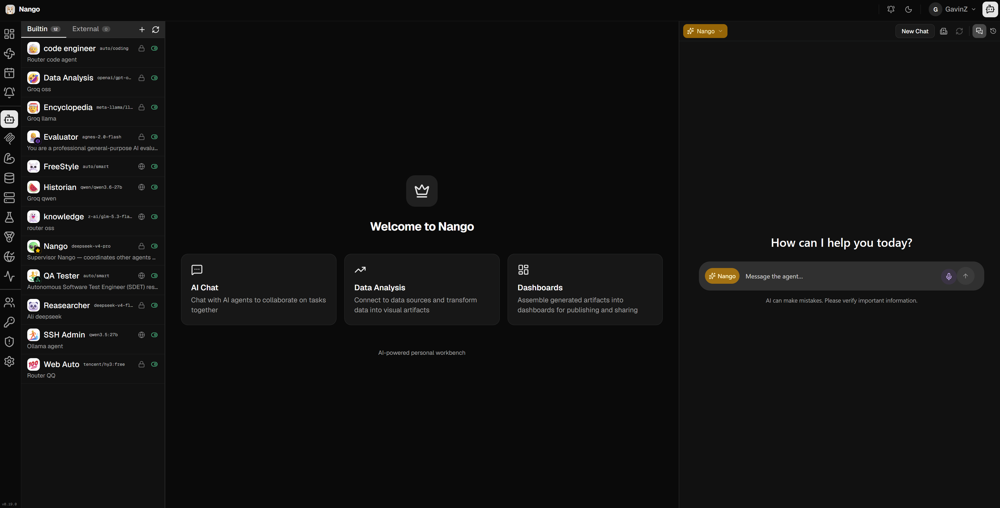
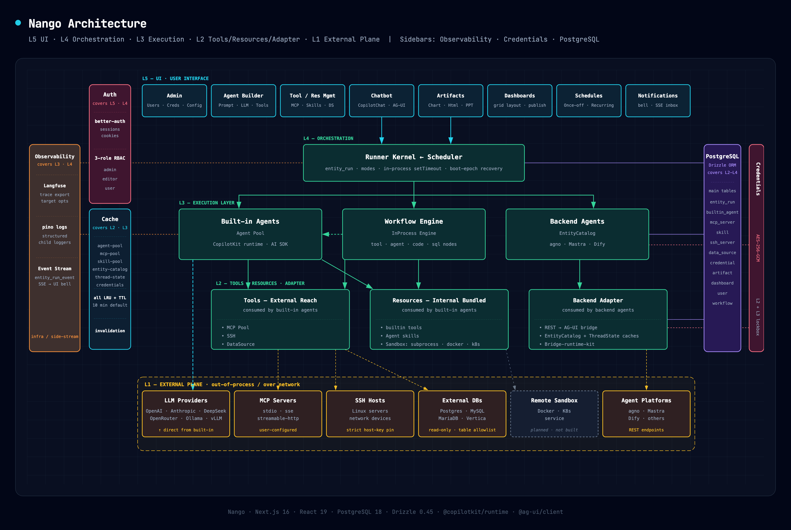

<div align="center">
  

  <h1>Nango</h1>

  <p><strong>An AI-native collaboration workspace for individual or small teams.</strong></p>

  <p>
    Chat with <strong>Nango</strong>, your AI teammate. Turn one-shot answers into
    refreshable, shareable data products the whole team can build on.
  </p>

  <p>
    
    
    
    
    
    
    
    
  </p>

  <p>
    <a href="https://github.com/GavinZha0/nango/actions/workflows/lint-and-type-check.yml"></a>
    <a href="https://github.com/GavinZha0/nango/actions/workflows/e2e-tests.yml"></a>
    <a href="https://github.com/GavinZha0/nango/releases"></a>
  </p>

  <p>
    <a href="#quick-start-docker"><strong>Quick Start</strong></a> ·
    <a href="#development-setup">Development</a> ·
    <a href="#architecture-overview">Architecture</a> ·
    <a href="#documentation">Docs</a>
  </p>
</div>

---

## What is Nango (南瓜)?

Nango is a small-team **AI collaboration workspace**. Instead of a one-off chatbot,
it positions an AI agent — also named **Nango** — as a *colleague* who sits in
the team workspace, talks to users, picks up tasks, and works with the team to
get things done. The product's current focus is the **data analysis** workflow:
connect a database, ask a question, get a chart, save it, schedule it, share it.

Nango's design is centered around two product pillars: **AI Engine** (intelligent
collaboration) and **Artifact Engine** (artifact management), which work in tandem.

---

### AI Engine — Your AI Colleague

- **Multi-backend agent support** — Connect agno, Mastra, Dify, or build custom in-app agents on raw LLMs (OpenAI, DeepSeek, Ollama, Groq, xAI). All streams normalized to **AG-UI** protocol server-side; API keys never reach the browser.
- **Supervisor-specialist orchestration** — Nango acts as the supervisor, routing tasks to specialist agents via sync calls, tool routing, conversational handoffs, or async fire-and-forget runs.
- **Extensible tool ecosystem** — Native **MCP** servers (stdio/sse/streamable), database-resident **Skills** (reusable scripts), **SSH hosts**, and governed **Data Sources** (Postgres, MySQL, MariaDB, Vertica).
- **Custom agent builder** — Configure built-in agents with bound credentials, tools, and runtime prompts via the CopilotKit runtime.
- **Built-in voice recognition** — Client-VAD streaming with keybindings (`Ctrl+Shift+M`), supporting **SenseVoice** (offline), OpenAI, Deepgram, and FunASR.

---

### Artifact Engine — Build, Publish & Refresh

- **Artifact library** — Folder-tree catalog of AI-generated outputs (charts, code, HTML, images, PPT, reports) with full lineage trace back to the originating workflow.
- **Dashboard composition** — Combine saved artifacts into responsive grid dashboards with stable publish URLs.
- **Workflow-driven refresh** — Artifacts are backed by replayable workflows. Apply filters, refresh with live data, or use the AI editor to tweak the underlying query and save a new version.
- **Outputs that run without AI** — Many artifacts execute independently via their underlying workflow, decoupled from the chat session.

---

### Security & Governance

- **AES-256-GCM credential encryption** — All secrets encrypted at rest, decrypted server-side only, with versioned keyring and zero-downtime rotation.
- **Never exposed to agents** — Agent tools access credentials via server-side handles; raw secrets never reach the LLM or browser.
- **RBAC** — Three roles: `admin` (everything), `editor` (resource builders), `user` (consumers). Soft-delete only for user deletion.
- **Governed data access** — Read-only flags, table-level allow/deny lists, SQL parsed & validated before execution, results cached as **Parquet** for safe sharing and sandbox execution.
- **Input / output / tool guardrails** — Enforced at runtime for safe agent execution.

---

### Automation & Quality Harness


| Subsystem | Purpose | Type |
|---|---|---|
| **Verification** | Deterministic assert-on-output testing for MCP tools & workflows (json_schema, jsonpath, js_expression) | Deterministic |
| **Evaluation** | Stochastic LLM-as-Judge conversational quality assessment for agents | Stochastic |
| **Web Auto** | Playwright-based browser automation & regression testing with dual-tier eval (VM assertions + LLM visual inspection) | Deterministic + AI |

---

### Additional Capabilities

- **Schedules & async runs** — One-shot or recurring cron dispatch; async results push to a live notification inbox via SSE.
- **Sandbox code execution** — Isolated Python sandbox (dify-sandbox) for safe code-execution tools.
- **Admin forensics** — Triage layouts at `/admin/run` and `/admin/run/[id]` with full run timelines.
- **Single-node multi-tenant runtime** — One process, long-lived; heavy work delegated outward. Not for serverless / multi-replica auto-scaling.

---




## Quick Start (Docker)

Requires **Docker** (≥ 20.10) and **Docker Compose** v2.

### 1. Clone

```bash
git clone https://github.com/GavinZha0/Nango.git
cd nango
```

### 2. Create `.env`

```bash
cp .env.example .env
```

Generate required secrets:

```bash
# Generate a 32-byte key for credential encryption
node -e "console.log(require('crypto').randomBytes(32).toString('hex'))"
# → e.g. c60f15a2dd1bdecd92bca72728ec8104c0570832e9d8827592bfa865ba35fc5a
```

Put them into `.env`:

```dotenv
CREDENTIAL_ENCRYPTION_ACTIVE_KEY_ID=k1
CREDENTIAL_ENCRYPTION_KEYRING=k1=<the-64-hex-you-just-generated>
BETTER_AUTH_SECRET=<another-long-random-string>
NO_HTTPS=1
```

### 3. Bring everything up

```bash
docker compose up -d
```

This starts:

| Container | Purpose | Port |
|---|---|---|
| `nango-app` | Nango Next.js server (auto-runs DB migrations) | `9300` |
| `nango-db`  | PostgreSQL 18 | `5433` → `5432` |
| `sandbox`   | dify-sandbox (isolated Python/Node.js code execution) | `8194` |
| `playwright`| Playwright MCP (browser automation) | `8931` |
| `sensevoice`| SenseVoice ASR speech-to-text service | `10085` → `8000` |

Open **http://localhost:9300**. The first user to sign up becomes the admin automatically.

> 💡 **Voice Setup**: In Docker mode, set SenseVoice credential Base URL to `http://sensevoice:8000`. In local dev mode, use `http://localhost:10085`.

---

## Development Setup

| Tool | Version |
|---|---|
| Node.js | **≥ 24** (LTS) |
| pnpm    | **10.32.1** (pinned via `packageManager`) |
| Docker  | Needed for bundled Postgres + Python sandbox |
| PostgreSQL | 18 (or `pnpm docker:db`) |

```bash
corepack enable          # picks up pinned pnpm
pnpm install
cp .env.example .env     # set encryption + auth secrets
pnpm docker:db           # Postgres 18 on localhost:5433
pnpm db:migrate          # apply schema
pnpm dev                 # Turbopack on http://localhost:9300
```

---

## Architecture Overview



---

## Contributing

1. Skim the relevant design notes under [`docs/`](docs/) for the subsystem you are touching.
2. Run lint, type-check, and tests: `pnpm check`.
3. For schema changes, generate a Drizzle migration and commit **both** the SQL file and the snapshot.

---

## License

[MIT](LICENSE) © Nango contributors.

<p align="right"><sub>Nango is intentionally small, opinionated, and team-shaped. We hope it makes your AI feel like a colleague rather than a vending machine.</sub></p>
