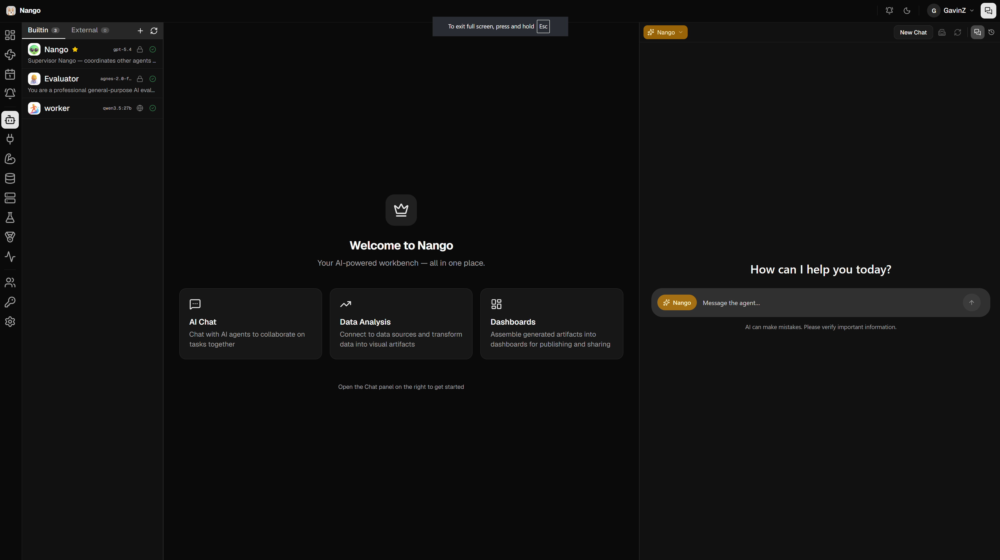
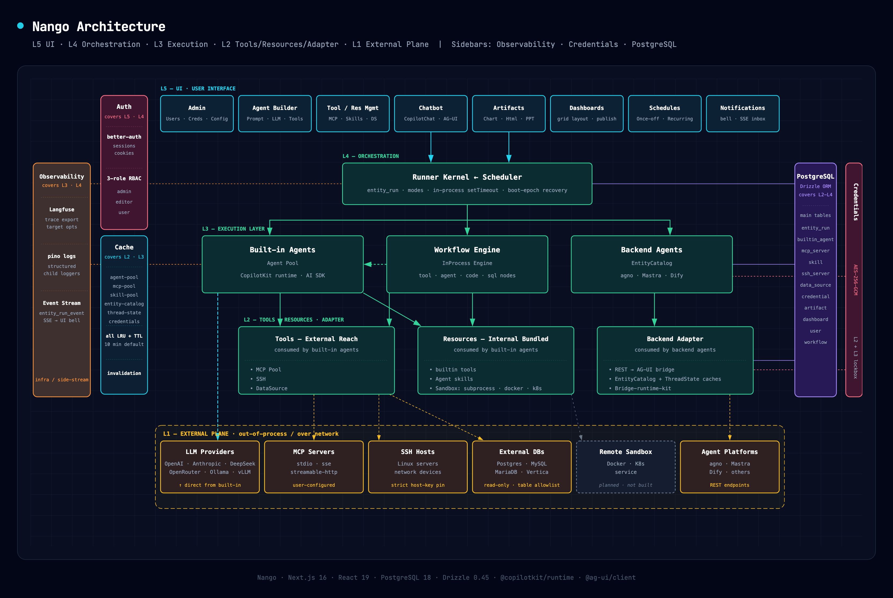

<div align="center">
  

  <h1>Nango</h1>

  <p><strong>面向小团队的 AI 原生协作工作空间 — 专为数据分析而构建。</strong></p>

  <p>
    与 <strong>Nango</strong> 聊天，你的 AI 队友。将一次性答案转化为
    可刷新、可共享的数据产品，让整个团队都能在此基础上构建。
  </p>

  <p>
    
    
    
    
    
    
    
    
  </p>

  <p>
    <a href="https://github.com/GavinZha0/nango/actions/workflows/lint-and-type-check.yml"></a>
    <a href="https://github.com/GavinZha0/nango/actions/workflows/e2e-tests.yml"></a>
    <a href="https://github.com/GavinZha0/nango/actions/workflows/release-please.yml"></a>
    <a href="https://github.com/GavinZha0/nango/pkgs/container/nango"></a>
    <a href="https://github.com/GavinZha0/nango/releases"></a>
  </p>

  <p>
    <a href="#quick-start-docker"><strong>快速开始</strong></a> ·
    <a href="#development-setup">开发设置</a> ·
    <a href="#architecture-overview">架构概览</a> ·
    <a href="#recommended-companions">推荐组件</a> ·
    <a href="#documentation">文档</a>
  </p>
</divNango 的功能设计围绕 **AI Engine（智能协作）** 与 **Artifact Engine（交付物管理）** 两大产品支柱展开，它们相辅相成：

* **多源智能接入与协议统一**：支持桥接外部代理平台（agno, Mastra, Dify）或直接基于 raw LLM（OpenAI, DeepSeek, Ollama 等）构建内置代理，并在服务端统一转换为 **AG-UI 协议** 输送至前端，保持一致的交互体验。
* **多代理编排协作 (Supervisor-Specialist)**：主管代理（Nango）能自动编排、分发或移交任务给其他专家代理，支持同步调用、工具路由和异步处理。
* **丰富的工具生态**：原生支持并将 **MCP（Model Context Protocol）** 服务、数据库常驻 **Skills（脚本技能）**、**SSH 主机连接** 以及 **数据源 (Data Sources)** 作为扩展工具绑定至代理。
* **Credential 凭证统一管理与安全使用**：所有第三方服务凭证（如 API 密钥、数据库账密、SSH 密钥等）在后台使用 **AES-256-GCM** 加密存储，仅在服务端解密使用，支持零停机密钥轮转，保证敏感凭证绝不暴露给浏览器或客户端。
* **受控数据访问与执行安全**：提供只读及表级黑白名单安全策略。执行 SQL 前进行解析校验，并将查询结果缓存为 Parquet 格式存入共享区，以供代码沙箱和数据重用。
* **异步调度与统一历史审计**：支持一键或周期性定时调度触发任务，异步执行结果自动推送至通知中心。内置与外部会话共享同一 PostgreSQL 存储，并提供管理员 run-forensics 页面审计运行 timeline。
* **交付物管理与一键保存 (Artifacts)**：提供类似文件系统的目录树，分类管理 AI 产出的图表、代码、HTML、PPT、报告等交付物（Artifacts），支持从聊天会话中一键保存并保留溯源。
* **动态看板组装 (Dashboard)**：支持将多个 Artifacts 组合为网格布局的看板，发布并共享稳定 URL。
* **工作流驱动与活态更新 (Workflow-backed refresh & Re-creation)**：保存的交付物后端绑定了重放工作流。用户无需重新向 AI 对话提问，即可直接应用时间或维度过滤器过滤图表，或者重跑工作流以刷新实时数据；亦可在编辑器中借助 AI 二次微调工作流以调整并保存新版本。

---



## 快速开始（Docker）

运行 Nango 的最快路径。仅需要 **Docker**（≥ 20.10）和
**Docker Compose** v2。

### 1. 克隆

```bash
git clone <your-fork-or-this-repo>.git
cd nango
```

### 2. 创建 `.env`

```bash
cp .env.example .env
```

在应用启动之前，你**必须**设置两个加密变量：

```bash
# 生成一个 32 字节的十六进制密钥
node -e "console.log(require('crypto').randomBytes(32).toString('hex'))"
# → 例如 c60f15a2dd1bdecd92bca72728ec8104c0570832e9d8827592bfa865ba35fc5a
```

将其放入 `.env`：

```dotenv
CREDENTIAL_ENCRYPTION_ACTIVE_KEY_ID=k1
CREDENTIAL_ENCRYPTION_KEYRING=k1=<你刚刚生成的64位十六进制>

# 还要设置一个长随机会话密钥（32+ 字符）
BETTER_AUTH_SECRET=<另一个长随机字符串>
NO_HTTPS=1
```

### 3. 启动所有内容

从 GitHub Container Registry 拉取发布的多架构镜像：

```bash
docker compose up -d
```

或从源代码本地构建（开发者模式）：

```bash
docker compose up -d --build
```

要升级到更新的发布镜像：

```bash
docker compose pull && docker compose up -d
```

这将启动：

| 容器 | 用途 | 端口 |
|---|---|---|
| `nango-app` | Nango Next.js 服务器（启动时自动运行 DB 迁移） | `9300` |
| `nango-db`  | PostgreSQL 18 | `5433` → `5432` |

然后打开 **http://localhost:9300**。

**第一个注册的用户自动成为管理员**。从
管理员用户管理页面，你可以将队友提升为 `editor`
（资源构建者）或保持为 `user`（消费者）。

兼容 **Podman**：在每个命令中将 `docker` 替换为 `podman`。

---

## 开发设置

用于贡献或针对热重载开发服务器运行。

### 先决条件

| 工具 | 版本 |
|---|---|
| Node.js | **≥ 24** (LTS) |
| pnpm    | **10.32.1**（通过 `packageManager` 固定；`corepack enable` 足够） |
| Docker  | 需要用于捆绑的 Postgres **以及**代码执行工具使用的 Python 沙盒镜像 |
| PostgreSQL | 18（或使用捆绑的 `pnpm docker:db`） |

### 运行它

```bash
corepack enable          # 从 package.json 获取固定的 pnpm
pnpm install

cp .env.example .env     # 设置 CREDENTIAL_ENCRYPTION_KEYRING、
                         # CREDENTIAL_ENCRYPTION_ACTIVE_KEY_ID
                         # 和 BETTER_AUTH_SECRET — 见上面的快速开始

pnpm docker:db           # localhost:5433 上的 Postgres 18
pnpm db:migrate          # 应用架构

pnpm dev                 # http://localhost:9300 上的 Next.js with Turbopack
```

---

## 架构概览



---

## 贡献

欢迎贡献。在打开 PR 之前：

1. 浏览 [`docs/`](docs) 下与你接触的子系统相关的设计说明。
2. 运行 lint、type-check 和测试（见 `package.json`）。
3. 对于架构更改，生成 Drizzle 迁移并提交**两者**
   SQL 文件和快照。

---

## 许可证

[MIT](LICENSE) © Nango 贡献者。

<p align="right"><sub>Nango 故意保持小众、有主见且团队导向。我们希望它让你的 AI 感觉像一个同事，而不是自动售货机。</sub></p>
