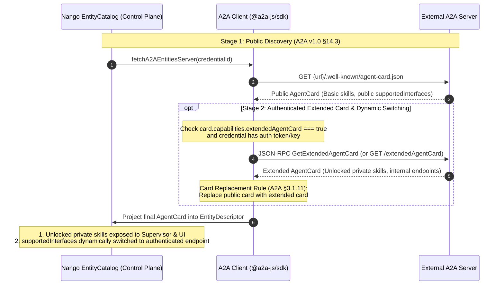
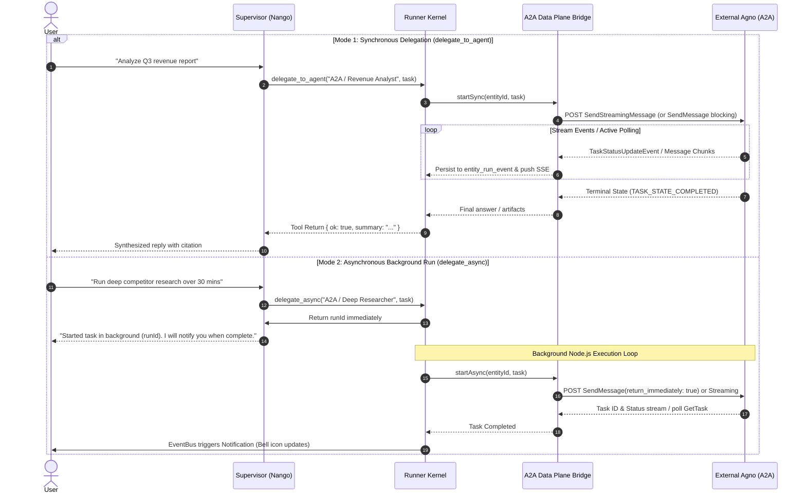
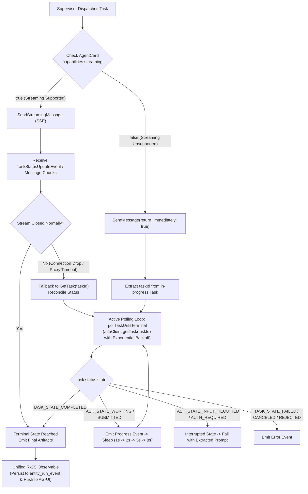
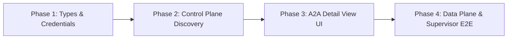
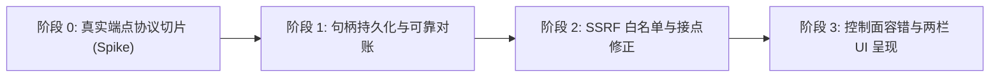

# A2A Integration Specification & Compatibility Architecture (v1.0)

Status: **Approved Design & Implementation Roadmap**  
Target Specification: **[A2A Protocol Specification v1.0.0](https://github.com/a2aproject/A2A/blob/main/docs/specification.md)**  
Target Backend: **External Agent Platforms (e.g., Agno A2A Endpoints)**

---

## 1. Executive Summary & Objective

This document defines the end-to-end design, architectural positioning, data mapping, management UI presentation, and phased implementation steps for integrating external agent platforms (such as Agno) into Nango via Google / Linux Foundation's **A2A (Agent-to-Agent) Protocol v1.0**.

### Core Requirements & Scope
1. **Orchestration First (Scenario 1)**: Nango Supervisor orchestrates and schedules external A2A agents via `delegate_to_agent` (sync) and `delegate_async` (async). Direct 1:1 chat routing from the left panel is not required for this phase.
2. **First-Class Agent Management & Inspection**: While execution is routed via the Supervisor, external A2A agents must be fully discoverable and inspectable in Nango's Agent Management page (`AgentPanel` and detail routes).
3. **Multi-Agent Endpoint Resolution**: A2A natively models one `AgentCard` per endpoint. Platforms like Agno host multiple agents differentiated by agent IDs. Nango bridges this by allowing administrators to configure a **URL path template** and an **Agent IDs list** within a single credential.
4. **Upgraded `EntityDescriptor` (Full A2A Parity)**: Upgrade Nango's canonical `EntityDescriptor` to comprehensively cover all fields of the A2A 1.0 `AgentCard` without breaking existing backends (Agno REST, Mastra, Dify).
5. **Dedicated Two-Column A2A Detail View**: Retain the existing `ExternalAgentDetailView` for traditional REST backends; route A2A entities (`provider === "a2a"`) to a dedicated `A2AAgentDetailView` featuring a balanced two-column layout tailored to A2A's black-box, contract-driven nature.
6. **Centralized Encrypted Credentials**: Managed via Nango's existing AES-256-GCM `CredentialTable`. Agent IDs are persisted in `metadata.agentIds: string[]` requiring **zero database schema migrations**.
7. **Nango Kernel-Managed Lifecycles**: Retain Nango's `runner` and `entity_run` state machine. Nango acts as an A2A Client, bridging A2A streaming events into Nango's AG-UI event bus and notifying users via the bell notification system.
8. **Strict A2A v1.0.0 Compliance Only**: Strictly conforms to the standard A2A v1.0.0 specification (`.well-known/agent-card.json`, 8-state `TaskState`, multi-part messages). Nango explicitly drops all legacy v0.3 protocol drafts without backward compatibility baggage.

---

## 2. Architecture & System Positioning

### Technology Selection: Path A (Official `@a2a-js/sdk`)
To ensure rock-solid protocol conformance, Nango adopts **Path A** by integrating the official `@a2a-js/sdk` library (`@a2a-js/sdk` v1.x). This offloads low-level JSON-RPC 2.0 framing, `ClientFactory.createFromUrl`, well-known discovery URI resolution, `CancelTask` RPC framing, and v1.0 TypeScript definitions to the upstream canonical SDK, eliminating manual wire protocol errors.

The A2A integration acts as a standard protocol bridge (`src/lib/backends/a2a/`), positioned between Nango's internal execution engine and external A2A servers:

```
┌────────────────────────────────────────────────────────────────────────┐
│                              Nango Client                              │
│                   (Chat UI / Notification Bell / Run Forensics)         │
└───────────────────────────────────┬────────────────────────────────────┘
                                    │ AG-UI Protocol (SSE)
                                    ▼
┌────────────────────────────────────────────────────────────────────────┐
│                         Nango Server (Node.js)                         │
│                                                                        │
│   ┌───────────────────────────┐      ┌─────────────────────────────┐   │
│   │    Supervisor (Nango)     │◄─────┤        EntityCatalog        │   │
│   │ (delegate_to_agent/async) │      │  (In-process LRU cache)     │   │
│   └─────────────┬─────────────┘      └──────────────▲──────────────┘   │
│                 │                                   │                  │
│                 ▼                                   │                  │
│   ┌───────────────────────────┐      ┌──────────────┴──────────────┐   │
│   │       Runner Kernel       │      │        Control Plane        │   │
│   │   (entity_run state/log)  │      │ (a2a/entity.server.ts)      │   │
│   └─────────────┬─────────────┘      └──────────────▲──────────────┘   │
│                 │                                   │                  │
│                 ▼                                   │                  │
│   ┌───────────────────────────┐                     │                  │
│   │        Data Plane         │                     │                  │
│   │   (a2a/chat.server.ts)    │                     │                  │
│   └─────────────┬─────────────┘                     │                  │
└─────────────────┼───────────────────────────────────┼──────────────────┘
                  │                                   │
                  │ A2A v1.0 (SendMessage)            │ A2A v1.0 (Get Agent Card)
                  ▼                                   ▼
┌────────────────────────────────────────────────────────────────────────┐
│                   External Agent Platform (e.g. Agno)                  │
│                                                                        │
│   ┌───────────────────────────┐      ┌─────────────────────────────┐   │
│   │   Agent A2A Endpoint 1    │      │    Agent A2A Endpoint 2     │   │
│   │(/.well-known/agent-card.json)│   │(/.well-known/agent-card.json)│   │
│   └───────────────────────────┘      └─────────────────────────────┘   │
└────────────────────────────────────────────────────────────────────────┘
```

### The Two Operating Planes
1. **Control Plane (Discovery & Catalog Projection)**:
   - Evaluated during catalog warmup or refresh (`EntityCatalog.list(credentialId)`).
   - Fetches each agent's `AgentCard` from `{url}/.well-known/agent-card.json` (A2A v1.0 §14.3).
   - Upgrades to `GetExtendedAgentCard` when supported and credentials are provided.
   - Projects card metadata (`name`, `description`, `skills`, `supportedInterfaces`, etc.) into `EntityDescriptor[]` to populate both the Supervisor's prompt (`Available agents`) and the Agent Management UI.
2. **Data Plane (Execution & Task Delegation)**:
   - Triggered when the Supervisor executes `delegate_to_agent` or `delegate_async`.
   - Nango acts as an A2A Client, calling A2A `SendMessage` / `SendStreamingMessage` targeting the resolved active endpoint from `supportedInterfaces[]`.
   - Incoming A2A streaming chunks (`TaskStatusUpdateEvent`, artifacts) are transformed into AG-UI/Nango events, written to `entity_run_event`, and returned to the Supervisor upon completion.

### 2.1 Two-Stage Discovery & Extended Agent Card Workflow

A2A v1.0 separates anonymous discovery from authenticated capability negotiation through a two-stage lifecycle:



#### Key Architectural Guarantees:
1. **"Send If Present" Token Policy & Placeholder Interception**:
   - **Mandatory Credential Invariant**: Across Nango's UI (`CredentialFormDialog.tsx`), database schema (`encryptedPayload NOT NULL`), and `entity-catalog.ts`, credential payloads remain **strictly mandatory**. For unauthenticated local or public endpoints (such as Ollama or local A2A agents), administrators provide standard placeholder strings (`"empty"`, `"none"`, `"dummy"`).
   - **Send If Present**: When a genuine token is configured, Nango unconditionally forwards it in HTTP headers (`Authorization: Bearer <token>` or `X-API-Key: <key>`). If the endpoint does not require auth, it is safely ignored; if an enterprise API Gateway / reverse proxy enforces auth, the request succeeds immediately.
   - **Transport Layer Interception**: When `cfg.token` matches `isAnonymousPlaceholder(cfg.token)` (`"empty"`, `"none"`, etc.), the transport layer safely **omits all authorization headers**, sending pure anonymous requests.
   - **Actionable 401/403 Handling**: If an unauthenticated or placeholder request returns HTTP `401 Unauthorized` or `403 Forbidden`, Nango catches the status and returns a clear diagnostic message: *"The endpoint requires authentication (HTTP 401/403). Please replace the placeholder token with a valid Bearer Token or API Key in credential settings."*
2. **Dynamic Endpoint & Capability Switching**:
   - When `capabilities.extendedAgentCard: true` and a credential token is available, Nango calls `GetExtendedAgentCard` using the configured token.
   - **Card Replacement Rule (A2A Specification §3.1.11)**: The client replaces its cached public card with the authenticated extended card.
   - **Dynamic Endpoint Switching**: If the extended card declares new or optimized HTTP endpoints in `supportedInterfaces[]` (e.g. an internal, low-latency private gateway URL not visible on the public internet), Nango's Data Plane (`chat.server.ts`) **dynamically switches to dispatch messages to that authenticated HTTP interface**. (See §2.2: V1 strictly operates over HTTP and gracefully skips gRPC bindings).
   - **Unlocked Skills Exposure**: Any additional private or role-scoped skills in the extended card are added to `EntityDescriptor.skills[]`, making them instantly available to the Supervisor for intelligent dispatching and visible in the Agent detail UI.

### 2.2 Supported Transports & Authentication Scope (V1 Boundaries)

#### 1. Transport Bindings: HTTP Only (`HTTP+JSON` / JSON-RPC over HTTP) (P0-3 Resolution)
- **V1 Scope**: Nango's runtime is built on standard Web `fetch` and SSE. In V1, Nango **exclusively supports HTTP-based bindings**:
  - `HTTP+JSON` (Standard A2A JSON-RPC 2.0 or REST over HTTP/HTTPS POST)
  - SSE streaming via `text/event-stream`
- **Graceful gRPC Handling**: Nango does **not** bundle `@grpc/grpc-js` or compile Protobuf drivers.
  - When inspecting an agent's `supportedInterfaces[]`, Nango filters for HTTP bindings (`HTTP+JSON` or JSON-RPC over HTTP).
  - If an agent only advertises `GRPC`, or an extended card proposes a `GRPC` endpoint, Nango **gracefully skips or flags it as unsupported in V1** and presents an informational badge in the UI: `[gRPC (Unsupported in V1)]`.
  - Nango does **not** attempt gRPC connections.

#### 2. Authentication Scope: Static Bearer / API Key Only (P0-4 Resolution)
- **V1 Scope**: Nango's credential subsystem supports encrypted static secrets (`bearer_token` and `api_key`).
- **No Dynamic OAuth2/OIDC Token Exchange in V1**:
  - If an external AgentCard advertises `securitySchemes` such as OpenID Connect (`openid`) or OAuth2 Authorization Code flow, Nango **does not execute interactive browser login or dynamic token exchange**.
  - **Contract**: An operator configuring such an external agent must obtain a valid, pre-shared Bearer Token / Personal Access Token (PAT) out-of-band and configure it in Nango's Credential table.
  - In the UI (§6.2), the declared `securitySchemes` and `securityRequirements` are rendered with an explicit label: **"Remote Declared Schemes (Informational)"** alongside a badge: `[Pre-shared Token Required]`.

#### 3. Protocol Extensions Scope: Informational Only (P2-3 Resolution)
- **V1 Scope**: In A2A v1.0, agents may advertise custom extensions via `capabilities.extensions`.
- Nango parses and preserves `capabilities.extensions` within `EntityDescriptor.capabilities`, but V1 **does not activate or evaluate custom protocol extensions**. They are surfaced strictly as informational metadata.

#### 4. Cryptographic Signatures Scope: Display Only (P1-2 Resolution)
- **V1 Scope**: External agents may provide JWS detached signatures via `AgentCard.signatures` (`AgentCardSignature[]`).
- **No Runtime Cryptographic Enforcement**: Validating signatures requires out-of-band JWKS public key resolution and agent card canonicalization (RFC 8785). In V1, Nango stores and parses `signatures` for auditing, but **does not perform cryptographic signature validation**.
- In the UI (§6.2), if signatures are present, the badge clearly states: `Signed (verification not enforced in V1)` to maintain complete transparency.

---

## 3. Delegation Mechanics: Sync vs. Async

Nango's orchestration engine governs the execution mode, delegating down to A2A primitives:

### 3.1 Delegation Sequence (Sync vs. Async)



### 3.2 Polymorphic Response Handling (`Message` vs `Task`)
In A2A v1.0, the **external Agent determines whether to return a direct `Message` or a stateful `Task`**, even when the client specifies blocking execution (`return_immediately: false`):
1. **Lightweight Interactions**: The agent MAY return a direct `Message` object (direct text reply with no lifecycle overhead).
2. **Stateful Workflows**: The agent creates a `Task` object. With `return_immediately: false`, the server holds the connection until terminal state (`TASK_STATE_COMPLETED`), but the returned root object is still a `Task` (containing `task.id`, `task.status`, `task.artifacts`), not a `Message`.
3. **Server-Enforced Asynchrony**: If execution exceeds server timeouts or is inherently long-running, the agent MAY return an in-progress `Task` (`TASK_STATE_WORKING`), forcing the client into task tracking.

> **Contract for Nango Client**: Nango's bridge never assumes a single response shape. It checks whether the payload is a `Message` or `Task`; if it is an in-progress `Task`, it automatically transitions to tracking/polling.

---

### 3.3 Hybrid Execution Strategy: Streaming Preferred + Active Polling (`GetTask`) Fallback

A2A provides complementary update mechanisms: SSE Streaming (`SendStreamingMessage`, `SubscribeToTask`) and Active Query (`GetTask`). Nango implements a **Dual-Track Hybrid Strategy**:



#### Why Active Query (`GetTask`) is Mandatory:
1. **Agent Capabilities Compatibility**: `capabilities.streaming` is optional in A2A 1.0. If an external agent declares `streaming: false`, invoking streaming endpoints immediately fails with `UnsupportedOperationError`. Active querying via `GetTask` is the only viable protocol path.
2. **Network Resilience & Proxy Timeout Recovery**: Long-running SSE connections are vulnerable to intermediate proxy timeouts (e.g. Nginx 60s `proxy_read_timeout`) and transient network drops. If a stream disconnects prematurely, Nango immediately calls `GetTask` with the `taskId` to reconcile whether the task completed or is still running.
3. **Resource Efficiency for Extended Async Runs**: For 30+ minute background tasks (`delegate_async`), polling with exponential backoff (e.g., 5s–15s intervals) consumes significantly fewer network resources than maintaining an idle persistent HTTP connection.

#### Polling Engine Implementation (`pollTaskUntilTerminal`):
- Operates inside `src/lib/backends/a2a/chat.server.ts` as a pure Node.js asynchronous loop (`while` + `sleep`).
- Uses exponential backoff (starting at 1000ms, capped at 8000ms).
- Intermediate status updates (extracted text from `task.status.message?.parts`) are emitted as `TEXT_MESSAGE_CHUNK` events onto the same RxJS `Observable<BaseEvent>`.
- Reaching `TASK_STATE_COMPLETED` extracts artifacts/messages and completes the Observable cleanly.

#### Architectural Distinction: Backend Adapter Code Polling vs. LLM `repeat_tool`
Nango already includes an internal repeated execution tool (`repeat_tool` in `src/lib/repeater/runtime-tools.ts`). It is critical to recognize that **A2A task polling is strictly an in-process, backend adapter code-level loop, NOT an LLM tool for the Supervisor**:

| Dimension | In-Process Backend Adapter Polling (`chat.server.ts`) | LLM `repeat_tool` (`src/lib/repeater/runtime-tools.ts`) |
|---|---|---|
| **Layer & Target** | **Protocol / Transport Layer** (internal bridge mechanics) | **Application / LLM Layer** (agent-callable tool for MCP/actions) |
| **Duration Limit** | Full async lifecycle: up to `runner.async_timeout` (**1800s / 30 mins**) | Micro-polling: hard ceiling capped at **60s** (`timeout_sec.max(60)`) |
| **Iteration Limit** | Unlimited until task reaches terminal state or deadline | Hard ceiling capped at **12 executions** (`max_count.max(12)`) |
| **Token Cost** | **Zero Token Cost** (runs in Node.js event loop without calling LLMs) | **High Token Cost** (each invocation passes arguments and inspects outputs) |
| **Supervisor Context** | **Pure Black Box**: Supervisor delegates via `delegate_to_agent/async` and remains oblivious to whether the bridge is streaming or polling | **Leaky Abstraction**: Supervisor would have to receive `taskId`, understand A2A RPCs, and configure stop conditions |

> **Conclusion**: `repeat_tool` remains dedicated to business-level tool retries and MCP micro-checks. A2A asynchronous polling is handled transparently within the adapter's `pollTaskUntilTerminal` engine.

---

### 3.4 Why Nango Kernel-Managed Async is Preferred over A2A Webhook Push
- **Firewall & NAT Agnostic**: A2A `PushNotification` requires the external server to POST back to a client webhook URL. In enterprise/private VPC deployments, Nango cannot easily receive external inbound webhooks.
- **Client-Driven Long-Polling / Streaming**: Nango holds an outbound streaming or polling connection (`GetTask`), keeping all network requests strictly **egress-only** from Nango to Agno.
- **Unified Notification & Audit**: Completing the task immediately writes to Nango's `notification` table and closes the `entity_run` lifecycle, ensuring the bell notification and `/admin/run/[id]` views stay completely consistent.

---

### 3.5 Interrupted State Boundary & Message Extraction (P0-B & P0-C Resolution)

Under A2A v1.0, `TaskState` consists of 8 explicit states (§4.1.3):
- **Working States**: `TASK_STATE_SUBMITTED`, `TASK_STATE_WORKING`
- **Terminal States**: `TASK_STATE_COMPLETED` (success), `TASK_STATE_FAILED` (error), `TASK_STATE_CANCELED` (canceled), `TASK_STATE_REJECTED` (remote server rejected the task)
- **Interrupted States**: `TASK_STATE_INPUT_REQUIRED` (requires user input) and `TASK_STATE_AUTH_REQUIRED` (requires interactive authentication / consent)

#### 1. Safe Message Extraction from `TaskStatus.message` (P0-B Resolution)
In A2A v1.0, `TaskStatus.message` is **NOT a string**; it is an A2A `Message` object:
```json
{
  "role": "ROLE_AGENT",
  "parts": [
    { "text": "Please provide your access credentials or authentication token..." }
  ]
}
```
Interpolating `${task.status.message}` causes JavaScript `[object Object]` corruption. Nango implements a robust extraction utility:

```typescript
export function extractTaskStatusText(message?: any): string {
  if (!message) return "";
  if (typeof message === "string") return message;
  if (Array.isArray(message.parts)) {
    for (const part of message.parts) {
      if (typeof part?.text === "string" && part.text.trim()) {
        return part.text.trim();
      }
    }
  }
  return "";
}
```

#### 2. Contract under Nango Headless Delegation (`delegate_to_agent` / `delegate_async`)
1. **No Mid-Flight Blocking Dialog**: In automated delegation, the Supervisor runs in an automated orchestration loop without an open, interactive human-in-the-loop modal to collect ad-hoc input mid-flight.
2. **Deterministic Failure on Interrupted States (`INPUT_REQUIRED` & `AUTH_REQUIRED`)**: When an external A2A task reaches `TASK_STATE_INPUT_REQUIRED` or `TASK_STATE_AUTH_REQUIRED`, the bridge adapter:
   - Does **not** spin indefinitely in a polling loop.
   - Extracts the agent's question or required authentication prompt using `extractTaskStatusText(task.status?.message)`.
   - Emits a structured terminal failure:
     ```typescript
     const promptText =
       extractTaskStatusText(task.status?.message) ||
       (task.status?.state === "TASK_STATE_AUTH_REQUIRED"
         ? "Authentication required"
         : "Input required");

     return {
       isError: true,
       status: "failed",
       message: `External A2A agent requested interaction (${task.status?.state}: ${promptText}), which is not supported in automated delegation.`,
     };
     ```
   - Closes the `entity_run` cleanly. The Supervisor receives this message and can synthesize a helpful explanation back to the user (e.g. informing the user what specific parameter or authorization was missing).
3. **Handling `TASK_STATE_REJECTED`**:
   - `TASK_STATE_REJECTED` is treated as a terminal execution failure (alongside `FAILED` and `CANCELED`), logging the extracted reason and closing the run immediately.

---

### 3.6 Remote Task Lifecycle, Cleanup & Cancellation Contract (`CancelTask`) (P0-5 & P2-1 Resolution)

In A2A v1.0, long-running agent execution is tracked via stateful `Task` entities (`tasks/{taskId}`). If Nango terminates execution locally without notifying the remote server, the external agent will continue consuming GPU/compute resources. Nango establishes an **end-to-end cancellation and cleanup lifecycle**:

#### 1. Trigger Conditions for Remote Cancellation
Nango triggers remote task cancellation (`CancelTask` via `a2aClient.cancelTask` or `DELETE /tasks/{taskId}`) in three distinct scenarios:
1. **User Cancellation (`stop_run`)**: The user clicks the stop button in the chat UI, triggering `abortController.abort()`.
2. **Execution Timeout**:
   - `startSync` timeout (capped by `syncTimeoutMs`, default 300s): If an external agent does not reach terminal state within 5 minutes, Nango aborts.
   - `startAsync` timeout (capped by `asyncTimeoutMs`, default 1800s / 30 mins): Runner unsubscribes and terminates the stream.
3. **Stream Unsubscribe / Navigation**: Caller disconnects or terminates the in-flight observable.

#### 2. Teardown Hook in Data Plane Bridge (`chat.server.ts`)
```typescript
// Register cancellation listener once taskId is acquired:
let activeTaskId: string | null = null;
let terminalReached = false;

abortSignal.addEventListener("abort", () => {
  if (activeTaskId && !terminalReached) {
    // Fire-and-forget remote cancellation
    a2aClient.cancelTask(activeTaskId).catch((err) => {
      log.warn(
        { event: "a2a_remote_cancel_failed", taskId: activeTaskId, err: String(err) },
        "failed to send cancelTask to remote A2A server",
      );
    });
  }
});
```

#### 3. Process Boot Zombie Recovery (`recovery.ts`)
When Nango restarts, `process-boot.ts` / `recovery.ts` sweeps zombie `entity_run` rows. For runs where `provider === "a2a"` and `metadata.a2aTaskId` is stored, Nango issues a best-effort `cancelTask` to prevent orphaned background tasks on remote worker nodes.

#### 4. Synchronous Delegation Bounds
- `delegate_to_agent` (sync) has a hard timeout ceiling of **300 seconds** (`syncTimeoutMs`).
- **Supervisor Routing Prompt Directive**: The Supervisor prompt explicitly directs the LLM that any long-running, research-heavy, or multi-step external A2A tasks must be routed through `delegate_async`.

---

### 3.7 Mapping A2A `Message.parts` & `Task.artifacts` to Nango Artifacts (P1-5 Resolution)

A2A v1.0 models rich outputs via multi-part messages (`Message.parts`) and task artifacts (`Task.artifacts`):
- `TextPart`: Plain text or markdown fragments.
- `FilePart`: File content (base64 inline or downloadable URI, with filename and MIME type).
- `DataPart`: Structured JSON payloads (e.g., table schemas, telemetry, raw metrics).

#### Processing Pipeline in A2A Data Plane:
1. **Text Message Aggregation**:
   - All `TextPart` entries are concatenated and emitted as `EventType.TEXT_MESSAGE_CHUNK` for conversational display and Supervisor LLM synthesis.
2. **Artifact & File Ingestion**:
   - Every `FilePart` and `Task.artifacts` item is extracted and persisted into Nango's run artifact directory via Nango's `ArtifactStore` (`OutcomeStore`).
   - The bridge emits an `EventType.ARTIFACT_CREATED` event onto the AG-UI event stream containing `artifactId`, `name`, `mimeType`, and byte size.
   - The generated file immediately surfaces in Nango's **Chat Artifacts Panel** and Run Timeline.
3. **Outcome Linking**:
   - The bridge returns relative artifact links in the tool return payload:
     `{ ok: true, summary: "Generated analysis", artifacts: [{ name: "Q3_Report.pdf", url: "/artifacts/..." }] }`
   - Enables the Supervisor to cite and present downloadable download links directly to the user.

---

### 3.8 Multi-Turn Context Boundary (`contextId`) (P2-4 Resolution)

In A2A v1.0 (§3.4 *Context Identifier Semantics*), multi-turn conversation affinity is preserved by passing a client-managed `contextId` string in request parameters across successive invocations.

**Contract for Nango V1 Execution**:
1. **Stateless Orchestration Scope**: Supervisor delegations via `delegate_to_agent` (sync) and `delegate_async` (async) are structured as self-contained, goal-driven dispatches. Each dispatch contains the full conversational context and specific prompt necessary to complete the sub-task.
2. **Omission of `contextId` in V1**: In V1, Nango's bridge **omits `contextId`**, treating each delegation as an independent execution context. Nango does not bind its internal `threadId` to remote `contextId`.
3. **Future Extension**: When 1:1 conversational interactive chat with external A2A agents is enabled in future phases, Nango will map `contextId = threadId` to maintain external session affinity across multiple messages.

---

## 4. Credential & Multi-Agent URL Specification

### 4.1 Schema Usage
Existing `CredentialTable` fields are reused without migration:
- `serviceType`: `"agent"`
- `provider`: `"a2a"`
- `type`: `"bearer_token"` | `"api_key"` (or custom)
- `restUrl`: Base URL or URL template with `{agentId}` placeholder:
  - Example 1 (Agno): `http://agno-host:7878/agents/{agentId}/a2a`
  - Example 2 (Direct path): `http://agno-host:7878/a2a/{agentId}`
  - Example 3 (Single agent): `http://standalone-agent:8000/a2a`
- `metadata.agentIds`: `string[]` (e.g., `["researcher", "data_analyst", "planner"]`)
- `encryptedPayload`: Encrypted `{ token: "..." }` or `{ key: "..." }` using AES-256-GCM.

### 4.2 Endpoint Resolution Logic
```typescript
export function resolveAgentEndpoint(templateUrl: string, agentId?: string): string {
  const cleanUrl = templateUrl.replace(/\/+$/, "");
  if (!agentId || !cleanUrl.includes("{agentId}")) {
    return cleanUrl;
  }
  return cleanUrl.replace("{agentId}", encodeURIComponent(agentId));
}
```

### 4.3 Single-Agent Graceful Fallback
When an administrator configures a standalone A2A microservice:
- `restUrl` does NOT contain `{agentId}` (e.g. `http://single-agent:8000/a2a` or `http://localhost:11434/a2a`).
- `metadata.agentIds` is empty or omitted.
- **Resolution Strategy**: The adapter gracefully falls back to treating this as a **single standalone agent**. It fetches `{restUrl}/.well-known/agent-card.json` directly. The entity's `id` defaults to the card's `name` (slugified) or `"default"`, and registers exactly one `EntityDescriptor` under this credential.

### 4.4 Auth Header Protocol Mapping & Shared Anonymous Placeholder Filtering

In Nango, the admin UI (`CredentialFormDialog.tsx`) and database schema (`CredentialTable.encryptedPayload NOT NULL`) enforce that new credentials must have a non-empty secret payload. For local models, Ollama, or unauthenticated services, administrators standardly enter placeholder values like `"empty"`, `"none"`, or `"dummy"`.

If sent verbatim, headers like `Authorization: Bearer empty` trigger `401 Unauthorized` or `422 Invalid Token` errors on servers with strict JWT/token parsing middleware that would otherwise allow anonymous requests.

#### Universal Helper: `isAnonymousPlaceholder`
Nango defines a shared helper (in `src/lib/backends/bridge-runtime-kit.server.ts` or credential utilities) applied across **all** outgoing HTTP requests—including A2A, Agno, Mastra, Dify, and custom endpoints:

```typescript
export function isAnonymousPlaceholder(token: string | null | undefined): boolean {
  if (!token) return true;
  const normalized = token.trim().toLowerCase();
  return (
    normalized === "empty" ||
    normalized === "none" ||
    normalized === "null" ||
    normalized === "dummy" ||
    normalized === "no_auth" ||
    normalized === ""
  );
}
```

#### Outgoing Header Construction Rules:
1. **Placeholder or Omitted (`isAnonymousPlaceholder(token) === true`)**:
   - Headers: **Omit all authorization headers** (`Authorization` / `X-API-Key` are not set).
   - Result: Pure, clean anonymous HTTP request matching the target service's open access policy.
2. **Bearer Token (`credential.type === "bearer_token"` or default)**:
   - Header: `Authorization: Bearer <token>`
3. **API Key (`credential.type === "api_key"`)**:
   - Header: `X-API-Key: <key>` (or the header name specified in the agent card's `securitySchemes`).

> **Architectural Guarantee**: This pattern safely reconciles the UI/DB requirement of non-empty encrypted credentials with real-world unauthenticated/local endpoints (A2A, Agno, Ollama, etc.) without requiring dummy headers on the wire.

### 4.5 `metadata.agentIds` Pipeline Delivery (P1-1 & P1-2 Resolution)
To ensure `fetchA2AEntitiesServer` receives `metadata.agentIds` without redundant database queries and without breaking existing backends:
1. **Extend `CredentialMetadata` in `schema.ts`**:
   - In `src/lib/db/schema.ts`, declare `agentIds?: string[];` in `CredentialMetadata`. (Zero DDL migration required as `metadata` is a `jsonb` column).
2. **Expose `metadata` in `CredentialFullConfig` and `AgentCredentialConfig`** (`src/lib/credentials/lookup.ts`):
   - Add `metadata?: CredentialMetadata | null;` to `CredentialFullConfig`.
   - In `getCredentialConfigById`, `getAllAgentCredentials`, AND `getAgentCredentialConfigById` (crucial for `resolveBridgeCredential` on the bridge hot-path), select and map `metadata: row.metadata`.
   - Reuses Nango's existing 10-minute in-process LRU credential cache.
3. **Non-Breaking `EntityFetcher` Options Bag** (`src/lib/backends/types.ts`):
   - Rather than adding a mandatory 4th positional argument, define an optional options parameter:
     ```typescript
     export interface EntityFetchOptions {
       metadata?: CredentialMetadata | null;
     }
     export type EntityFetcher = (
       credId: string,
       restUrl: string,
       token: string,
       options?: EntityFetchOptions,
     ) => Promise<EntityFetchResult>;
     ```
   - **Contract Preservation**: Existing backends (`agno`, `mastra`, `dify`) continue accepting 3 arguments without any breaking changes. `EntityCatalog` passes `{ metadata: cfg.metadata }` as the 4th argument, which `fetchA2AEntitiesServer` reads.

### 4.6 Authoritative `EntityDescriptor.id` Resolution Rule (P1-4 Resolution)

To avoid routing mismatches between detail routes, catalog entries, and the data-plane `{agentId}` URL template:
1. **Multi-Agent Mode (`metadata.agentIds` configured)**:
   - **`descriptor.id`**: Must **strictly equal the configured `agentId`** from `metadata.agentIds[i]` (e.g. `"researcher"`, `"data_analyst"`).
   - **`descriptor.name`**: Takes the remote `card.name ?? agentId` (for human UI display).
   - **Guarantee**: When Supervisor dispatches via `runner.start({ entityId: entry.entityId })`, `resolveAgentEndpoint` substitutes `{agentId}` with `encodeURIComponent(entry.entityId)`, perfectly matching the upstream platform's routing expectation.
2. **Single-Agent Mode (Standalone endpoint, no `agentIds`)**:
   - **`descriptor.id`**: Fixed to `"default"` (consistent with Dify's `DIFY_AGENT_ID = "default"` pattern).
   - **`descriptor.name`**: Takes `card.name ?? "A2A Agent"`.
   - **Guarantee**: Endpoint URL is resolved directly without template placeholder substitution.

---

## 5. Canonical Data Model: `EntityDescriptor` Upgrade

### 5.1 Clarification: Agent Skills vs. A2A Skills
A critical conceptual distinction exists between the two uses of the term "skills":
1. **Agent Skills (Internal / Private)**:
   - Reusable capabilities, file trees (`SKILL.md`, scripts, sandboxed python code).
   - Implementation detail of *how* the agent functions.
   - For traditional agents (Agno REST, Mastra), this remains private; Nango surfaces only `skillCount?: number` to protect internal instructions.
2. **A2A Skills (Advertised / Public Contract)**:
   - Defined in A2A Protocol v1.0 `AgentCard.skills[]`.
   - High-level business capabilities: functional description, keyword tags, calling examples, input/output MIME modes.
   - Describes *what* the agent can do for other agents.
   - For A2A agents (`provider === "a2a"`), this is fully expanded into `skills?: EntitySkillDescriptor[]`. An agent entity will **only possess one of these two forms**, determined by its provider.

### 5.2 Upgraded TypeScript Types (`src/lib/backends/types.ts`) (P1-1 Resolution)

> **ARCHITECTURAL CONTRACT: Single Source of Truth & Layering**
> - **Canonical Model (`EntityDescriptor`)**: Nango's proprietary, universal domain model across all backends (`agno`, `mastra`, `dify`, `a2a`).
> - **Wire Type Authority**: During implementation, all wire-level A2A sub-structures (`AgentInterface`, `AgentCapabilities`, `AgentSkill`, `AgentCardSignature`, `AgentProvider`) are imported directly from `@a2a-js/sdk` to eliminate duplicate definitions and field drift.
> - The code block below defines the canonical projection into Nango's backend types (`src/lib/backends/types.ts`).

```typescript
import type {
  AgentInterface,
  AgentCapabilities as SdkAgentCapabilities,
  AgentSkill as SdkAgentSkill,
  AgentCardSignature,
  AgentProvider as SdkAgentProvider,
} from "@a2a-js/sdk";

// Registered backend providers
export const BACKEND_IDS = ["agno", "mastra", "dify", "a2a"] as const;
export type BackendId = (typeof BACKEND_IDS)[number];

// Direct re-exports & canonical aliases (SDK Authority)
export type { AgentInterface, AgentCardSignature } from "@a2a-js/sdk";
export type AgentCapabilities = SdkAgentCapabilities;
export type EntitySkillDescriptor = SdkAgentSkill;
export type AgentProviderInfo = SdkAgentProvider;

// Canonical Entity Descriptor (Complete A2A 1.0 coverage + Backwards Compatibility)
export interface EntityDescriptor {
  // Core Identity
  id: string;
  kind: EntityKind; // "agent" | "team" | "workflow"
  name?: string;
  description?: string;
  prompt?: string; // Empty for A2A (Opaque Execution)
  version?: string;

  provider: BackendId; // "agno" | "mastra" | "dify" | "a2a"
  credentialId: string;
  credentialName?: string;

  // Traditional Runtime Metrics
  model?: ModelInfo; // Empty for A2A
  toolCount?: number;
  skillCount?: number; // Internal skill count for REST, or skills.length for A2A
  kbCount?: number;
  memberCount?: number;

  // --- Upgraded A2A AgentCard Fields (Mapped from @a2a-js/sdk) ---
  iconUrl?: string;
  documentationUrl?: string;
  providerInfo?: AgentProviderInfo;
  capabilities?: AgentCapabilities; // includes streaming, pushNotifications, extendedAgentCard, extensions
  supportedInterfaces?: AgentInterface[];
  skills?: EntitySkillDescriptor[]; // Advertised capability contract (SdkAgentSkill[])
  defaultInputModes?: string[];
  defaultOutputModes?: string[];

  // Security definitions (Deliberately weakly typed: Informational display only in V1 per §2.2)
  securitySchemes?: Record<string, unknown>;
  securityRequirements?: Array<Record<string, unknown>>;
  signatures?: AgentCardSignature[]; // JWS detached signatures (SDK type)

  // Internal escape hatches
  dbId?: string;
  raw?: Record<string, unknown>;
}
```

### 5.3 Complete Field Mapping Summary

| A2A AgentCard field (v1.0) | Nango `EntityDescriptor` | Mapping Strategy |
|---|---|---|
| `name` | `name?: string` | Direct map |
| `description` | `description?: string` | Direct map |
| `version` | `version?: string` | Direct map |
| `iconUrl` | `iconUrl?: string` | Direct map, rendered in UI headers |
| `documentationUrl` | `documentationUrl?: string` | Direct map, rendered as external doc link |
| `provider` | `providerInfo?: AgentProviderInfo` | Avoids collision with Nango's `provider: BackendId` slug (SDK `AgentProvider`) |
| `capabilities` | `capabilities?: AgentCapabilities` | Structured object (`streaming`, `pushNotifications`, `extendedAgentCard`, `extensions`) |
| `supportedInterfaces[]` | `supportedInterfaces?: AgentInterface[]` | Preserves bindings (`HTTP+JSON`, `JSONRPC`, etc.) |
| `skills[]` | `skills?: EntitySkillDescriptor[]` | Full capability objects with tags and examples (SDK `AgentSkill[]`) |
| `defaultInputModes` | `defaultInputModes?: string[]` | Array of MIME types |
| `defaultOutputModes` | `defaultOutputModes?: string[]` | Array of MIME types |
| `securitySchemes` | `securitySchemes?: Record<string, unknown>` | Auth definitions (Informational display only in V1) |
| `securityRequirements` | `securityRequirements?: Array<...>` | Required schemes & scopes (Informational display only in V1) |
| `signatures[]` | `signatures?: AgentCardSignature[]` | JWS cryptographic signatures (informational in V1, verification not enforced) |

### 5.4 Supervisor Perception & Skills Projection (`supervisor-tools.server.ts`) (P1-3 Resolution)

A fundamental divergence exists between built-in agents and A2A agents in the Supervisor's routing system:
- **Built-in / REST Agents**: Have an explicit system prompt (`e.prompt`), which Nango projects into `AgentCard.promptExcerpt` (capped at 300 chars) and inspects via `get_agent_details`.
- **A2A Agents (Opaque Execution)**: Never expose their prompt (`e.prompt` is undefined). Their capability differentiator lives inside advertised `e.skills: EntitySkillDescriptor[]`.

#### Adhering to the "Deliberately Narrow" Prompt Contract:
`supervisor-tools.server.ts` line 66 enforces: *"CONTRACT: deliberately narrow — no model choice, no tool inventory, no internal IDs leak. If you add a field, confirm it is strictly necessary for the routing decision."*

To honor this contract without causing Supervisor prompt bloat or leaking unbounded schemas:
1. **Extend `AgentCard`** (`src/lib/runner/supervisor-tools.server.ts:67`):
   ```typescript
   export interface AgentCard {
     displayName: string;
     sourceLabel: string;
     kind: EntityKind;
     name?: string;
     description?: string;
     promptExcerpt?: string;
     /** Slim, 1-line comma-separated summary of top skills (max 100 chars). */
     skillsExcerpt?: string;
     /** Trimmed skill descriptors derived from SdkAgentSkill for progressive disclosure via get_agent_details. */
     skillsSummary?: Array<Pick<SdkAgentSkill, "id" | "name" | "description"> & { tags?: string[] }>;
   }
   ```
2. **Catalog Block Bounding (`formatCatalogBlock`)**:
   - In the system prompt's markdown block, inject at most a single compact line:
     `- skills: ${card.skillsExcerpt}`
   - **Hard Cutoff**: Top 3 skill names only, sliced at **100 characters** max (e.g. `skills: Traffic Optimizer, Map Generator (+1 more)`).
3. **Progressive Disclosure Bounding (`get_agent_details`)**:
   - When Supervisor calls `get_agent_details`, it receives `skillsSummary` rather than the raw, unbounded `EntitySkillDescriptor[]`.
   - **Hard Cutoffs**:
     - At most **5 skills** returned.
     - Each skill's `description` is sliced at **150 characters**.
     - At most **3 tags** per skill.
     - Raw JSON input/output schemas and multi-turn calling examples are **omitted** to prevent context contamination.
   ```typescript
   return {
     ok: true,
     displayName: entry.card.displayName,
     kind: entry.card.kind,
     description: entry.card.description ?? null,
     promptExcerpt: entry.card.promptExcerpt ?? null,
     skills: entry.card.skillsSummary ?? null,
   };
   ```

---

## 6. UI Architecture & Two-Column Detail View

### 6.1 Unified Routing & Component Branching
To prevent regressions and avoid polluting the existing codebase, routes remain unified. Dispatching occurs inside the page component:

**Route**: `/agent/external/[credentialId]/[agentId]`  
**Page Component**: `src/app/(workspace)/agent/external/[credentialId]/[agentId]/page.tsx`

```tsx
export default function ExternalAgentDetailPage(): ReactNode {
  const { credentialId, agentId } = useParams<{ credentialId: string; agentId: string }>();
  const { agents, teams, workflows } = useWorkspaceStore();

  const entity = useMemo(() => {
    const all = [...agents, ...teams, ...workflows];
    return all.find((e) => e.credentialId === credentialId && e.id === decodeURIComponent(agentId));
  }, [agents, teams, workflows, credentialId, agentId]);

  if (!entity) return <AgentNotFoundState />;

  // Component branching based on provider:
  if (entity.provider === "a2a") {
    // Dedicated A2A AgentCard Showcase (Two-Column Contract Layout)
    return <A2AAgentDetailView entity={entity} />;
  }

  // Traditional REST Backends (Agno, Mastra, Dify): unchanged
  return <ExternalAgentDetailView entity={entity} />;
}
```

### 6.2 `A2AAgentDetailView` Two-Column Layout Specification

In keeping with Nango's desktop UI rhythm (`BuiltinAgentEditor` and `ExternalAgentDetailView`), the new `A2AAgentDetailView` maintains a **two-column layout** (`grid-cols-1 lg:grid-cols-2`).

Because A2A agents have no `prompt` (the right column in the traditional view), the spacious right column is repurposed to render the **Advertised Skills & Capabilities Catalog (`skills[]`)**, which represents the most comprehensive content of an A2A AgentCard:

```
┌────────────────────────────────────────────────────────────────────────────────────────────────────────┐
│ [← Back] [Icon] GeoSpatial Route Planner v1.2.0 [A2A AGENT]               Org: Example Geo [Refresh]   │
├──────────────────────────────────────────────────┬─────────────────────────────────────────────────────┤
│ LEFT COLUMN (Metadata & Interfaces)              │ RIGHT COLUMN (Sticky / Full-Height Capabilities)    │
│                                                  │                                                     │
│ ┌─ Overview ───────────────────────────────────┐ │ ┌─ Advertised Capabilities (A2A Skills) ──────────┐ │
│ │ ID: georoute-agent-prod                      │ │ │                                                 │ │
│ │ Name: GeoSpatial Route Planner               │ │ │ ❖ Traffic-Aware Route Optimizer                 │ │
│ │ Description: Provides advanced route planning│ │ │   id: route-optimizer-traffic                   │ │
│ │ Organization: Example Geo Services Inc. ↗    │ │ │   Calculates optimal driving route between two  │ │
│ │ Documentation: https://docs.example.com ↗    │ │ │   or more locations, considering live traffic.  │ │
│ └──────────────────────────────────────────────┘ │ │   Tags: [maps] [routing] [navigation] [traffic] │ │
│                                                  │ │   Formats: in: [json, text] -> out: [json, geo] │ │
│ ┌─ Capabilities & Modes ───────────────────────┐ │ │   ▸ Examples:                                   │ │
│ │ Streaming:           [Supported ✓]           │ │ │     • "Plan a route from SFO to Mountain View"  │ │
│ │ Push Notifications:  [Supported ✓]           │ │ │                                                 │ │
│ │ Extended Agent Card: [Disabled  ✗]           │ │ │ ❖ Personalized Map Generator                   │ │
│ │ Default Input:       application/json, text  │ │ │   id: custom-map-generator                     │ │
│ │ Default Output:      application/json, png   │ │ │   Creates custom map images or interactive map  │ │
│ └──────────────────────────────────────────────┘ │ │   views based on user-defined POIs.             │ │
│                                                  │ │   Tags: [maps] [customization] [visualization]  │ │
│ ┌─ Supported Interfaces (Protocols) ───────────┐ │ │   Formats: in: [json] -> out: [png, jpeg, json] │ │
│ │ • HTTP+JSON (v1.0)                           │ │ │                                                 │ │
│ │   https://georoute-agent.example.com/a2a/json│ │ └─────────────────────────────────────────────────┘ │
│ │ • JSONRPC (v1.0)                             │ │                                                     │
│ │   https://georoute-agent.example.com/a2a/v1  │ │                                                     │
│ │ • GRPC (v1.0) [Unsupported in V1]            │ │                                                     │
│ │   https://georoute-agent.example.com/a2a/grpc│ │                                                     │
│ └──────────────────────────────────────────────┘ │ │                                                     │
│                                                  │ │                                                     │
│ ┌─ Remote Security Schemes (Informational) ────┐ │ │                                                     │
│ │ Declared: Google OpenID Connect              │ │ │                                                     │
│ │ Required Scopes: openid, profile, email      │ │ │                                                     │
│ │ Client Auth: Pre-shared Bearer Token         │ │ │                                                     │
│ │ JWS Signatures: Signed (unverified in V1)    │ │ │                                                     │
│ └──────────────────────────────────────────────┘ │ │                                                     │
└──────────────────────────────────────────────────┴─────────────────────────────────────────────────────┘
```

#### Visual Rhythm & Design Details:
1. **Left Column**:
   - **Overview Section**: Agent ID, Name, Description, Organization Link, Documentation Link.
   - **Capabilities & Modalities Section**: Clean status badges for streaming/push/extended card; supported MIME type pills.
   - **Supported Interfaces Section**: Code-styled list of supported communication bindings (`HTTP+JSON`, `JSONRPC`). Non-HTTP bindings (e.g. `GRPC`) carry an explicit `[Unsupported in V1]` badge.
   - **Remote Security Schemes Section**: Informational display of upstream authentication schemes and scopes. Explicitly indicates `[Pre-shared Bearer Token Required]` to avoid misleading operators into expecting interactive OIDC login. Detached JWS signatures are marked as `Signed (unverified in V1)` to clearly convey that cryptographic JWKS validation is informational in V1.
2. **Right Column (Sticky & Scrollable)**:
   - **Advertised Capabilities (`skills[]`)**: Renders each skill as an interactive card.
   - Badges for `tags`.
   - Supported input and output modes for the specific skill.
   - Expandable / formatted calling `examples` to assist developers and operators in understanding how to interact with the agent.

---

## 7. Phased Implementation Roadmap



### Phase 1: Canonical Types & Credential Infrastructure
- **Dependency**: Install official A2A TypeScript SDK: `pnpm add @a2a-js/sdk` (repo: `https://github.com/a2aproject/a2a-js`).
- **Files**: `src/lib/db/schema.ts`, `src/lib/backends/types.ts`, `src/lib/credentials/lookup.ts`, `src/lib/backends/entity-catalog.ts`, `src/components/credentials/CredentialDialog.tsx`
- Add `"a2a"` to `BACKEND_IDS`.
- Extend `CredentialMetadata` in `schema.ts` with `agentIds?: string[]`.
- Extend `EntityDescriptor` with all A2A fields (`capabilities`, `supportedInterfaces`, `skills`, `iconUrl`, `providerInfo`, etc.).
- In `lookup.ts`, expose `metadata?: CredentialMetadata | null` on `CredentialFullConfig` (and `getAgentCredentialConfigById`) to avoid redundant database reads.
- In `types.ts`, add optional `options?: EntityFetchOptions` to `EntityFetcher` without breaking existing backends.
- In `entity-catalog.ts`:
  - Retain mandatory token check (`!cfg.restUrl || !cfg.token`), allowing standard placeholders like `"empty"`.
  - Forward `metadata` into `fetchEntities(credentialId, restUrl, token, { metadata: cfg.metadata })`.
- In `CredentialDialog`:
  - Add `"a2a"` under `serviceType === "agent"`.
  - Support `{agentId}` URL template in `restUrl`.
  - Render a `TagInput` component for `metadata.agentIds` (optional).
  - Add test connection probe (`verifyA2AEndpoint`) to ping `/.well-known/agent-card.json` (applying Send-If-Present token header).

### Phase 2: Control Plane (Discovery & Projection)
- **Directory**: `src/lib/backends/a2a/`
  - `adapter.ts`: Declare capabilities (`displayName: "A2A Protocol"`, `entityKinds: ["agent"]`).
  - `entity.server.ts`: Implement `fetchA2AEntitiesServer(credentialId, restUrl, token, options)`:
    1. Single-Agent vs Multi-Agent Fallback: If `agentIds` is empty and URL has no `{agentId}`, fetch base URL as a standalone agent with `id: "default"`. Otherwise, iterate over `metadata.agentIds` assigning `id: agentId`.
    2. Stage 1: Fetch Public `AgentCard` from resolved URLs (`/.well-known/agent-card.json`) using "Send If Present" header. Handle HTTP 401/403 with clear configuration guidance.
    3. Stage 2: If `card.capabilities.extendedAgentCard` is true and token is present, invoke `GetExtendedAgentCard` and replace the public card with the authenticated card (unlocking private skills & internal endpoints).
    4. Project final `AgentCard` to full `EntityDescriptor` (filtering out unsupported non-HTTP bindings like `GRPC`).
  - `index.server.ts`: Register `a2aBackend` into `src/lib/backends/registry.server.ts`.

### Phase 3: A2A Detail View UI
- **Files**:
  - `src/components/main-panels/A2AAgentDetailView.tsx` (New component): Implement the two-column layout described in Section 6.2 (featuring informational security notices and `[Unsupported in V1]` badge on gRPC interfaces).
  - `src/app/(workspace)/agent/external/[credentialId]/[agentId]/page.tsx`: Add provider check to dispatch to `A2AAgentDetailView` when `entity.provider === "a2a"`.
- Verify in `AgentPanel`: A2A agents appear under the `external` tab; clicking navigates to the two-column A2A detail view.

### Phase 4: Data Plane Bridge & Supervisor E2E
- **Files**: `src/lib/backends/a2a/chat.server.ts`, `src/lib/runner/supervisor-tools.server.ts`
- Implement `IBackendChatHandler` (`chat.server.ts`):
  - Polymorphic response handler: Parse both direct `Message` and stateful `Task` payloads.
  - Auth header mapping: Inject `Authorization: Bearer <token>` or `X-API-Key: <key>` based on credential type and `securitySchemes` (omitting on anonymous placeholders).
  - Remote Lifecycle & Cancellation: Hook `abortSignal` to fire-and-forget `CancelTask` (`a2aClient.cancelTask`) on user stop, `startSync` 300s timeout, or `startAsync` 1800s timeout.
  - Artifact Pipeline: Extract `Message.parts` and `Task.artifacts` (`FilePart`/`DataPart`), write to Nango run artifact store, and emit `EventType.ARTIFACT_CREATED` events.
  - Streaming Track: Call `SendStreamingMessage` when `capabilities.streaming: true`, bridging SSE chunks (`TaskStatusUpdateEvent`, artifacts) to AG-UI RxJS Observable events.
  - Active Query Track: Implement `pollTaskUntilTerminal` (with exponential backoff) for non-streaming agents (`capabilities.streaming: false`) and stream-disconnect reconciliation.
  - Interactive Boundary: Handle `TASK_STATE_INPUT_REQUIRED` & `TASK_STATE_AUTH_REQUIRED` by safely extracting text messages from `parts` and terminating the run with a clear diagnostic message.
- Upgrade Supervisor Tools (`supervisor-tools.server.ts`):
  - Enrich `AgentCard` with bounded `skillsExcerpt` (max 100 chars) and `skillsSummary` (max 5 skills, 150 chars description, max 3 tags).
  - Update `buildCatalog` to project A2A advertised skills into the catalog.
  - Update `formatCatalogBlock` to display compact skills in the prompt block.
  - Update `get_agent_details` to return bounded `skillsSummary` on request.
- Test Supervisor delegation:
  - Test synchronous delegation: `delegate_to_agent` (constrained by 300s timeout).
  - Test asynchronous background delegation: `delegate_async` with bell notifications.

---

## 8. Source Pointers & References

- **Nango Backends Architecture**: `src/lib/backends/types.ts`
- **Nango Entity Catalog**: `src/lib/backends/entity-catalog.ts`
- **External Agent Detail View**: `src/components/main-panels/ExternalAgentDetailView.tsx`
- **Workspace Agent Routing**: `src/app/(workspace)/agent/external/[credentialId]/[agentId]/page.tsx`
- **Supervisor Prompts & Tools**: `src/lib/constants/supervisor.ts`, `src/lib/runner/supervisor-tools.server.ts`
- **Official A2A 1.0 Specification**: https://github.com/a2aproject/A2A/blob/main/docs/specification.md
- **Official A2A TypeScript/JavaScript SDK**: https://github.com/a2aproject/a2a-js (`@a2a-js/sdk`)
- **A2A Protocol Website**: https://a2a-protocol.org

---

## 9. 架构评审意见与整改备忘（Architecture Review & Revision Notes）

> **评审结论**：**方向可取，但不建议按当前文档直接进入代码实施**。  
> 将 A2A 作为服务端 backend bridge、让 Supervisor 通过现有 `runner.start()` 委派、并继续使用 `entity_run` 记录审计，符合 Nango 整体架构。方案对 `Message | Task` 两种返回形态、流式与轮询降级也有充分考虑。  
> 但文档目前将“支持 A2A 1.0”写得比实际设计范围宽得多，且存在协议细节混淆、旧草案（v0.3）模型残留、虚构持久化字段、SSRF 安全隐患以及与 Nango 现有异步调度/代码库脱节等硬伤。**建议先按本章意见修订协议契约与任务状态设计，再拆阶段推进落地**。

### 9.1 调查核实与事实证据对照表

| 评审关注项 | 核查结论 | 源码 / 规范证据与事实对照 |
|---|:---:|---|
| **1. 传输绑定混淆** | **必须解决** | 文档 L124-127 把 `HTTP+JSON` 描述为“JSON-RPC 2.0 或 REST”，取消操作写成 `DELETE /tasks/{id}`（L327）。在 A2A 1.0 规范中，`JSONRPC` 与 `HTTP+JSON` 是两种完全不同的独立绑定，后者为 REST 风格，标准取消接口为 **`POST /tasks/{id}:cancel`**。必须按 `supportedInterfaces` 精确匹配绑定并交付 SDK 对应 transport，不可用“统一 HTTP”含混处理。 |
| **2. 缺少版本协商** | **必须解决** | A2A 1.0 规范明确要求客户端请求头携带 **`A2a-Version: 1.0`**，缺省时服务端可能降级按 0.3 解释。发现 Agent Card、获取扩展卡及后续请求均须带上此头，并显式拒绝仅支持 0.x 的端点。 |
| **3. 远端 Task 恢复信息无落地** | **必须解决** | 文档 L354 规划开机时从 `metadata.a2aTaskId` 取消任务。经核查 `src/lib/db/schema.ts:1171-1248`，**`entity_run` 表根本没有 `metadata` 列**！现有 `recovery.ts:35-86` 仅简单批量标记 `failed`，没有任何针对 A2A 外部任务的取消或对账扩展钩子。远端 `taskId`、`interfaceUrl`、协议绑定在进程重启后丢失。 |
| **4. 伪取消（Fire-and-forget）** | **必须解决** | 文档拟在 abort listener 中 fire-and-forget 发起取消，本地立刻结束。远端可能拒绝取消、已执行完毕或请求根本未送达。应区分“本地已停止等待”与“远端已确认取消”，并在重连或异常时通过 `GetTask` 对账，不可在未确认时向用户宣称资源已释放。 |
| **5. 动态端点引发 SSRF 与 Token 泄露** | **必须解决** | 文档 L119 规定若扩展卡声明了新的内部 URL，数据面自动切换并附带静态 Token 请求。外部卡片是不可信输入，这构成了高危的 **SSRF 内部探测与敏感鉴权 Token 外泄漏洞**。必须对初始端点建立 Host 白名单，禁止无条件跨 Host 切换并附带认证头。 |
| **6. 发现路径不可写死** | **重要修订** | 文档强行将发现路径写死为 `{restUrl}/.well-known/agent-card.json`。平台多 Agent 托管模式或网关反代模式下，卡片通常发布在专属子路径上。应允许管理员配置显式的 Card URL。 |
| **7. 混淆 v0.3 与 v1.0 数据模型** | **重要修订** | 文档 L364-367 仍使用已被废弃的 `TextPart`、`FilePart`、`DataPart`，而 A2A 1.0 规范已统一合并为单模型 `Part`（按 `text`、`raw`、`url`、`data` 字段区分）；认证需求字段在 A2A 规范中为 `security`，文档误写为 `securityRequirements`；缺少 `tenant` 绑定参数。 |
| **8. 产物与前端 Store 语境混淆** | **重要修订** | 文档 L373 称将产物写入“`OutcomeStore`”，但 `outcome-store.ts` 是纯客户端 Zustand 临时状态，不是服务端文件持久化目录；`PersistingAgent` 也不会拦截处理 `ARTIFACT_CREATED` 事件。首期应聚焦于文本及有界结构化结果，不应过早承诺完整文件落地能力。 |
| **9. 现有代码接点冲突与重复建设** | **重要修订** | `src/lib/backends/types.ts:214` 中已有 `EntityFetchOptions`（包含 `type`、`headerName`），文档若替换为纯 `metadata` 会破坏已有认证配置；`isAnonymousPlaceholder` 和 `buildAuthHeaders` 已经在 `bridge-runtime-kit.server.ts:250-286` 完整实现，不应重复编写；页面组件实际为 `CredentialFormDialog.tsx`，详情页原有 loading/404 引导逻辑需保留。 |

---

### 9.2 关键架构硬伤与系统限制

#### 1. 异步任务与 Supervisor 唤醒闭环断层（Known Gap 碰撞）
* **现状矛盾**：方案极力强调利用 A2A 的异步长任务（`delegate_async`），并设计后台轮询完成后推送通知铃铛。
* **架构断层**：根据项目核心架构文档 `docs/orchestrator.md` §11，**Nango 当前的 Supervisor 是单向触发的（Fire-and-Notify），在异步任务结束后根本不会被自动唤醒**。若用户指令为 *“先让 A2A 外部 Agent 跑 20 分钟深度分析，完成后给我总结生成报告”*，当前架构下任务执行完毕后只会滞留在用户铃铛中，无法自动驱动后续分析。本方案不能暗示已经具备跨任务自动连续编排能力。

#### 2. 30 分钟 Node 进程内长轮询隐患
* Nango 定位为单一常驻 Node.js 进程（Single long-running Node process）。方案拟在 `chat.server.ts` 内部使用 `while + sleep` 挂起维持长达 1800 秒的轮询。
* 多任务并发长轮询将持续霸占事件循环资源，且在遭遇部署热重载（HMR / 重启）时协程中断且无法续跑。需设立并发任务数硬顶上限。

#### 3. 直接对话（Direct Chat）时上下文记忆彻底丢失
* 文档 §3.8 明确在 V1 丢弃 A2A 的 `contextId`。
* 若用户在左侧面板点击该 Agent 发起 1:1 独立聊天（走 `/api/copilotkit/[...path]`），因没有透传 `contextId`，外部 A2A 平台会将每轮输入视为独立的新会话，**导致多轮对话记忆完全丢失**。首期必须在 UI 上明确标为 `[仅限委派调度]` 并隐藏直接对话入口，或在直接对话时注入 `contextId = threadId`。

---

### 9.3 建议调整的产品边界与真实承诺

方案作者应将原文档中过宽的“Full A2A Parity / Strict Compliance”收敛为准确严谨的 V1 范围说明：

> **“Nango A2A V1.0 客户端边界界定”**：  
> 1. **协议支持**：首期仅支持基于 HTTP 的 `JSONRPC` 与 `HTTP+JSON` 经测试验证的传输绑定；不支持 `GRPC` 绑定。  
> 2. **身份与认证**：仅支持预共享静态 Bearer Token / API Key；不支持动态 OAuth2 / OIDC 交互式授权换票。  
> 3. **任务形态**：支持文本型及有界结构化数据的同步委派（`delegate_to_agent`）与后台跟踪通知（`delegate_async`）；不支持不可中断的人机交互式续办（`INPUT_REQUIRED` / `AUTH_REQUIRED` 视为需人工介入的阻断终态并终止运行）。  
> 4. **产物管理**：首期仅解析文本与轻量结构化数据摘要，暂不支持任意外部二进制大文件落盘与解析。  
> 5. **编排联动**：异步委派完成后仅负责落库 `notification` 并广播铃铛，不具备自动唤醒 Supervisor 连续自治执行后续步骤的能力。

---

### 9.4 实施整改路线图与验收矩阵

建议放弃粗放的四阶段规划，调整为如下严谨的实施顺序：



#### 阶段 0：最小真实协议切片验证（Spike）
1. 锁定 `@a2a-js/sdk` 具体小版本依赖；
2. 所有出站 HTTP 请求强制携带 `A2a-Version: 1.0`；
3. 解析 `supportedInterfaces`，严格区分并路由至 `JsonRpcTransport` 或 `RestTransport`，取消端点固定为 `POST /tasks/{id}:cancel`；
4. 纠正数据模型为统一 `Part` 结构，使用标准 `security` 与 `tenant` 字段。

#### 阶段 1：持久化句柄与可靠取消
1. **持久化锚点**：不改表结构前提下，统一利用 `entity_run.input_params`（`jsonb`）落盘保存 `{ a2aTaskId, interfaceUrl, protocolBinding, credentialId }`；
2. **对账与取消**：区分“本地超时停止”与“远端确认取消”，记录取消调用的 HTTP 状态与错误；异常断流重连时主动通过 `GetTask` 核验状态。

#### 阶段 2：安全沙箱与代码接点修正
1. **SSRF 防御**：Extended Card 声明的 URL 必须与管理员填写的初始凭证 URL 保持同 Host；若域名发生变化，必须经管理员授权，严禁静默带 Token 跨域外发；
2. **接点复用**：全面复用 `src/lib/backends/bridge-runtime-kit.server.ts` 已有的 `buildAuthHeaders` 和 `isAnonymousPlaceholder`；
3. **保持类型兼容**：在 `EntityFetchOptions` 中将 `metadata` 作为非破坏性扩展字段加入，绝不破坏原有 `type` 与 `headerName`。

#### 阶段 3：控制面容错与两栏 UI 呈现
1. **并发隔离**：在 `fetchA2AEntitiesServer` 遍历多 Agent 时引入 `Promise.allSettled` 与 `p-limit(5)` 并发限制，单个请求 3 秒超时熔断；
2. **对话模式隔离**：在前端 `AgentPanel` 与详情页将 A2A Agent 标示为 `[仅支持委派调度]`，隐藏 1:1 直接对话入口（或补齐 `contextId = threadId` 映射）；
3. **两栏式展示**：保留现有 `ExternalAgentDetailPage` 的加载态（`agentsLoaded`）与返回逻辑，渲染 Advertised Skills 列表。

#### 验收测试矩阵
* [ ] **传输兼容性**：覆盖标准 `JSONRPC` 与 `HTTP+JSON` 两种服务，验证 `POST /message:send` 与 `POST /tasks/{id}:cancel`。
* [ ] **版本门禁**：验证请求头携带 `A2a-Version: 1.0`，且仅声明 0.x 的外部服务会被明确报错拒绝。
* [ ] **断流对账**：模拟中间 SSE 意外断开，系统通过 `GetTask` 准确查询终态而不会陷入死循环。
* [ ] **非流式轮询**：外部声明 `streaming: false` 时，能够通过指数退避轮询正常完成任务。
* [ ] **SSRF 拦截**：模拟返回私有跨域 IP 的 Extended Card，验证系统拦截跨域外发 Token。
* [ ] **中断态处理**：模拟返回 `TASK_STATE_INPUT_REQUIRED`，验证提取提示文本后结构化失败退出。
