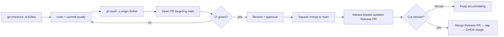
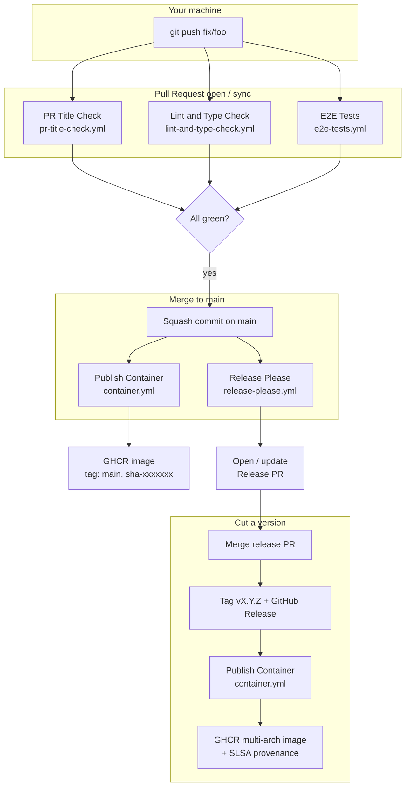

# Developer Workflow

This is the operational handbook for day-to-day work on Nango. It covers
the branching model, what you do locally, what GitHub does on your behalf
after you push, and a worked end-to-end bug-fix example.

For high-level contribution rules (code of conduct, when to open an
issue first, security disclosure), see
[`CONTRIBUTING.md`](../CONTRIBUTING.md). This document is the deeper
"how"; that file is the lighter "why".

---

## 1. Branching Model — GitHub Flow

Nango uses **GitHub Flow**: one long-lived trunk (`main`), short-lived
topic branches, squash-merge PRs.

| Branch                | Role                                                                         | Direct push? |
| --------------------- | ---------------------------------------------------------------------------- | ------------ |
| `main`                | Protected trunk. Always green, always releasable. Source of truth for tags and container images. | ❌           |
| `feat/<slug>`         | New feature                                                                  | ✅           |
| `fix/<slug>`          | Bug fix                                                                      | ✅           |
| `refactor/<slug>`     | Refactor with no behaviour change                                            | ✅           |
| `docs/<slug>`         | Docs-only change                                                             | ✅           |
| `chore/<slug>`        | Tooling, deps, build, CI                                                     | ✅           |

**Naming rules**

- All lowercase, kebab-case slug.
- Keep slugs short and intention-revealing: `fix/duplicate-event-on-reconnect`, not `fix/bug`.
- If the work is tied to an issue, prefix the slug with the number:
  `fix/1234-duplicate-event-on-reconnect`.

**Lifetime**

- Target: branch merged within **3 days** of creation.
- If a branch lives longer than a week, it should be split, not nursed.

---

## 2. The Loop at a Glance



Three rules to internalise:

1. **No direct commits to `main`.** Branch protection should enforce this.
2. **The PR title is the contract** — it becomes the squash-commit
   message on `main` and feeds `release-please`. It must be a valid
   Conventional Commit.
3. **CI failures stay on the topic branch.** A red `main` is an incident,
   not a routine.

---

## 3. Conventional Commits Cheat Sheet

The `PR Title Check` workflow enforces this format on the PR title.
Local commit messages are also validated by `commitlint` (via husky), but
they are squashed away on merge, so they matter less.

```
<type>(<optional-scope>): <lowercase subject>

[optional body]

[optional footer, e.g. BREAKING CHANGE: ..., Closes #123]
```

| Type        | Use for                            | Appears in changelog | Version bump |
| ----------- | ---------------------------------- | -------------------- | ------------ |
| `feat`      | New user-visible capability        | ✅ Features          | minor        |
| `fix`       | Bug fix                            | ✅ Bug Fixes         | patch        |
| `perf`      | Performance change, no API change  | ✅ Performance       | patch        |
| `refactor`  | Internal restructure, no behaviour | ✅ Refactoring       | patch        |
| `docs`      | Documentation only                 | ✅ Documentation     | patch        |
| `build`     | Build system / Docker / packaging  | ✅ Build             | patch        |
| `ci`        | CI config / GitHub Actions         | ✅ CI                | patch        |
| `chore`     | Repo housekeeping                  | hidden               | patch        |
| `style`     | Formatting only                    | hidden               | patch        |
| `test`      | Test-only change                   | hidden               | patch        |
| `revert`    | Revert a prior commit              | special              | depends      |

**Breaking change** — append `!` after the type or add a
`BREAKING CHANGE:` footer. Either bumps the **major** version.

Examples:

```
feat(skills): support zip import with 10MB cap
fix(runner): prevent duplicate event persistence on SSE reconnect
refactor(backends): extract bridge runtime kit
feat(api)!: rename /v1/agents to /v1/builtin-agents
```

---

## 4. The Local Side

1. **Start a topic branch**: Pull the latest `main` and branch off using the naming rules.
2. **Code and commit**: Local commits will be squashed, so commit often.
3. **Pre-PR checks**: Run `pnpm lint`, `pnpm check-types`, `pnpm test`, and optionally `pnpm test:e2e` locally.
4. **Stay current**: Rebase on `main` using `git fetch` and `git rebase` (avoid `git merge`).
5. **Open PR**: Push to origin and open a PR. Ensure the PR title follows Conventional Commits.

## 5. What Happens on GitHub After You Push

The moment you push or open a PR, several workflows in
`.github/workflows/` come alive. This is the whole machine in one
diagram:



### 5.1 PR-time workflows (gating)

| Workflow             | File                          | Trigger                       | Purpose                                                              |
| -------------------- | ----------------------------- | ----------------------------- | -------------------------------------------------------------------- |
| PR Title Check       | `pr-title-check.yml`          | PR opened / edited / synced   | Validates Conventional Commits format on the PR title.               |
| Lint and Type Check  | `lint-and-type-check.yml`     | PR targeting `main`           | `pnpm lint` + `pnpm check-types` + `pnpm test` (Vitest unit tests).  |
| E2E Tests            | `e2e-tests.yml`               | PR targeting `main`           | Boots Postgres 18, runs migrations, builds the app, runs Playwright. |

All three must be green before merge. Branch protection rules in
GitHub Settings make them **required status checks**.

### 5.2 Post-merge workflows (continuous)

| Workflow             | File                  | Trigger                                                       | Effect                                                                                                                                                              |
| -------------------- | --------------------- | ------------------------------------------------------------- | ------------------------------------------------------------------------------------------------------------------------------------------------------------------- |
| E2E Tests            | `e2e-tests.yml`       | `push` to `main` (regression run)                             | Same job as PR-time, catches any post-merge surprise.                                                                                                               |
| Release Please       | `release-please.yml`  | `push` to `main`                                              | Parses new Conventional Commits, maintains a long-lived `chore(main): release X.Y.Z` PR with version bump + CHANGELOG. Merging that PR tags + creates GitHub Release. |
| Publish Container    | `container.yml`       | `push` to `main` and `release` published                      | Builds `linux/amd64 + linux/arm64` images, pushes to `ghcr.io/<repo>` with appropriate tags, attaches SLSA build provenance.                                         |

### 5.3 Background workflows (housekeeping)

| What             | Where                  | Effect                                                                                              |
| ---------------- | ---------------------- | --------------------------------------------------------------------------------------------------- |
| Dependabot       | `.github/dependabot.yml` | Opens weekly PRs for `npm`, `github-actions`, and `docker` (Node base image) updates, with cooldowns and grouping. Majors are blocked globally — humans only. |
| Issue templates  | `.github/ISSUE_TEMPLATE/` | Drive the bug-report / feature-request forms.                                                       |
| PR template      | `.github/pull_request_template.md` | The skeleton you see when opening a PR.                                                              |

### 5.4 Container image tagging

The `container.yml` workflow uses `docker/metadata-action` to emit
multiple tags per build:

| Trigger                | Tags pushed to GHCR                                |
| ---------------------- | -------------------------------------------------- |
| Push to `main`         | `main`, `sha-<short-sha>`                          |
| Release `vX.Y.Z`       | `X.Y.Z`, `X.Y`, `X`, `latest`, `sha-<short-sha>`   |
| Manual `workflow_dispatch` | Branch / sha tags                              |

Consumers should pin to `X.Y.Z` or `X.Y` in production; `latest` is for
demos and local pulls only.

---

## 7. Special Situations & Pitfalls

- **Hotfixes**: Follow the normal flow. Do not use dedicated hotfix branches.
- **Reverts**: Use GitHub's revert PR feature. It follows the same flow.
- **Documentation**: Docs-only PRs skip heavy E2E and container builds but still run basic checks.
- **Branch Protection**: `main` requires a PR, approvals, linear history (squash/rebase), and passing CI checks.
- **Pitfalls**: Always `pull --ff-only` to avoid local merges. Use `push --force-with-lease` when rebasing. Do not manually edit `CHANGELOG.md` or create tags; `release-please` handles this. Keep PRs small.

## 10. One-Page Summary

```
Topic branch off main
  → small commits, push often
  → PR with conventional title, base = main
  → CI: pr-title-check + lint-and-type-check + e2e-tests
  → squash merge
  → main: release-please updates Release PR, container.yml ships sha-tagged image
  → merge Release PR
  → tag vX.Y.Z, GitHub Release, container.yml ships versioned + latest image with provenance
```

That's it. The whole pipeline lives in `.github/workflows/` and exists
to make this loop boring and fast.
