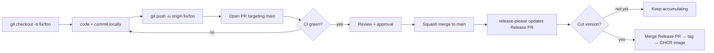
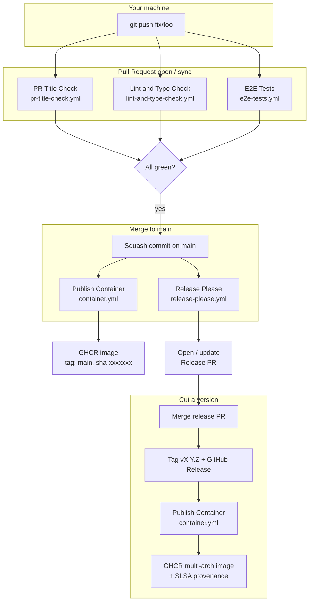
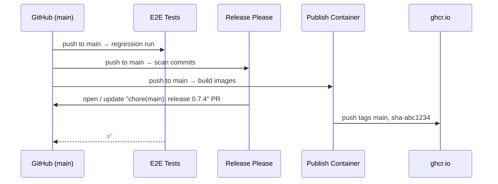
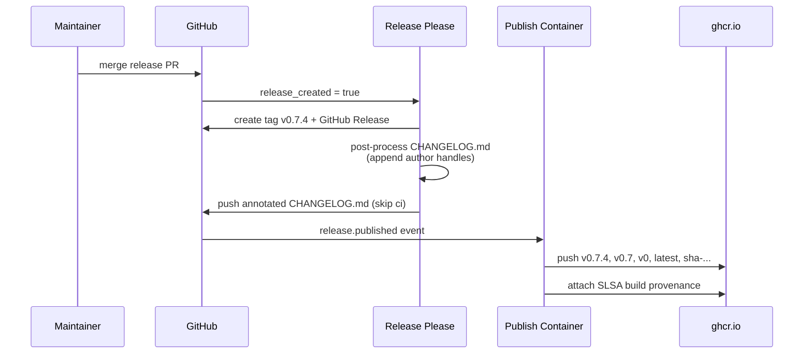

# Developer Workflow

This is the operational handbook for day-to-day work on Nango. It covers
the branching model, what you do locally, what GitHub does on your behalf
after you push, and a worked end-to-end bug-fix example.

For high-level contribution rules (code of conduct, when to open an
issue first, security disclosure), see
[`CONTRIBUTING.md`](../CONTRIBUTING.md). This document is the deeper
"how"; that file is the lighter "why".

---

## 1. Branching Model — GitHub Flow

Nango uses **GitHub Flow**: one long-lived trunk (`main`), short-lived
topic branches, squash-merge PRs.

| Branch                | Role                                                                         | Direct push? |
| --------------------- | ---------------------------------------------------------------------------- | ------------ |
| `main`                | Protected trunk. Always green, always releasable. Source of truth for tags and container images. | ❌           |
| `feat/<slug>`         | New feature                                                                  | ✅           |
| `fix/<slug>`          | Bug fix                                                                      | ✅           |
| `refactor/<slug>`     | Refactor with no behaviour change                                            | ✅           |
| `docs/<slug>`         | Docs-only change                                                             | ✅           |
| `chore/<slug>`        | Tooling, deps, build, CI                                                     | ✅           |

**Naming rules**

- All lowercase, kebab-case slug.
- Keep slugs short and intention-revealing: `fix/duplicate-event-on-reconnect`, not `fix/bug`.
- If the work is tied to an issue, prefix the slug with the number:
  `fix/1234-duplicate-event-on-reconnect`.

**Lifetime**

- Target: branch merged within **3 days** of creation.
- If a branch lives longer than a week, it should be split, not nursed.

---

## 2. The Loop at a Glance



Three rules to internalise:

1. **No direct commits to `main`.** Branch protection should enforce this.
2. **The PR title is the contract** — it becomes the squash-commit
   message on `main` and feeds `release-please`. It must be a valid
   Conventional Commit.
3. **CI failures stay on the topic branch.** A red `main` is an incident,
   not a routine.

---

## 3. Conventional Commits Cheat Sheet

The `PR Title Check` workflow enforces this format on the PR title.
Local commit messages are also validated by `commitlint` (via husky), but
they are squashed away on merge, so they matter less.

```
<type>(<optional-scope>): <lowercase subject>

[optional body]

[optional footer, e.g. BREAKING CHANGE: ..., Closes #123]
```

| Type        | Use for                            | Appears in changelog | Version bump |
| ----------- | ---------------------------------- | -------------------- | ------------ |
| `feat`      | New user-visible capability        | ✅ Features          | minor        |
| `fix`       | Bug fix                            | ✅ Bug Fixes         | patch        |
| `perf`      | Performance change, no API change  | ✅ Performance       | patch        |
| `refactor`  | Internal restructure, no behaviour | ✅ Refactoring       | patch        |
| `docs`      | Documentation only                 | ✅ Documentation     | patch        |
| `build`     | Build system / Docker / packaging  | ✅ Build             | patch        |
| `ci`        | CI config / GitHub Actions         | ✅ CI                | patch        |
| `chore`     | Repo housekeeping                  | hidden               | patch        |
| `style`     | Formatting only                    | hidden               | patch        |
| `test`      | Test-only change                   | hidden               | patch        |
| `revert`    | Revert a prior commit              | special              | depends      |

**Breaking change** — append `!` after the type or add a
`BREAKING CHANGE:` footer. Either bumps the **major** version.

Examples:

```
feat(skills): support zip import with 10MB cap
fix(runner): prevent duplicate event persistence on SSE reconnect
refactor(backends): extract bridge runtime kit
feat(api)!: rename /v1/agents to /v1/builtin-agents
```

---

## 4. The Local Side

### 4.1 Start a topic branch

```bash
git checkout main
git pull --ff-only
git checkout -b fix/duplicate-event-on-reconnect
```

`--ff-only` is intentional: if your local `main` has drifted, you want
to know immediately, not silently merge.

### 4.2 Code and commit freely

Local commits don't have to be pretty — they will be squashed. Commit
often, push early.

```bash
git add -A
git commit -m "wip: reproduce bug in unit test"
git commit -m "wip: dedupe by event_id"
git commit -m "fix lint"
```

### 4.3 Pre-PR checklist

The same checks run in CI; running them locally first avoids round
trips.

```bash
pnpm lint
pnpm check-types
pnpm test
pnpm test:e2e        # only if you touched UI or auth-affected code
```

### 4.4 Stay current with main

While your PR is open, `main` may move. Rebase, don't merge:

```bash
git fetch origin
git rebase origin/main
git push --force-with-lease
```

`--force-with-lease` (never `--force`) is the safe form: it refuses to
overwrite remote commits you haven't seen, which protects against
clobbering a co-reviewer's push to your branch.

### 4.5 Open the PR

```bash
git push -u origin fix/duplicate-event-on-reconnect
gh pr create --base main --fill
```

Or use the GitHub UI. Either way, the **PR title** must be a
Conventional Commit.

---

## 5. What Happens on GitHub After You Push

The moment you push or open a PR, several workflows in
`.github/workflows/` come alive. This is the whole machine in one
diagram:



### 5.1 PR-time workflows (gating)

| Workflow             | File                          | Trigger                       | Purpose                                                              |
| -------------------- | ----------------------------- | ----------------------------- | -------------------------------------------------------------------- |
| PR Title Check       | `pr-title-check.yml`          | PR opened / edited / synced   | Validates Conventional Commits format on the PR title.               |
| Lint and Type Check  | `lint-and-type-check.yml`     | PR targeting `main`           | `pnpm lint` + `pnpm check-types` + `pnpm test` (Vitest unit tests).  |
| E2E Tests            | `e2e-tests.yml`               | PR targeting `main`           | Boots Postgres 18, runs migrations, builds the app, runs Playwright. |

All three must be green before merge. Branch protection rules in
GitHub Settings make them **required status checks**.

### 5.2 Post-merge workflows (continuous)

| Workflow             | File                  | Trigger                                                       | Effect                                                                                                                                                              |
| -------------------- | --------------------- | ------------------------------------------------------------- | ------------------------------------------------------------------------------------------------------------------------------------------------------------------- |
| E2E Tests            | `e2e-tests.yml`       | `push` to `main` (regression run)                             | Same job as PR-time, catches any post-merge surprise.                                                                                                               |
| Release Please       | `release-please.yml`  | `push` to `main`                                              | Parses new Conventional Commits, maintains a long-lived `chore(main): release X.Y.Z` PR with version bump + CHANGELOG. Merging that PR tags + creates GitHub Release. |
| Publish Container    | `container.yml`       | `push` to `main` and `release` published                      | Builds `linux/amd64 + linux/arm64` images, pushes to `ghcr.io/<repo>` with appropriate tags, attaches SLSA build provenance.                                         |

### 5.3 Background workflows (housekeeping)

| What             | Where                  | Effect                                                                                              |
| ---------------- | ---------------------- | --------------------------------------------------------------------------------------------------- |
| Dependabot       | `.github/dependabot.yml` | Opens weekly PRs for `npm`, `github-actions`, and `docker` (Node base image) updates, with cooldowns and grouping. Majors are blocked globally — humans only. |
| Issue templates  | `.github/ISSUE_TEMPLATE/` | Drive the bug-report / feature-request forms.                                                       |
| PR template      | `.github/pull_request_template.md` | The skeleton you see when opening a PR.                                                              |

### 5.4 Container image tagging

The `container.yml` workflow uses `docker/metadata-action` to emit
multiple tags per build:

| Trigger                | Tags pushed to GHCR                                |
| ---------------------- | -------------------------------------------------- |
| Push to `main`         | `main`, `sha-<short-sha>`                          |
| Release `vX.Y.Z`       | `X.Y.Z`, `X.Y`, `X`, `latest`, `sha-<short-sha>`   |
| Manual `workflow_dispatch` | Branch / sha tags                              |

Consumers should pin to `X.Y.Z` or `X.Y` in production; `latest` is for
demos and local pulls only.

---

## 6. Worked Example — Fixing a Bug End to End

Scenario: a user reports that when an SSE connection drops mid-stream
and reconnects, the run timeline shows the same event twice. We will
take this from issue to released container image.

### 6.1 Reproduce locally

```bash
git checkout main
git pull --ff-only
git checkout -b fix/1234-duplicate-event-on-reconnect

pnpm docker:db
pnpm db:migrate
pnpm dev
```

Reproduce, isolate, add a failing unit test next to
`src/lib/runner/...`. The failing test is the contract for the fix.

### 6.2 Implement the fix

Smallest-possible upstream change: dedupe by `event_id` in the
persistence layer, not in the UI. Reference
[`docs/runner-events.md`](runner-events.md) for the event-pipeline
invariants.

```bash
git add -A
git commit -m "wip: dedupe events by event_id in persistEvents"
git commit -m "wip: extend test to cover reconnect after partial flush"
```

Run the local gates:

```bash
pnpm lint
pnpm check-types
pnpm test
```

### 6.3 Push and open the PR

```bash
git push -u origin fix/1234-duplicate-event-on-reconnect
gh pr create --base main \
  --title "fix(runner): dedupe events by event_id on SSE reconnect" \
  --body  "Closes #1234

  ## Root cause
  ...

  ## Fix
  ...

  ## Verification
  pnpm test src/lib/runner/persist.test.ts"
```

What happens on GitHub the moment the PR opens:

```mermaid
sequenceDiagram
    participant Dev as Developer
    participant GH as GitHub
    participant Title as PR Title Check
    participant Lint as Lint and Type Check
    participant E2E as E2E Tests

    Dev->>GH: open PR
    GH->>Title: dispatch (opened)
    GH->>Lint: dispatch (pull_request)
    GH->>E2E: dispatch (pull_request)
    Title-->>GH: ✅ title is conventional
    Lint-->>GH: ⏳ install → lint → types → unit
    E2E-->>GH: ⏳ install → playwright → pg → migrate → build → next start → test:e2e
    Lint-->>GH: ✅
    E2E-->>GH: ✅
    GH-->>Dev: all required checks green
```

### 6.4 Review and merge

After approval, click **Squash and merge**. The squash commit on `main`
inherits the PR title:

```
fix(runner): dedupe events by event_id on SSE reconnect (#NNN)

Closes #1234
...
```

Your branch is auto-deleted; locally:

```bash
git checkout main
git pull --ff-only
git branch -D fix/1234-duplicate-event-on-reconnect
```

### 6.5 What runs after the merge



At this point the fix is on `main` and there is a rolling image
`ghcr.io/<repo>:sha-abc1234` you can pull and verify in staging. The
release PR is queued but not yet merged.

### 6.6 Cut the version

When you (or another maintainer) are ready to release, you review and
merge the open release PR. It contains the proposed version
(`0.7.4` for a fix-only batch) and an auto-generated CHANGELOG section.



The fix is now available as `ghcr.io/<repo>:0.7.4` and `:latest`,
verified end to end, with a signed provenance attestation.

---

## 7. Special Situations

### 7.1 Hotfix

GitHub Flow has no dedicated hotfix branch — the regular flow is fast
enough:

```bash
git checkout -b fix/auth-bypass main
# fix, test, PR, merge → release-please → merge release PR
```

If `main` has accumulated unreleased changes that *cannot* ship with
the hotfix, that is a sign of a different problem (long-running PRs,
unreviewed work) — fix the process, not by inventing a branch.

### 7.2 Reverting a bad merge

```bash
gh pr revert <PR-number>
```

GitHub creates a revert PR. Same gating, same flow, same release-please
behaviour (a `revert:` commit is captured in the changelog).

### 7.3 Long-running work

If a feature genuinely cannot be merged in one PR:

- Land scaffolding behind a feature flag in small PRs.
- Keep the feature branch alive only as a coordination point; rebase
  often onto `main`.
- Never let it diverge for weeks.

### 7.4 Documentation-only PRs

`docs/**` and `**/*.md` are in `paths-ignore` for `container.yml` and
the post-merge `e2e-tests` push trigger, so they will **not** rebuild
the image or re-run regression e2e. They still go through `Lint and
Type Check` and `E2E Tests` at PR time, because PR triggers
intentionally have no `paths-ignore` (it would deadlock required
checks).

---

## 8. Required Branch Protection (`main`)

These rules make the whole model work. Configure them in
**Settings → Branches → Branch protection rules** for `main`:

- ✅ Require a pull request before merging
- ✅ Require approvals (≥ 1 for team work; 0 acceptable for solo)
- ✅ Dismiss stale approvals when new commits are pushed
- ✅ Require status checks to pass before merging:
  - `PR Title Check`
  - `Lint and Type Check`
  - `E2E Tests`
- ✅ Require branches to be up to date before merging
- ✅ Require linear history (forces squash or rebase merge)
- ✅ Do not allow bypassing the above settings
- ✅ Restrict who can push to matching branches (empty = nobody by direct push)
- ✅ Allow auto-merge (optional, useful for trivial dependabot PRs)
- ✅ Automatically delete head branches (Settings → General)

---

## 9. Common Pitfalls

- **Forgetting `--ff-only`** on `git pull` and silently creating merge
  commits in your local `main`. Always `--ff-only`.
- **`git push --force`** instead of `--force-with-lease`. Use the safe
  form.
- **Editing `CHANGELOG.md` by hand.** Don't. `release-please` owns it.
- **Manually creating git tags.** Don't. `release-please` owns them.
- **Big PRs.** Anything over ~400 lines of diff should be split.
- **`[WIP]` in the PR title.** Use a GitHub **Draft PR** instead — the
  title check will reject `[WIP]` prefixes.
- **Merging without rebasing.** If "Update branch" is offered, prefer
  local rebase + force-with-lease over the merge-commit button so the
  squashed commit on `main` stays clean.

---

## 10. One-Page Summary

```
Topic branch off main
  → small commits, push often
  → PR with conventional title, base = main
  → CI: pr-title-check + lint-and-type-check + e2e-tests
  → squash merge
  → main: release-please updates Release PR, container.yml ships sha-tagged image
  → merge Release PR
  → tag vX.Y.Z, GitHub Release, container.yml ships versioned + latest image with provenance
```

That's it. The whole pipeline lives in `.github/workflows/` and exists
to make this loop boring and fast.
