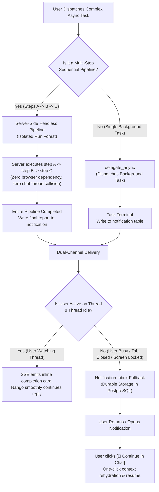

# Nango Orchestrator (`南瓜`) — Design Plan

Status: **In progress** — P0, P1, P2 complete; P3 partially complete
(13 done, 14–15 pending); P4 pending.

This document started life as a design discussion held on 2026-04-30
and has been kept in sync with the implementation as each phase
landed. Sections still labelled "(proposed)" are unimplemented or
forward-looking.

Runtime boundary (v1): the orchestrator runs in Nango's
**single-instance** app process. Do not enable automatic
multi-replica scaling for this runtime. Heavy / distributed work
should be delegated to backend agent platforms; built-in agents are a
lightweight orchestration complement. Positioning is
**single-node multi-tenant** for personal and small-team usage; tenant
isolation and lifecycle capabilities will continue to evolve.

---

## 1. Vision

Set up a single **super agent** ("`南瓜` / Nango") as the user's default entry point. It owns four responsibilities:
1. **Intent recognition**
2. **Routing**
3. **Tracking**
4. **Reporting**

Nango acts as a bridge. We chose **tool-call delegation** as the primary pattern (rather than full Swarm-style handoff) to preserve persona continuity, allow natural verification, and support heterogeneous backends via AG-UI.

## 2. Core Architectural Lift: Task / Run as a First-Class Citizen

Every act of "let agent X do thing Y" — whether synchronous, background, or
scheduled — is materialised as a **`entity_run` row** and dispatched by a
single **`Runner`**. Different orchestration modes only differ in
*how the run is created* and *how its result is consumed*.

This mirrors Temporal / LangGraph / Inngest / Agno Workflows.

### Data model

**`entity_run` Table (All modes share this table)**

| Field | Description |
|---|---|
| `id`, `parentRunId` | Unique ID, and parent for fan-out / debate |
| `threadId` | User-facing conversation thread |
| `initiator` | `user` \| `orchestrator` \| `schedule` \| `system` |
| `entityId`, `entityKind`, `entitySource` | Agent identity (`builtin` or `backend`) |
| `mode` | `sync` \| `async` \| `scheduled` |
| `status` | `queued` \| `running` \| `awaiting_input` \| `paused` \| `succeeded` \| `failed` \| `cancelled` |

**`entity_run_event` Table (Append-only stream)**

| Field | Description |
|---|---|
| `runId`, `seq`, `type`, `payload`, `ts` | Types include `started`, `message`, `tool_call_chunk`, `tool_call_result`, `final`, `error`. |

*Note: AG-UI streams are buffered and persisted as single coalesced rows at natural boundaries, rather than per-token.*

**`schedule` Table (Triggers)**

| Field | Description |
|---|---|
| `intervalValue`, `intervalUnit` | Unit ∈ `minute\|hour\|day\|week\|month`. Null for one-shot. |
| `startAt`, `endAt` | Trigger boundaries |

### Unified Runner (shipped API)

```ts
interface Runner {
  runChatRequest(request: Request, input: StartRunInput): Promise<Response>;
  runBuiltinChatRequest(
    request: Request,
    args: RunBuiltinChatRequestArgs,
  ): Promise<Response>;
  start(input: StartRunInput): Promise<ProgrammaticRunResult>;
}
```

`await(runId)`, `cancel(runId)`, and `status(runId)` were part of the
early proposal but are **not** in the current v1 Runner contract. Real-time
terminal updates are surfaced through `/api/runs/stream` SSE +
`notification` rows; run state is read from `entity_run`.

There is exactly **one** Runner implementation. Internally it dispatches by
`entitySource`:

- `backend` → call the platform's `IBackendChatHandler.buildAgent()` to
  get an `AbstractAgent`, wrap with a `PersistingAgent` decorator that
  tees AG-UI events into `entity_run_event`, plug into the AG-UI runtime.
- `builtin` → (P0 step 4) call the in-process CopilotRuntime via
  `agentPool.get(id)`, same persistence wrapper.

`entityKind` (agent / team / workflow) drives upstream URL choice
*inside* the per-platform handler (e.g. agno's `/agents/{id}/runs` vs
`/teams/{id}/runs`); the Runner itself doesn't branch on kind.

All consumers (sync wait, async notification stream, scheduled trigger,
debate coordinator) work against the same Runner API.

### CopilotKit's Role: Protocol Adapter, Not Dispatch Engine

> **Principle.** CopilotKit is Nango's *presentation + protocol layer*. It is **not** the dispatch engine or the source of truth for agent state. All agent invocations and run lifecycles go through Nango's `runner.start(...)`.

We deliberately use CopilotKit strictly for HTTP/SSE adaptation at the edge. Routing Nango's server-side multi-agent orchestrator through CopilotKit's core map would conflict with headless tasks (cron/async), eager-loading performance constraints, and observability needs.

#### The boundary in concrete terms

| Concern | Owner |
|---|---|
| Chat HTTP/SSE protocol & AG-UI schema | **CopilotKit runtime / client** |
| Inner agent execution & API wrappers | **Bridge agents (Nango)** + **BuiltInAgent** |
| Event persistence & Run lifecycle | **Nango `PersistingAgent` + `entity_run`** |
| Supervisor / Scheduled / Async dispatch | **Nango `runner.start(...)`** |

## 3. Mode Registry (Open–Closed)

```ts
interface OrchestrationMode {
  id: string;                                  // "tool-call" | "handoff" | "auto" | ...
  label: string;
  description: string;
  applicability(ctx): boolean;                 // gate by context (e.g. ≥2 agents for debate)
  initiate(ctx, userMsg): Promise<ModeOutcome>;
}
```

The user-facing mode switch in the chat input is a **render of the
registry**. Adding a new mode = registering one item; the UI requires no
code change.

### Shipped modes (`lib/orchestration/modes.ts`)

The mode the user picks in the chat input drives a `promptDirective`
appended to the supervisor's system prompt at dispatch time. `auto`
is the default — the supervisor decides between delegating, handing
off, or going async based on the prompt SOP.

| Mode          | How a Task is created                                                                 | How it's consumed                                              | Nango's role            |
| ------------- | ------------------------------------------------------------------------------------- | -------------------------------------------------------------- | ----------------------- |
| **auto**      | Supervisor chooses tool-call / handoff / async per the prompt SOP                     | (see chosen sub-mode)                                          | dictated by SOP         |
| **tool-call** | `delegate_to_agent` tool → `runner.start({mode: "sync"})`                             | LLM awaits final event; result feeds back into the chat        | always present          |
| **handoff**   | **Frontend tool** `switch_agent_with_context` (registered via `useFrontendTool` in `hooks/useHandoff.ts`): mutates the workspace store → `<CopilotKitProvider>` remounts on the target agent (its `key={copilotKey}` includes `agentId`; see `docs/copilotkit-provider-lifecycle.md`) → `useInjectHandoffContext` primes the new thread with `contextSummary` and dispatches a run | Target agent takes over the conversation directly              | exits, recall available |
| **async**     | `delegate_async` tool → `runner.start({mode: "async"})` returns `runId` immediately   | Notification tray + SSE; user gets a bell entry on completion  | dispatches & broadcasts |

`scheduled` and `debate` are not user-selectable modes — they are
separate machinery driven by the supervisor's tool surface
(`create_schedule`) and by P3.14 (pending) respectively. Each
fires through `runner.start` like any other run.

> **Note**: `handoff` is *not* a Swarm-style runtime control transfer.
> It is a **UI-level agent switch with context transcription**. This
> avoids cross-protocol handoff complexity.

---

## 4. Long-Running Tasks & Notifications (shipped)

When `mode = async`:

1. `runner.start({ mode: "async" })` returns a `RunHandle` immediately
   (`{ runId, status: "running" }`); the run executes in the same Node
   process via the existing `PersistingAgent` subscription path.
2. The runner publishes events to an in-process `EventBus`
   (`lib/runner/event-bus.ts`, keyed by `ownerId` and held on
   `globalThis` so HMR doesn't fragment subscribers).
3. The browser subscribes via SSE (`/api/runs/stream`) to receive
   `notification` and `run_finalized` frames in real time. Each
   `notification` frame ships with `id: <notification.id>` (UUIDv7),
   so EventSource auto-reconnect uses `Last-Event-ID` to resume; the
   handler runs `WHERE owner_id = $u AND id > $lastId ORDER BY id
   LIMIT 200` against the `notification` table and de-duplicates
   live-during-replay events by id before switching back to live.
   `run_finalized` carries no `id:` because it has no durable copy —
   the matching `notification` row is what survives a brief gap.
   Multi-tab sync is achieved with a
   `BroadcastChannel("nango.notifications")`.
4. On terminal events the runner inserts a `notification` row
   (kind = `run_completed | run_failed`) and broadcasts it. The bell
   dropdown caps at 6 rows; the full `/notifications` page is the
   long-form inbox.
5. At Next.js boot, `recordProcessBoot()` writes one row to
   `process_boot` capturing `started_at`, then
   `recoverStrandedRuns(boot.startedAt)` (in `instrumentation.ts`)
   flips any `running` run with `started_at < boot.startedAt` to
   `failed` and emits a `run_failed` notification — those rows are
   by definition zombies left by a prior process. Users see the
   notification within seconds of redeploy instead of waiting an
   hour for the previous coarse heuristic to trigger.

> Nango holds **only the `runId`** in the main conversation context — never
> the run's intermediate output — so long tasks do not bloat the session.

---

## 5. Scheduling (shipped)

A single in-process `setTimeout`-based scheduler covers all backends
uniformly. The user-facing trigger spec is intentionally cron-free —
`(startAt, [intervalValue, intervalUnit], [endAt])` where unit is one
of `minute | hour | day | week | month`. Three valid shapes:

| `startAt` | `interval` | `endAt` | meaning              |
|-----------|------------|---------|----------------------|
| ✓         | —          | —       | one-shot             |
| ✓         | ✓          | —       | recurring, no end    |
| ✓         | ✓          | ✓       | recurring, bounded   |

Why not cron / agno-native:

- The trigger spec users want to express ("every 7 minutes", "every
  2 weeks", "every 6 months at 09:00 EDT") is straightforward to
  compute with a `setTimeout` walk over a calendar but awkward to
  shoehorn into 5-field cron.
- Wrapping per-platform schedulers (agno native + cron fallback)
  doubles the failure surface and forces UI to either lowest-common-
  denominator or expose platform leakage. Single in-process scheduler
  + `runner.start({ mode: "async", initiator: "schedule" })` keeps
  every fire on the same code path as user-initiated async
  delegation, so scheduled runs land in the notification inbox for
  free.

Implementation: `lib/runner/scheduler.ts`. State is held in a
`globalThis` slot (HMR-safe) — one `setTimeout` per enabled `schedule`
row. Boot-time `bootstrapScheduler()` (called from
`instrumentation.ts`) re-arms every enabled row. No retries: a
failure records `lastError` and the next tick is independent.

Surface:

- REST: `/api/schedules` (list/create), `/api/schedules/[id]`
  (patch/delete), `/api/schedules/[id]/trigger` (manual fire).
- Supervisor tools: `create_schedule`, `list_schedules`,
  `update_schedule`, `delete_schedule`. `update_schedule` is partial
  and stricter than the REST PATCH route — a `startAt` in the past
  is rejected so the LLM can't backfill. `delete_schedule` is
  hard-delete; pause-without-delete is `update_schedule({enabled:
  false})`.
- UI: left `Schedules` panel (list-only) + `/schedule/[id]` editor.

---

## 6. Discussion / Debate Mode (proposed — P3.14 / P3.15 pending)

Powered by the same Task model:

- Parent run: a debate-coordinator agent (separate built-in role).
- Each round fans out child runs (`runner.start` in parallel).
- Coordinator reads each child's `final_summary`, decides next speaker /
  termination, modelled on **AutoGen GroupChatManager** + **CrewAI
  hierarchical process**.
- UI: a roundtable view rendering the parent run + its children.

The recursion-depth limit (§8.1) and the `parent_run_id` chain
already in place are sufficient for the parent / fan-out shape; the
gating work is the coordinator built-in role plus the roundtable
component, both still pending.

---

## 7. Future work

Everything described in §1–§6 has shipped. The list below is the
remaining backlog.

### Multi-Agent Collaboration

- **Debate / discussion coordinator** — multi-specialist back-and-forth
  with a structured turn protocol, on top of the existing parent-child
  run forest.
- **Roundtable UI** — surface the multi-specialist forest as a single
  visual instead of nested task cards.

### Governance

- **Quotas / rate limits / cost tracking.** CopilotKit's
  `BuiltInAgent` currently swallows the AI SDK `usage` field, so
  token counts require either a fork or per-platform bridges (Dify
  already exposes usage). Wall-clock timing (TTFT, duration,
  inter-event gaps) is already captured authoritatively on
  `entity_run` + `entity_run_event` and surfaced by
  `/admin/thread/[id]`; a dedicated performance view on top of that
  data is future work.
- **Run replay** — re-render an `entity_run` from its
  `entity_run_event` timeline (debug + audit).
- **Working memory across runs** — Nango remembering prior
  delegations. See `docs/memory-architecture.md`; deferred
  pending product signal.

---

## 8. Hard invariants

1. **Recursion depth** — `parentRunId` chain limited to 3. Orchestrator
   delegating to another orchestrator → reject.
2. **Cancellation** — main chat cancellation cascades to child runs in
   `queued` / `running` state via `AbortSignal` plumbed through to
   backend handlers.
3. **Ownership** — `entity_run.ownerId` is mandatory; all APIs must filter
   by it. Async run visibility = run owner, **not** agent owner.
4. **Retries** — Runner does **not** auto-retry (avoids re-firing
   side-effecting tools). Nango's SOP decides whether to retry / switch
   agent.
5. **Event retention** — target horizon for `entity_run_event` is
   ~7 days; the durable summary survives in `entity_run.outputSummary`.
   The actual cleanup job is not yet shipped — see
   `docs/runner-events.md` §10 (open questions). When implemented it
   should also drop matching `notification` rows whose `run_id` no
   longer resolves.

---

## 9. Chat History — Replay From `entity_run_event`

The orchestration kernel and the user-facing chat history are the
**same** tables. Built-in and backend agents share one PG-side
history source (no per-platform `/sessions` reverse-proxy any more).

Endpoints (all owner-scoped via `eq(entityRun.ownerId,
session.user.id)`):

| Endpoint | Behaviour |
|---|---|
| `GET /api/threads` | List the user's threads (one row per `thread_id`), most-recent first. Optional `?entityId=` filter. |
| `GET /api/threads/[id]/messages` | Reconstruct AG-UI `Message[]` from `entity_run.input_task` (user turns) + `entity_run_event` (assistant / reasoning / tool turns). |
| `DELETE /api/threads/[id]` | Recursive CTE walks the run forest and removes top-level + delegated sub-runs together. |

Sub-runs from supervisor delegation are **excluded** from these
reads (`parent_run_id IS NULL`) — the user-facing chat surface stays
uncluttered while admins still see the full forest at
`/admin/thread/[id]`. Client hydration on page load goes through
`useThreadHydration`, which calls `agent.setMessages(...)` on the
`<CopilotChat>` component's first mount per `(agentId, threadId)` so
refresh / history-click resumes mid-conversation.

The full event-to-`Message[]` projection (including how
`tool_call_chunk` / `tool_call_result` rows compose into AG-UI tool
calls, and which AG-UI events are coalesced vs dropped on the way
in) lives in `docs/runner-events.md` §6.

---

## 10. Implementation Details

- **Polymorphism**: If `credentialId` is present, it's a backend entity; if absent, it's builtin.
- **Custom HTTP Headers**: The system strictly uses two custom headers for routing because they represent user choices the server cannot derive:
  - `X-Credential-Id`: Identifies the backend.
  - `X-Orchestration-Mode`: Carries the user's transient session preference (`auto`, `tool-call`, etc.).
- **Boot Recovery**: A single `process_boot` row anchors the server epoch. Any `running` run older than the boot timestamp is immediately flipped to `failed` to recover stranded runs.

---

## 11. Known Open Issue: Asynchronous Continuation & Post-Task Orchestration (Pending / Proposed)

Status: **Pending / Unimplemented (Identified Architectural Gap — Scheduled for Future Enhancement)**

### 11.1 Problem Statement
Currently, `delegate_async` operates as a **"Fire and Notify User"** pattern rather than an **autonomous feedback loop**. When the Supervisor dispatches an async run (`mode: "async"`):
1. The tool returns `{ ok: true, runId }` immediately.
2. The Supervisor concludes its turn with a message like *"I have started the task in the background, you'll be notified when done."*
3. The HTTP connection closes, ending the active conversational turn.
4. When the background task reaches a terminal state (`run_completed`), `runner.ts` inserts a row into `notification` and emits an SSE frame to the browser bell icon.

**The Architectural Gap**: The Supervisor is **never re-awakened**. If a user request requires a sequential multi-step autonomous pipeline (e.g. *"First crawl 50 sites in the background, and once done, analyze the results and produce report B"*), the Supervisor cannot automatically retrieve the output and continue. The workflow dead-ends at the user's notification bell, requiring the human to manually read the notification, paste the result back into the chat, and prompt Nango to proceed.

---

### 11.2 Candidate Solutions & Inherent Challenges

#### Scheme 1: Server-Side Autonomous Continuation (Server Loop)
- **Concept**: In `runner.ts` `complete` callback, when `input.initiator === "orchestrator"`, the server automatically starts a new programmatic run (`mode: "sync", initiator: "system"`) against the original `threadId`, injecting the completed output as a system continuation message.
- **Inherent Challenges**:
  1. **Concurrent Thread Mutation (Race Conditions)**: If the user is actively chatting with Nango or generating tokens when the background task finishes, two generation streams collide in the same thread.
  2. **Context Divergence / Interruption**: If the user has already moved on to a completely different conversation topic, an unexpected background result violently interrupts the active context.
- **Engineering Mitigations**:
  - **Thread-Level Mailbox / Mutex Lock**: If `entity_run.status === "running"` for that `threadId`, queue the completion in a pending mailbox. When the active turn ends, Nango drains the mailbox (*"By the way, your background analysis task also just finished..."*).
  - **Headless Pipeline (Isolated Sub-Threads)**: Multi-step composite workflows execute within an isolated backend orchestration context, completely decoupled from the interactive chat thread, producing only a single final outcome.

#### Scheme 2: Client-Side Reactive Wakeup (UI-Driven Callback)
- **Concept**: The browser SSE listener (`/api/runs/stream`) receives `run_completed`. If the user is currently on the conversation thread, the UI automatically dispatches a continuation turn injecting the background result.
- **Inherent Challenges**:
  1. **Ephemeral Browser Lifecycle**: Browsers are not persistent daemons. If the user closes the tab, locks the screen, puts the laptop to sleep, or switches away, the JavaScript event loop and SSE connection are suspended or killed. Client-side wakeup fails to fire.
- **Engineering Mitigations**:
  - **Durable State + "Continue in Chat" Action**: The background result is permanently saved in the database. When the user returns and views the notification, the notification card features an interactive **[💬 Continue in Chat]** action button. Clicking it navigates to the thread, hydrates the result into the chat input/context, and prompts Nango to resume.
  - **Visibility Reconnection Replay**: On `visibilitychange` or SSE reconnection, the client inspects pending unread notifications and prompts the user to resume.

---

### 11.3 The Ultimate Target Architecture: Dual-Loop Orchestration (Proposed)



1. **Headless Execution for Multi-Step Pipelines**: Chained multi-agent jobs run in an isolated server-side forest without relying on or colliding with the active chat UI.
2. **Thread Mailbox for Active Sessions**: When the user is present and the thread is idle, live inline continuation smoothly resumes.
3. **Durable Inbox Action for Offline Users**: Safe, deterministic resumption via an interactive "Continue in Chat" button on notifications.

*Note: This architecture is documented here as an approved design guideline for the next dedicated iteration on the orchestration kernel.*
