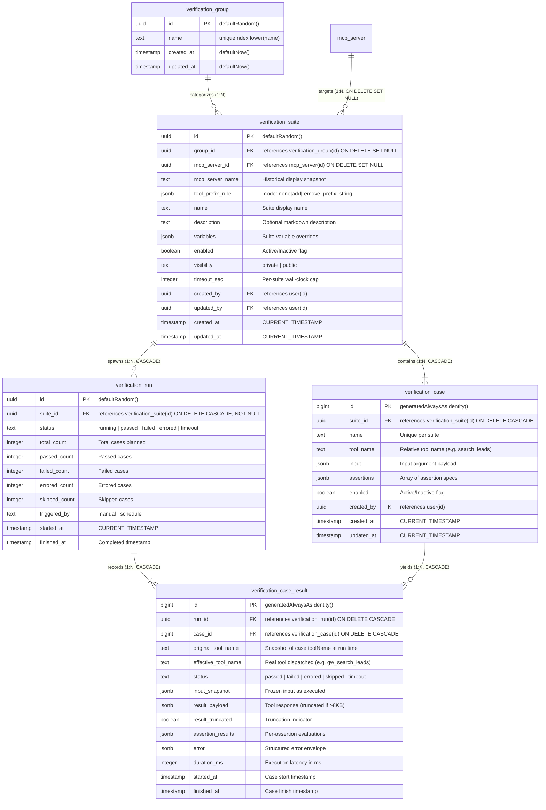

# Verification 子系统架构重构与能力升级技术方案（全面重构评审终版）

> **文档定位**：本文档为 Nango 平台 MCP 验证子系统（Verification Subsystem）全面架构升级与深度重构的最终技术规范标准，整合了多轮深度评审（包括 DS 架构评审的最新反馈）与用户核心业务定案，用于统领从数据库 Schema、底层存储、执行内核、前缀引擎、API 契约到前端交互的全栈研发落地。

---

## 1. 重构背景、核心痛点与战略目标

### 1.1 业务背景与现有架构的五大核心痛点

1. **Tool 命名在“直连”与“网关”多环境间的漂移断层**：
   - 现存 MCP 测试用例强绑定 MCP Server 导出的原始工具名称（如 `search_leads`）；
   - 当系统接入 MCP Gateway 或聚合网关时，网关往往为工具统一追加命名前缀（如 `crm_search_leads`），反之亦然。这导致同一套高质量测试用例在“直连测试”和“网关测试”之间无法复用，造成资产割裂和维护成本翻倍。
2. **组织架构由“物理服务器驱动”向“业务编排驱动”演进**：
   - 原有层级为 `Server -> Suite -> Case`，Suite 被物理限制在单一 MCP Server 节点下，无法按业务域（如“CRM 核心链路”、“订单中心”）跨 Server 组织套件，左侧侧边栏按 Server 罗列，无法反映业务全貌；
   - 亟需升级为 `Group -> Suite -> Case` 层级，以业务分组（Group）作为顶层组织单元，一个 Group 聚合多个 Suite，各 Suite 自由绑定所需 MCP Server，并支持全组一键并发回归测试。
3. **MCP Server 绑定过于僵化与失效死锁**：
   - 原有设计中 Suite 一旦创建，禁止改绑 MCP Server；
   - 一旦绑定的底层物理 MCP Server 在系统中被删除，数据库外键级联置空导致 Suite 变为“坏死不可用”状态，无法运行也无法拯救。
4. **历史包袱、死字段与冗余技术债堆积**：
   - 早期设计的 Server Run 与未落地的旧 Workflow V2 设想在数据库表（`verification_run`、`verification_suite`、`verification_case_result`）中残留了大量废弃死字段（`mcpServerId`、`workflowId`、`entityRunId`）、死约束（XOR CHECK）与死索引，且代码层存在未清理的无效逻辑。
5. **权限与越权执行安全隐患（F6 家族漏洞）**：
   - 早期 Server Run 存在越权执行他人私有用例的 F6 漏洞；在 Group 升级为团队共享目录后，若底层查询在 `viewer` 传参或过滤逻辑上存在松动，极易重演“普通用户触发 Group Run 越权执行他人私有 Suite”的重大安全隐患。

---

### 1.2 重构战略目标与收益

| 维度 | 重构前（现状） | 重构后（目标） | 架构收益 |
| :--- | :--- | :--- | :--- |
| **组织拓扑** | `Server -> Suite -> Case` 物理绑定 | `Group -> Suite -> Case` 业务编排 | 业务视角驱动，支持跨 Server 套件编排与一键整组回归。 |
| **资产解耦** | Suite 终身绑死 Server，被删即报废 | 随时自由改绑，删除保留快照，弹窗引导自愈 | 测试资产永久存续，提升系统高容错性与健壮度。 |
| **工具适配** | 仅支持硬编码绝对工具名 | Suite 级前缀转换引擎（`none/add/remove`） | 直连与网关无缝切换，用例资产 100% 跨环境复用。 |
| **回放保真** | 历史回放仅读 Case 当前名，前缀或用例编辑后失真 | `case_result` 沉淀 `originalToolName` + `effectiveToolName` 双快照 | 审计证据链 100% 自包含，用例编辑绝不污染历史。 |
| **执行编排** | 前端无批量运行能力，旧 Server Run 笨拙 | 后端原生 `startGroupRun` 并发调度 + Bell 单条聚合通知 | 毫秒级 HTTP 响应，杜绝通知轰炸，状态精准收敛。 |
| **安全隔离** | `viewer?` 可选传参，存在漏传越权后门 | `viewer: VerificationViewer` 强类型必填，强制 `visibilitySql` | 利用 TypeScript 编译器在编译期物理级封死 F6 越权。 |
| **技术债清账**| 散落 6 处死字段、死索引与死接口 | 存量数据 TRUNCATE 清空，全栈地毯式彻底清理 | 架构纯净无历史包袱，代码库清晰可维护。 |

---

## 2. 架构约定与关键决策纪要

### 2.1 核心决策对照矩阵

| 决策维度 | 核心技术定案 | 论证与初衷 |
| :--- | :--- | :--- |
| **数据迁移策略** | **存量验证数据直接清空（TRUNCATE）** | 针对 4 张测试业务表清空；严格排除 better-auth 表；零成本彻底清理历史废弃字段与冗余约束。 |
| **Group 表形态** | **独立极简表（`verification_group`）** | 仅保留 `id(uuid), name(unique lower), createdAt, updatedAt`。彻底排除所有者和业务字段，团队共享受控字典。 |
| **Group 唯一性** | **全局忽略大小写唯一（Case-Insensitive）** | 数据库底层 `uniqueIndex on lower(name)` 强制约束，CRM 与 crm 视为同组，彻底杜绝分裂。 |
| **Group 生命周期** | **零创建、零删除、零成员隐藏、撞名无感复用** | 随 Suite 保存原子 upsert；UI 无创建/删除入口；无 suite 自动隐藏；改名撞空组事务内自动划转复用，不报 409。 |
| **Suite 唯一索引** | **同用户全局唯一：`(name, createdBy)`（方案 1）** | 彻底根除 `(groupId, name, createdBy)` 中 `groupId IS NULL` 导致的 Ungrouped 重名穿透硬伤；无 NULL 边界漏洞。 |
| **工具相对命名** | **Case 存相对名，Suite 存转换规则** | `case.toolName` 保持纯粹业务名（如 `search_leads`）；环境差异由 Suite 的 `toolPrefixRule` 动态抹平。 |
| **回放双快照保真**| **`case_result` 存储 `originalToolName` + `effectiveToolName`** | 冻结执行当下原名与转换后真实调用的工具名；即使 Case 事后被修改，历史回放与审计证据链依然 100% 保真。 |
| **批量执行编排** | **后端实现 `startGroupRun`，复用 `startSuiteRun`** | 前端单次 POST 触发；后端并发驱动底层套件循环，复用成熟的执行核，不另造循环轮子。 |
| **通知聚合契约** | **Group 汇总通知多 Run 聚一，`runId: null`** | `startSuiteRun` 增加 `suppressNotification` 与 `onFinish`；全组收敛发送单条 Bell 通知（`runId: null`，点击跳 `/verification`）。 |
| **安全类型不变性**| **`viewer: VerificationViewer` 强类型必填** | 移除 `?` 修饰符；底层无脑执行 `if (!viewer.isAdmin)` 强制挂载 `visibilitySql`，编译期禁止漏传。 |
| **单 Case 调试定位**| **单 Case 调试运行内存执行、不落库** | 定位为轻量交互式调试（Ephemeral Debugging），追求 <50ms 极速反馈，不制造海量无用 DB 历史碎片。 |
| **Group 级历史取舍**| **不增设 `group_run` 聚合历史表** | Suite 是唯一聚合根与历史归宿，Group 是动态分类编排域；全组历史翻通知，套件明细看详情，极简低负担。 |

---

### 2.2 六项架构设计基本原则

1. **原则一：DDD 聚合根清晰收敛原则（Suite as Aggregate Root）**
   - **Suite 是唯一的聚合根**：负责绑定执行环境（MCP Server）、配置前缀规则、限定超时与可见性，并作为唯一的运行历史记录主体。
   - **Group 仅为逻辑编排目录（Catalog）**：无业务属性、无个人所有权，随用随生，空则隐退。
   - **Case 为从属实体（Child Entity）**：无独立 URL，完全隶属于 Suite，声明相对测试用例规范。
2. **原则二：唯一调度源原则（Single Source of Orchestration）**
   - 坚决不在前端做循环调度，也坚决不在后端另造一套套件执行循环。所有的执行核心全部收敛至后端 `run-orchestrator.ts` 的 `startSuiteRun`，`startGroupRun` 仅作为轻量级并发包装器。
3. **原则三：安全零妥协与静态类型不变性（Zero Security Regression）**
   - 团队共享资源绝不能突破用户数据隔离红线。Group 虽跨用户共享，但底层执行查询必须坚决执行 `visibilitySql` 过滤。通过 TypeScript 强类型必填参数（`viewer: VerificationViewer`），在编译期筑起安全防波堤。
4. **原则四：优雅降级与自愈原则（Polite UX & Self-healing）**
   - 外部依赖（MCP Server）失效或被删除属于常态。系统在表结构层面通过 `SET NULL` 保留数据快照，在左侧栏静默灰显保护，在编辑弹窗醒目引导重绑，确保系统在异常依赖下始终自愈可用。
5. **原则五：历史不可篡改与全自包含原则（Faithful & Self-contained Audit Trail）**
   - 任何涉及运行时的动态转换（前缀增减、变量替换），必须在执行落库时将“原工具名快照（`originalToolName`）”与“实际生效工具名（`effectiveToolName`）”完整持久化。历史查看必须还原当时真实执行现场，严禁受事后 Case 编辑或规则修改的污染。
6. **原则六：彻底清理与纯净架构原则（Clean Slate & Zero Debt）**
   - 借由存量数据清空的契机，明确 Verification 子系统专属定位于 MCP Tool 自动化测试，不再支持 Workflow。彻底删除历史废弃的 Server Run 和旧 Workflow 遗留，从表结构、外键、约束、索引到 API 和前端代码，彻底移除 `category` 列、`workflowId` 列、`export type VerificationSuiteCategory` 及所有残留的废弃逻辑。

---

## 3. 全链路系统架构与数据模型重构

### 3.1 领域模型与实体关系图（ER Diagram）



---

### 3.2 深度论证：Suite 唯一索引与 Group 独立表

#### 1. 唯一索引决议：为什么坚决采用 `(name, createdBy)`（方案 1）？
- **硬伤分析（DS 审查指出的致命缺陷）**：
  - 若采用 `(groupId, name, createdBy)`，由于 `suite.groupId` 允许为 `NULL`（代表 Ungrouped 未分组套件）；
  - 在 PostgreSQL 默认机制中，`NULL` 被判定为彼此互不相等（`NULL != NULL`）。因此 `(NULL, "login_test", userA)` 与 `(NULL, "login_test", userA)` 能够并存无限制插入，**导致未分组下的同名套件无限重复，索引形同虚设**！
  - 若为了弥补这一缺陷而引入多颗 Partial Index（`WHERE groupId IS NULL`），不仅复杂度陡增，而且打破了“同一个用户不应持有同名套件”的清晰心智模型。
- **方案 1 裁定**：
  ```ts
  uniqueIndex("verification_suite_user_name_idx").on(t.name, t.createdBy)
  ```
  - 同一用户下的 Suite 名称全局唯一；
  - **形式化补丁（DDL 级强约束）**：在 DDL 中将 `createdBy`（以及 `updatedBy`）显式声明为 `.notNull()`，使 `(name, createdBy)` 在数据库内核层面 100% 免疫 NULL 穿透，数据完整性完全由数据库约束保证，绝不依赖脆弱的应用层业务约定；
  - 一颗索引，零 NULL 边界陷阱，无论 Suite 在哪个组还是未分组，或者在组间移动划转，均无冲突风险，干净健壮！

#### 2. 独立 Group 表的不可替代性：
- “Group 全局忽略大小写唯一、拒绝重名”在数据库层只能由独立表上的 `uniqueIndex("verification_group_lower_name_idx").on(sql`lower(${t.name})`)` 保证。
- 改名仅改 Group 单行 O(1)，API 拥有稳定 UUID 句柄（`groupId`），坚决不走扁平字段。

---

### 3.3 数据库五张表终态定义（DDL 精确规范）

在 `src/lib/db/schema.ts` 中的具体落地定义如下：

#### 1. `VerificationGroupTable`（新增极简受控表）
```ts
export const VerificationGroupTable = pgTable(
  "verification_group",
  {
    id: uuid("id").primaryKey().defaultRandom(),
    name: text("name").notNull(),
    createdAt: timestamp("created_at").notNull().default(sql`CURRENT_TIMESTAMP`),
    updatedAt: timestamp("updated_at")
      .notNull()
      .default(sql`CURRENT_TIMESTAMP`)
      .$onUpdate(() => sql`CURRENT_TIMESTAMP`),
  },
  (t) => [
    uniqueIndex("verification_group_lower_name_idx").on(sql`lower(${t.name})`),
  ],
);
```

#### 2. `VerificationSuiteTable`（重构）
```ts
export const VerificationSuiteTable = pgTable(
  "verification_suite",
  {
    id: uuid("id").primaryKey().notNull().defaultRandom(),
    groupId: uuid("group_id").references(() => VerificationGroupTable.id, {
      onDelete: "set null",
    }),
    mcpServerId: uuid("mcp_server_id").references(() => McpServerTable.id, {
      onDelete: "set null",
    }),
    mcpServerName: text("mcp_server_name"),
    toolPrefixRule: jsonb("tool_prefix_rule").$type<{
      mode: "none" | "add" | "remove";
      prefix: string;
    }>(),
    name: text("name").notNull(),
    description: text("description"),
    variables: jsonb("variables").notNull().default(sql`'{}'::jsonb`),
    enabled: boolean("enabled").notNull().default(true),
    visibility: text("visibility").notNull().default("private"),
    timeoutSec: integer("timeout_sec").notNull().default(300),
    createdBy: uuid("created_by")
      .notNull()
      .references(() => UserTable.id, {
        onDelete: "cascade",
      }),
    updatedBy: uuid("updated_by")
      .notNull()
      .references(() => UserTable.id, {
        onDelete: "cascade",
      }),
    createdAt: timestamp("created_at").notNull().default(sql`CURRENT_TIMESTAMP`),
    updatedAt: timestamp("updated_at")
      .notNull()
      .default(sql`CURRENT_TIMESTAMP`)
      .$onUpdate(() => sql`CURRENT_TIMESTAMP`),
  },
  (t) => [
    // 同一用户 Suite 名称唯一（createdBy 设为 NOT NULL，彻底免疫 NULL 穿透，无坑）
    uniqueIndex("verification_suite_user_name_idx").on(t.name, t.createdBy),
  ],
);
// 彻底移除：category 列、workflowId 列、VerificationSuiteCategory 类型、verification_suite_workflow_user_idx、verification_suite_target_xor、verification_suite_mcp_user_name_idx
```

> [!IMPORTANT]
> **关于 `updatedAt` 自动刷新与 `createdBy` 外键约束的架构说明**：
> 1. **`updatedAt` 刷新机制**：PostgreSQL 物理 DDL 原生不支持 MySQL 式的 `onUpdateNow()`（Drizzle 的 `pg-core` 也无此方法）。因此采用**“双保险防御”**：Schema 层面定义 `.$onUpdate(() => sql`CURRENT_TIMESTAMP`)`，在 Drizzle 执行 `db.update().set()` 时自动更新；同时在所有 API PATCH handler 与 Storage update 方法中显式传递 `updatedAt: sql`CURRENT_TIMESTAMP``，确保绝无死角。
> 2. **`createdBy` 级联与“共享目录”语义**：
>    - **不能用 `onDelete: "set null"`**：在上一轮裁决中，为使 `(name, createdBy)` 唯一索引彻底免疫 PostgreSQL 的 NULL 穿透，`createdBy` 已设为 `.notNull()`。在 Postgres 中，`NOT NULL` 字段配置 `ON DELETE SET NULL` 会直接导致数据库抛错！
>    - **软删除保障安全**：依据 `AGENTS.md` 规范，Nango 用户全部走软删除（`deleted_at`），物理 `DELETE FROM "user"` 绝不发生，因此外键级联删除 `onDelete: "cascade"` 永远不会在正常业务中被触发。
>    - **团队共享与归属**：Group 表本身是团队公共容器，无 `createdBy`；Suite 保留 `createdBy` 作为审计与 RBAC 权鉴归属。离职人员创建的公开 Suite（`visibility: "public"`）依然留在共享组中供团队使用，前端若创作者已软删除可友好呈现为 "Team Member"。这与 Nango 的 Skill、Agent、DataSource 全系统规范完全一致。

#### 3. `VerificationCaseTable`（相对名语义钉死）
```ts
export const VerificationCaseTable = pgTable(
  "verification_case",
  {
    id: bigint("id", { mode: "number" }).primaryKey().generatedAlwaysAsIdentity(),
    suiteId: uuid("suite_id")
      .notNull()
      .references(() => VerificationSuiteTable.id, { onDelete: "cascade" }),
    createdBy: uuid("created_by")
      .notNull()
      .references(() => UserTable.id, { onDelete: "cascade" }),
    name: text("name").notNull(),
    /** 相对工具名（如 search_leads），不加任何网关前缀 */
    toolName: text("tool_name"),
    input: jsonb("input").notNull().default(sql`'{}'::jsonb`),
    assertions: jsonb("assertions").notNull().default(sql`'[]'::jsonb`),
    enabled: boolean("enabled").notNull().default(true),
    createdAt: timestamp("created_at").notNull().default(sql`CURRENT_TIMESTAMP`),
    updatedAt: timestamp("updated_at")
      .notNull()
      .default(sql`CURRENT_TIMESTAMP`)
      .$onUpdate(() => sql`CURRENT_TIMESTAMP`),
  },
  (t) => [
    uniqueIndex("verification_case_suite_name_idx").on(t.suiteId, t.name),
    index("verification_case_suite_idx").on(t.suiteId),
  ],
);
```

#### 4. `VerificationRunTable`（清理升级）
```ts
export const VerificationRunTable = pgTable(
  "verification_run",
  {
    id: uuid("id").primaryKey().notNull().defaultRandom(),
    // 升级为必填 NOT NULL
    suiteId: uuid("suite_id")
      .notNull()
      .references(() => VerificationSuiteTable.id, { onDelete: "cascade" }),
    status: text("status").notNull(),
    totalCount: integer("total_count").notNull(),
    passedCount: integer("passed_count").notNull().default(0),
    failedCount: integer("failed_count").notNull().default(0),
    erroredCount: integer("errored_count").notNull().default(0),
    skippedCount: integer("skipped_count").notNull().default(0),
    triggeredBy: text("triggered_by").notNull(),
    startedAt: timestamp("started_at").notNull().default(sql`CURRENT_TIMESTAMP`),
    finishedAt: timestamp("finished_at"),
  },
  (t) => [
    index("verification_run_suite_started_idx").on(t.suiteId, t.startedAt.desc()),
    index("verification_run_recovery_idx").on(t.startedAt).where(sql`${t.status} = 'running'`),
  ],
);
// 彻底移除：mcpServerId、verification_run_server_started_idx、verification_run_target_xor
```

#### 5. `VerificationCaseResultTable`（双快照保真 + 清理）
```ts
export const VerificationCaseResultTable = pgTable(
  "verification_case_result",
  {
    id: bigint("id", { mode: "number" }).primaryKey().generatedAlwaysAsIdentity(),
    runId: uuid("run_id")
      .notNull()
      .references(() => VerificationRunTable.id, { onDelete: "cascade" }),
    caseId: bigint("case_id", { mode: "number" })
      .notNull()
      .references(() => VerificationCaseTable.id, { onDelete: "cascade" }),
    /** 执行时刻快照的原始相对工具名（来自 case.toolName，免疫未来用例编辑） */
    originalToolName: text("original_tool_name"),
    /** 真实打向 MCP Server 的最终工具名（如 gw_search_leads） */
    effectiveToolName: text("effective_tool_name"),
    status: text("status").notNull(),
    inputSnapshot: jsonb("input_snapshot").notNull(),
    resultPayload: jsonb("result_payload"),
    resultTruncated: boolean("result_truncated").notNull().default(false),
    assertionResults: jsonb("assertion_results").notNull().default(sql`'[]'::jsonb`),
    error: jsonb("error"),
    durationMs: integer("duration_ms"),
    startedAt: timestamp("started_at").notNull().default(sql`CURRENT_TIMESTAMP`),
    finishedAt: timestamp("finished_at"),
  },
  (t) => [
    index("verification_case_result_run_idx").on(t.runId),
  ],
);
// 彻底移除：entityRunId
```

---

### 3.4 存量数据清空（TRUNCATE）的 5 项严密工程规范

在执行 `pnpm db:generate` 后，必须在生成的迁移 SQL 文件最顶端手动注入清空语句：
```sql
-- ONE-TIME DESTRUCTIVE RESET FOR VERIFICATION SUBSYSTEM REFACTORING
-- NOTE: Explicitly excludes better-auth's "verification" table!
TRUNCATE TABLE 
  verification_case_result, 
  verification_run, 
  verification_case, 
  verification_suite 
CASCADE;
```
1. **执行时机**：置于 DDL 变更最顶端（建表与索引变更之前执行）；
2. **绝对排除 better-auth 表**：better-auth 维护着系统的邮箱验证凭证表 `verification`，**严禁将 `verification` 表放入 TRUNCATE 列表**；
3. **新建表无需清空**：`verification_group` 属于全新创建，不写入 TRUNCATE；
4. **CASCADE 级联安全性论证**：经排查，外部业务表对这 4 张测试表**没有任何物理外键引用**（`notification.run_id` 为无外键约束软引用；`schedule` 关联的是 `entity_run`），因此 `CASCADE` 仅在这 4 张表内级联清理，绝不殃及平台其他数据；
5. **注释警示**：头部附加大写安全警示注释，避免未来维护者产生误解。

---

## 4. 核心引擎与业务全链路设计

### 4.1 Tool Prefix 前缀转换引擎设计

#### 1. 核心转换函数实现（`src/lib/verification/tool-name.ts`）
纯函数设计，无副作用，采用大小写不敏感匹配与幂等保护：
```ts
export type ToolPrefixMode = "none" | "add" | "remove";

export interface ToolPrefixRule {
  mode: ToolPrefixMode;
  prefix: string;
}

export function resolveEffectiveToolName(
  toolName: string,
  rule?: ToolPrefixRule | null,
): string {
  if (!rule || rule.mode === "none" || !rule.prefix) {
    return toolName;
  }
  const prefix = rule.prefix.trim();
  if (!prefix) return toolName;

  const prefixLen = prefix.length;
  // 大小写不敏感比对前缀
  const isMatch = toolName.slice(0, prefixLen).toLowerCase() === prefix.toLowerCase();

  if (rule.mode === "add") {
    // 幂等保护：若已具备该前缀（忽略大小写），则不再重复添加
    return isMatch ? toolName : `${prefix}${toolName}`;
  }

  if (rule.mode === "remove") {
    // 幂等保护：若确实匹配该前缀（忽略大小写），剥离前缀长度的字符；否则原样返回
    return isMatch ? toolName.slice(prefixLen) : toolName;
  }

  return toolName;
}
```

#### 2. 执行期工具未命中排查诊断
当底层 MCP Server 抛出工具未找到错误（`-32601 Method not found`）时，`runner-mcp.ts` 捕获并输出结构化排查信息：
```ts
error: {
  source: "upstream",
  message: `MCP tool "${effectiveToolName}" not found on server "${serverName}". (Original toolName: "${originalToolName}", Mode: "${rule?.mode ?? 'none'}")`,
}
```

---

### 4.2 调度执行流与可观测体系

```mermaid
sequenceDiagram
    autonumber
    actor User as 用户 / 前端
    participant API as /api/verification-runs
    participant Orchestrator as run-orchestrator.ts
    participant Loop as executeSuiteLoop (Detached)
    participant MCP as MCP Provider Pool
    participant DB as Postgres Storage
    participant SSE as SSE Frame Channel
    participant Bell as Notification Bell

    Note over User, Bell: 场景 1：单 Suite 运行 (startSuiteRun)
    User->>API: POST { suiteId }
    API->>API: 校验 withEditor & 权限
    API->>Orchestrator: startSuiteRun({ suiteId, ownerId, triggeredBy: "manual" })
    Orchestrator->>DB: createRun({ suiteId, status: "running" })
    Orchestrator-->>API: 返回 { runId, totalCount }
    API-->>User: HTTP 202 Accepted (毫秒返回，关闭按钮 Spinner)
    
    Orchestrator-)Loop: 异步启动后台循环 (void executeSuiteLoop)
    Loop->>SSE: 广播 run_started
    loop 逐个串行执行 Suite 内 Case
        Loop->>Loop: resolveEffectiveToolName(case.toolName, rule)
        Loop->>MCP: 执行真实工具调用 (effectiveToolName)
        MCP-->>Loop: 返回 Output Payload
        Loop->>DB: writeCaseResult (记录 originalToolName, effectiveToolName, snapshot)
        Loop->>SSE: 广播 case_finished (实时点亮 UI)
    end
    Loop->>DB: finalizeRun (置终态 passed/failed)
    Loop->>Bell: recordRunNotification (写入单套件通知, runId: run.id)
    Loop->>SSE: 广播 run_finished

    Note over User, Bell: 场景 2：Group 批量运行 (startGroupRun)
    User->>API: POST { groupId }
    API->>API: 提取 session 组装 viewer: VerificationViewer
    API->>Orchestrator: startGroupRun({ groupId, ownerId, viewer })
    Orchestrator->>DB: listEnabledSuitesByGroup(groupId, viewer) (过滤可见+enabled)
    Orchestrator-->>API: 返回 { groupId, triggeredCount, skippedCount, runIds }
    API-->>User: HTTP 202 Accepted (前端弹单条汇总 Toast)

    par 并发分发 N 个 Suite
        Orchestrator-)Loop: startSuiteRun(suite 1, suppressNotification: true, onFinish)
        Orchestrator-)Loop: startSuiteRun(suite 2, suppressNotification: true, onFinish)
    end

    Note over Orchestrator, Bell: 各 Suite 独立广播 SSE；静默单个通知，触发 onFinish 回调
    Loop-->>Orchestrator: onFinish(res 1) -> 内存同步累加计数器
    Loop-->>Orchestrator: onFinish(res N) -> 计数器达到全量 totalSuites
    Orchestrator->>Bell: recordRunNotification (写入全组单条汇总通知, runId: null)
```

#### 4.2.1 Group Run 聚合通知与 `onFinish` 终态回调契约（P0 级核心机制）

为使 `startGroupRun` 在后台异步并发执行各 Suite Run 时能够准确收集四态统计结果、并在全组执行完毕后聚合发送单条 Bell 通知，对 `run-orchestrator.ts` 制定如下完备契约：

1. **类型定义（`OnFinishPayload`）**：
   ```ts
   export interface OnFinishPayload {
     status: VerificationRunStatus;
     passedCount: number;
     failedCount: number;
     erroredCount: number;
     skippedCount: number;
     runId: string;
     suiteId?: string;
     groupId?: string;
   }
   ```
2. **输入透传（`StartSuiteRunInput` & `ExecuteSuiteLoopInput`）**：
   - 增加 `groupId?: string`：运行隶属于组时透传，回调返回；
   - 增加 `suppressNotification?: boolean`：由 `startGroupRun` 启动时显式传 `true`，**静默单套件的 Bell 通知**，避免多套件并发向用户狂轰滥炸；
   - 增加 `onFinish?: (payload: OnFinishPayload) => Promise<void> | void`：套件生命周期终态回调。

3. **Orchestrator 终态出口 100% 覆盖保证**：
   - **出口 ①：空套件快速终态**（`startSuiteRun` 中 `cases.length === 0`）：直接落库 `status: "passed"` 后，立即调用 `onFinish` 透出 0 计数并返回；
   - **出口 ②：正常执行收敛（`finaliseAndAnnounce`）**：
     ```ts
     if (!input.suppressNotification) {
       await recordRunNotification({ ... }); // 仅单套件独立运行时发 Bell 通知
     }
     if (input.onFinish) {
       await input.onFinish({
         status: finalStatus,
         passedCount: counters.passedCount,
         failedCount: counters.failedCount,
         erroredCount: counters.erroredCount,
         skippedCount: counters.skippedCount,
         runId: input.runId,
         suiteId: input.suiteId,
         groupId: input.groupId,
       });
     }
     ```
   - **出口 ③：未捕获崩溃收敛（`handleSuiteLoopCrash`）**：
     ```ts
     if (!input.suppressNotification) {
       await recordRunNotification({ ... });
     }
     if (input.onFinish) {
       await input.onFinish({
         status: "errored",
         passedCount: counters.passedCount,
         failedCount: counters.failedCount,
         erroredCount: counters.erroredCount + 1,
         skippedCount: counters.skippedCount,
         runId: input.runId,
         suiteId: input.suiteId,
         groupId: input.groupId,
       });
     }
     ```
4. **Group Run 聚合状态计算与通知触发**：
   - 后台调度器追踪 `finishedSuites === totalSuites`；
   - 汇总各 Suite 的 counts，只要任一 Suite 失败/报错则全组判定为 `run_failed`，全绿为 `run_completed`；
   - 发送带有 `runId: null` 的单一聚合通知。

---

### 4.3 历史回放双快照保真机制（彻底解决 DS 缺口 A）

- **数据写入**：
  在 `run-orchestrator.ts` 执行用例并落库时，同时提取快照传入 `storage.writeCaseResult`：
  ```ts
  await storage.writeCaseResult({
    runId: input.runId,
    caseId: c.id,
    originalToolName: c.toolName ?? "",
    effectiveToolName,
    outcome,
    inputSnapshot: outcome.resolvedInput,
  });
  ```
- **回放呈现（100% 自包含审计）**：
  - `VerificationSuiteEditor` 与 `CaseInspector` 在回放模式下，不再去读活体 `case.toolName`，直接读取 `verification_case_result` 的物理快照：
    - 当 `originalToolName !== effectiveToolName` 时：
      顶部显式展示原名与调用名对照：`Tool: query_users → gw_query_users`；
    - 当两名相同时：直接展示 `Tool: query_users`；
  - **收益**：即使 Case 在数周后被用户修改了 toolName，历史运行记录始终原汁原味还原当时真实执行现场，审计证据链完全自包含。

---

### 4.4 通知 Bell 聚合契约与跳转语义（彻底解决 DS 缺口 B）

针对多 Run 聚一通知的契约规范如下：
- **`runId: null`**：直接传递 `null`。排查 Schema 确认 `NotificationTable.runId` 原本就是无外键约束的可空字段；
- **各字段明确赋值**：
  ```ts
  await recordRunNotification({
    ownerId: input.ownerId,
    runId: null, // 多 Run 聚合无单一 runId
    kind: allPassed ? "run_completed" : "run_failed",
    title: `Verification Group: ${groupName}`,
    body: `✓ ${passedSuites} Passed, ✗ ${failedSuites} Failed (${totalSuites} total suites)`,
    sourceLabel: "Verification Group",
    task: `Run verification group '${groupName}'`,
    initiator: "verification",
  });
  ```
- **点击跳转语义**：`NotificationBell.tsx` 的路由分支判断 `if (item.initiator === "verification") router.push("/verification")`，天然导航至 `/verification` 组目录页，行为优雅自洽。

---

### 4.5 MCP Server 改绑与失效优雅降级自愈交互（Detached UX）

1. **底层物理 Server 删除时**：
   - 数据库外键 `ON DELETE SET NULL` 自动将 `verification_suite.mcp_server_id` 置空；
   - 文本列 `mcp_server_name` 快照完整保留（如 `"CRM-Gateway"`）。
2. **左侧导航栏展示（静默保护）**：
   - Suite 行继续正常展示服务器名（`· CRM-Gateway`），保持侧边栏清爽紧凑；
   - 自动将该 Suite 的 Run 按钮灰显禁用（`disabled`，Tooltip 提示 `Server is unavailable`）。
3. **编辑弹窗自愈引导（明确改选）**：
   - 打开编辑弹窗（`VerificationSuiteDialog`），彻底解禁 Server 下拉框；
   - 若检测到 `!suite.mcpServerId && suite.mcpServerName`，在 Server 选择区域上方渲染醒目的琥珀色提示条：
     > **注意**：原绑定的 MCP 服务器 `"${suite.mcpServerName}"` 已被删除，请重新选择 MCP Server。
   - 用户随手选中可用 Server 并保存，Suite 瞬间自愈恢复可用！

---

## 5. 权限安全模型与边界铁律

### 5.1 F6 越权漏洞根除：`viewer: VerificationViewer` 强类型必填与编译期硬约束

- **背景警示**：旧 Server Run 曾出现未加可见性过滤导致越权执行他人 private suite 的 F6 漏洞。
- **静态类型强制约束**：
  ```ts
  // 坚决去掉可选符号 ?，强制调用方必须传递 viewer
  export async function listEnabledSuitesByGroup(
    groupId: string,
    viewer: VerificationViewer,
  ): Promise<Array<{
    id: string;
    name: string;
    mcpServerId: string | null;
    toolPrefixRule: ToolPrefixRule | null;
  }>> {
    const whereClauses = [
      eq(VerificationSuiteTable.enabled, true),
      eq(VerificationSuiteTable.groupId, groupId),
    ];

    // 直接基于 isAdmin 判断，彻底杜绝 if (viewer && ...) 漏传导致全通的漏洞
    if (!viewer.isAdmin) {
      whereClauses.push(
        visibilitySql(
          viewer,
          VerificationSuiteTable.visibility,
          VerificationSuiteTable.createdBy,
        ),
      );
    }

    return db
      .select({
        id: VerificationSuiteTable.id,
        name: VerificationSuiteTable.name,
        mcpServerId: VerificationSuiteTable.mcpServerId,
        toolPrefixRule: VerificationSuiteTable.toolPrefixRule,
      })
      .from(VerificationSuiteTable)
      .where(and(...whereClauses))
      .orderBy(asc(VerificationSuiteTable.name));
  }
  ```
- **调用层保障**：`POST /api/verification-runs` 在收到 `groupId` 时，强制从当前登录态 session 提取：
  ```ts
  const viewer: VerificationViewer = {
    userId: session.user.id,
    isAdmin: session.user.role === "admin",
    isEditor: true,
  };
  ```
  并传入 `startGroupRun`。任何试图漏传 `viewer` 的行为都会直接导致 TypeScript 编译报错。

---

## 6. 全栈 Code 层死代码清理清账清单

| 层面 | 目标文件/目录 | 具体清理内容 |
| :--- | :--- | :--- |
| **Schema 级** | `src/lib/db/schema.ts` | 1. **彻底删除 `verification_suite.category` 列及 `export type VerificationSuiteCategory` 类型定义**（Verification 子系统专属专职于 MCP Tool 自动化测试，不再保留任何 category 区分）<br>2. 彻底删除 `verification_suite.workflow_id` 列、关联索引及 target_xor 约束<br>3. 彻底删除 `verification_run.mcp_server_id` 列、关联索引及 target_xor 约束<br>4. 升级 `verification_run.suite_id` 为 `NOT NULL`<br>5. 彻底删除 `verification_case_result.entity_run_id` 列 |
| **Storage 级** | `src/lib/verification/storage.ts`<br>`src/lib/verification/types.ts` | 1. 彻底删除 `VerificationSuiteCategory` 类型引用，所有查询/新建函数剔除 `category` 参数<br>2. 彻底删除 `listEnabledCasesForServerRun`<br>3. 彻底删除 `listRecentServerRuns`<br>4. 彻底删除 `countServerRuns` |
| **Orchestrator 级** | `src/lib/verification/run-orchestrator.ts` | 1. 彻底删除 `startServerRun` 及 `StartServerRunInput`<br>2. 移除 `ExecuteSuiteLoopInput` 中的 `category: "suite" \| "server"` 字段<br>3. 移除 `finaliseAndAnnounce` 中针对 server 的判断分支 |
| **Recovery 级** | `src/lib/verification/recovery.ts` | 1. 移除 `listEnabledCasesForServerRun` 导入<br>2. 移除 `run.mcpServerId` 兜底分支，统一调用 `listEnabledCasesForRun(run.suiteId)` |
| **API 路由级** | `src/app/api/verification-runs/route.ts`<br>`src/app/api/verification-servers/`<br>`src/app/api/verification-suites/route.ts` | 1. `runs/route.ts` 移除 `mcpServerId` 参数，改为 `suiteId` vs `groupId` 的 XOR 校验<br>2. **彻底删除 `src/app/api/verification-servers/` 整个目录**（包括 `route.ts`, `[id]/route.ts`, `[id]/cases/route.ts`, `[id]/runs/route.ts` 4 个文件），废除按 Server 批量删 Suite 的反模式接口<br>3. `suites/route.ts` 移除 `categoryParam` 校验与 `category` 入参出参字段 |
| **测试工具层** | `src/lib/testing/tools/list-test-suites.ts`<br>`src/lib/testing/tools/create-test-suite.ts` | 1. `list-test-suites.ts` 移除 `eq(VerificationSuiteTable.category, "mcp")` 过滤条件<br>2. `create-test-suite.ts` 移除 `category: "mcp"` 字段赋值 |
| **Store 与前端级** | `src/store/verification.ts`<br>`src/store/verification-cases.ts`<br>`src/components/left-panels/VerificationPanel.tsx`<br>`src/components/main-panels/common/RecentRunsBanner.tsx`<br>`src/lib/testing/cache-invalidation.client.ts` | 1. `store/verification.ts` 删除 `VerificationCategory` 与 `VerificationServerRow`，清理 `refresh` 中对 `/api/verification-servers` 的拉取，拍平 category 嵌套<br>2. `store/verification-cases.ts` 删除 `loadCasesByServer`<br>3. `VerificationPanel.tsx` 移除 `onRunServer`、`deleteServer`、`handleStartServerRun`、`runningServerId`、`ServerTreeGroup` 等死代码<br>4. `RecentRunsBanner.tsx` 移除 `"verification-servers"` 联合类型<br>5. `cache-invalidation.client.ts` 替换为 `mutate("/api/verification-groups")` |

---

## 7. 实施计划与执行路线图

整个重构实施划分为严谨的六个阶段，串行推进，每步均有明确的验证门禁：


### Phase 1: 数据库 Schema 改造与受保护 TRUNCATE 迁移

#### Phase 1A: 认证令牌表彻底更名（独立安全平滑迁移）
为彻底杜绝数据库中名为 `"verification"` 的用户认证令牌表与测试子系统混淆，并保证后续 TRUNCATE 测试数据时物理绝缘，先执行独立的表重命名迁移：
1. 编辑 `src/lib/db/schema.ts`：
   - 将原 `export const VerificationTable = pgTable("verification", ...)` 彻底更名为：
     ```ts
     export const AuthTokenTable = pgTable("auth_token", {
       id: uuid("id").primaryKey().notNull().defaultRandom(),
       identifier: text("identifier").notNull(),
       value: text("value").notNull(),
       expiresAt: timestamp("expires_at").notNull(),
       createdAt: timestamp("created_at").default(sql`CURRENT_TIMESTAMP`),
       updatedAt: timestamp("updated_at").default(sql`CURRENT_TIMESTAMP`),
     });
     ```
   - **坚决不保留任何 `VerificationTable` 导出别名**，杜绝历史债务与代码残留；
2. 编辑 `src/lib/auth/auth-instance.ts`：
   - 将 `VerificationTable` 全部替换导入并使用 `AuthTokenTable`，绑定 `drizzleAdapter` 的 `verification: AuthTokenTable`。
3. 同步将全量单元测试 Mock 修改到位（彻底替换为 `AuthTokenTable`）：
   - `tests/unit/lib/auth/auth-instance.test.ts`（替换为 `AuthTokenTable: { id: "auth_token.id" }`）
   - `tests/unit/lib/artifacts/run-agent-bridge.test.ts`（替换为 `AuthTokenTable: {}`）
4. 运行 `pnpm db:generate --name=rename_verification_to_auth_token`（自动生成 `ALTER TABLE "verification" RENAME TO "auth_token";` 纯净迁移）；
5. 运行 `pnpm db:migrate` 执行物理表更名；
6. **Gate 1A（质量与回归验证门禁）**：
   - 运行 `pnpm check-types`：确保全站 TypeScript 静态类型编译 0 报错；
   - 运行 `pnpm test tests/unit/lib/auth/auth-instance.test.ts` 及全量测试：确保认证系统单元测试 100% 通过（当前基线 38/38 全部通过）；
   - **严格红线约定**：若 Gate 1A 发现任何类型或测试异常，**必须就地优先修复并重新验证通过，绝对严禁带病进入包含 TRUNCATE 的 Phase 1B**！
> *(至此，Gate 1A 验收通过，数据库中已彻底不存在名为 `verification` 的表，后续 Phase 1B 物理断绝误伤风险！)*

#### Phase 1B: Verification 测试子系统 Schema 重构与受保护 TRUNCATE
1. 编辑 `src/lib/db/schema.ts`：
   - 新增 `VerificationGroupTable`；
   - 更新 `VerificationSuiteTable`（添加 `groupId`、`toolPrefixRule`；**彻底删除 `category` 列与 `workflow_id` 列**；**移除 `export type VerificationSuiteCategory`**；`createdBy` / `updatedBy` 增加 `.notNull()`，唯一索引调整为 `(name, createdBy)`）；
   - 更新 `VerificationCaseTable`（`createdBy` 增加 `.notNull()`）；
   - 更新 `VerificationRunTable`（删除 `mcp_server_id`，`suite_id` 升级为 NOT NULL）；
   - 更新 `VerificationCaseResultTable`（添加 `originalToolName` 与 `effectiveToolName`，删除 `entityRunId`）；
2. 运行 `pnpm db:generate --name=verification_group_and_prefix`；
3. 在生成的迁移 SQL 顶端手工注入受保护的 `TRUNCATE TABLE verification_case_result, verification_run, verification_case, verification_suite CASCADE;`；
4. 运行 `pnpm db:migrate`。

### Phase 2: Tool Prefix 转换引擎及 Vitest 单元测试
1. 新建 `src/lib/verification/tool-name.ts` 实现 `resolveEffectiveToolName`；
2. 新建 `src/lib/verification/__tests__/tool-name.test.ts` 编写覆盖 `none/add/remove`、大小写不敏感、幂等防重、空值容错的全量单测；
3. 改造 `runner-mcp.ts` 接收 `originalToolName` 并在未命中时透出排查指引。

### Phase 3: Storage 存储层重构与死方法清理
1. 在 `src/lib/verification/storage.ts` 与 `types.ts` 中实现：
   - 彻底移除 `VerificationSuiteCategory` 类型定义与所有函数的 `category` 入参；
   - `listEnabledSuitesByGroup(groupId, viewer: VerificationViewer)`（强类型必填，防范 F6）；
   - `listGroupsWithActiveSuites(viewer)`（0 成员自动隐藏）；
   - `getOrCreateGroupByName`（原子 upsert）；
   - `renameGroup`（事务内复用唤醒）；
   - `writeCaseResult` 记录 `originalToolName` 与 `effectiveToolName` 双快照；
2. 彻底删除 Storage 里的 3 个旧 Server Run 查询函数。

### Phase 4: 后端调度器、Recovery 修复与 API 路由重构
1. 改造 `run-orchestrator.ts`：
   - `executeSuiteLoop` 与 `startSuiteRun` 接入 `suppressNotification` 与 `onFinish` 回调，移除 `category` 区分；
   - 彻底删除 `startServerRun` 及 `StartServerRunInput`；
   - 实现 `startGroupRun`（内存同步段计数器 + 单条 Bell 汇总通知，`runId: null`）；
2. 修复 `src/lib/verification/recovery.ts`：移除 `listEnabledCasesForServerRun`，统一走 `listEnabledCasesForRun`；
3. 新增 `src/app/api/verification-groups/route.ts`（GET）；
4. 新增 `src/app/api/verification-groups/[id]/route.ts`（PATCH 改名）；
5. 更新 `src/app/api/verification-runs/route.ts`（支持 `groupId`，强制注入 `viewer`）；
6. 彻底删除整个 `src/app/api/verification-servers/` 目录；
7. 更新 `src/app/api/verification-suites/`（支持 `groupName`、`toolPrefixRule`、移除 `category` 校验、解禁 `mcpServerId` 改选与快照刷新）。

### Phase 5: 前端 UI 重构与 Store 状态清理
1. 改造 `src/components/dialogs/VerificationSuiteDialog.tsx`：
   - 移除 `category: "mcp"`；
   - 解禁 MCP Server 下拉，展示失效琥珀色提示条；
   - 布局两行标准 Tool Prefix 控件；
   - 支持 Group 选择与输入新 Group；
2. 改造 `src/components/left-panels/VerificationPanel.tsx`：
   - 订阅 `/api/verification-groups` 重构为 Group 树；
   - 引入 `loadingEntityIds: Set<string>` 按钮即时防抖；
   - 支持 Group 改名与 Run Group；
   - Suite 行保留 Server Badge，失效 Server 仅灰化 Run 按钮；
   - 彻底删除旧 Server 树与批量删除代码；
3. 改造 `src/components/main-panels/verification/CaseInspector.tsx`：
   - 历史回放时展示 `originalToolName → effectiveToolName`；
4. 清理 `src/store/verification.ts`、`src/store/verification-cases.ts`、`RecentRunsBanner.tsx`、`cache-invalidation.client.ts`。

### Phase 6: 全量质量守卫与自动化验证
1. 运行 `pnpm test` 确保全量单测通过；
2. 运行 `pnpm check-types` 确保整个项目 TypeScript 零类型错误；
3. 运行 `pnpm lint` 确保代码规范与注释规范（// QUIRK, // SECURITY, // CONTRACT）完全合规。

---

## 8. 架构边界、已知限制与风险应对预案

1. **单进程异常重启边界**：
   - 若 Node 进程在并发 Group Run 期间异常重启，内存中的计数器会丢失，导致当次 Group 的 Bell 汇总通知缺失；
   - **兜底保障**：系统 Boot Recovery 机制在重启时会自动扫描所有处于 `status = 'running'` 的滞留 Run，统一置为 `status = 'errored'`，并在 `verification_case_result` 中补齐跳过状态，绝不会产生死锁任务。
2. **并发保存 Suite 撞隐藏 Group**：
   - 若两个用户几乎同时新建 Suite 且填入相同的新组名，或者改名撞到已被隐藏的空 Group；
   - **风险澄清与定级**：本项目定位于个人与小团队协同（≤ 30 人规模），毫秒级并发创建同名组且正好撞到隐藏 Group 的概率趋近于 0，不属于系统重大风险；
   - **工程兜底保障**：`getOrCreateGroupByName` 采用原子 SQL `ON CONFLICT (lower(name)) DO UPDATE`；重命名采用数据库事务内划转，仅作为系统级严谨代码实现，从数据库底层彻底规避死锁与 409 异常。
3. **前缀配置误配排查**：
   - 用户误配了前缀导致所有用例报 404/Method not found；
   - **兜底保障**：执行报错信息透出原始名与解析后名称对比，CaseInspector 顶部直观对比显示，帮助用户秒级定位配置失误。
