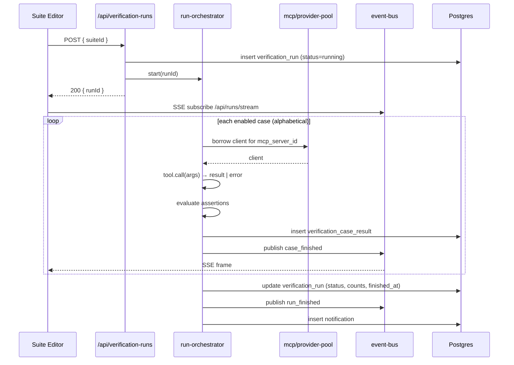

# Verification Subsystem

> **Status (V1)**
> - **MCP tool tests** — shipped end-to-end. Schema, runner, SSE
>   pipeline, suite/case CRUD, single-case rerun, suite run with
>   live updates, history-view via the recent-runs banner, and the
>   `(input snapshot, output, assertion verdicts, error envelope)`
>   inspector are all in place. Everything in §2–§8 (excluding the
>   workflow callouts) describes the current implementation.
> - **Workflow tests** — schema-level only. The left-panel tab
>   lists workflow suites; the editor renders a "coming soon"
>   placeholder. No runner, no case CRUD, no API. Tracked in §5.3,
>   §7.1, §8.5, and §11.
>
> **Position in the product**: a *deterministic* assert-on-output
> harness. Stochastic / quality-grade evaluation of agents lives in
> the separate **Eval** subsystem (`docs/eval.md`, TBD).

This document is the single source of truth for the Verification subsystem.
`AGENTS.md` carries the one-paragraph summary + the schema table
reference; everything operational is here.

---

## 1. Why a Verification Subsystem

Three needs the existing surfaces don't cover:

1. **MCP tool contract tests** — verify that our own MCP servers, and
   any REST APIs we wrap via MCPHub, behave as the LLM-facing schema
   promises. The MCP tool layer is the one the agent actually sees;
   testing at this layer catches MCPHub conversion errors that a raw
   REST test (Postman) cannot.
2. **Repeatable case organisation** — group cases into suites, share
   them, schedule recurring regression runs.
3. **Failure forensics** — surface *which layer* failed (MCPHub vs
   upstream vs assertion) so a red light is actionable.

What this is **not**:

- Not an agent quality evaluator. Agent outputs are stochastic and
  belong in the Eval subsystem.
- Not a replacement for unit / e2e tests. This is a runtime harness
  for live tools, not a CI gate.

---

## 2. Data Model

Four new tables. Nothing in the existing schema changes.

### 2.1 `verification_suite`

```sql
verification_suite (
  id          uuid v4 PK,
  name        text NOT NULL UNIQUE,
  description text,
  category    text NOT NULL,             -- 'mcp' | 'workflow'
  enabled     bool NOT NULL DEFAULT true,
  visibility  text NOT NULL DEFAULT 'private', -- 'private' | 'public'
  created_by  uuid → user,
  timeout_sec int NOT NULL DEFAULT 300, -- 5 min suite-level run timeout, in seconds
  created_at, updated_at
)
```

- `category` decides which left-panel tab the suite belongs to and
  which target columns its cases must populate.
- A suite is a pure management group; it does **not** bind a specific
  tool or workflow — that lives on each case.

### 2.2 `verification_case`

```sql
verification_case (
  id            bigint identity PK,
  suite_id      uuid NOT NULL → verification_suite ON DELETE CASCADE,
  name          text NOT NULL,
  -- Target (XOR by suite.category, enforced by CHECK)
  mcp_server_id uuid NULL → mcp_server,
  tool_name     text NULL,
  workflow_id   uuid NULL,
  input         jsonb NOT NULL DEFAULT '{}',
  assertions    jsonb NOT NULL DEFAULT '[]',
  enabled       bool NOT NULL DEFAULT true,
  created_at, updated_at,
  UNIQUE (suite_id, name),
  CHECK (
    (mcp_server_id IS NOT NULL AND tool_name IS NOT NULL AND workflow_id IS NULL)
    OR
    (mcp_server_id IS NULL AND tool_name IS NULL AND workflow_id IS NOT NULL)
  )
)
```

- PK is `bigint identity` — case rows are parent-owned children, never
  URL-exposed (the suite is). Follows `AGENTS.md` PK tier 1.
- `assertions` shape — see §4.
- A case in an `mcp` suite must have `(mcp_server_id, tool_name)`; a
  case in a `workflow` suite must have `workflow_id`. Mixing inside
  one suite is forbidden by the CHECK.

### 2.3 `verification_run`

```sql
verification_run (
  id            uuid v4 PK,                  -- DEFAULT gen_random_uuid()
  suite_id      uuid NOT NULL → verification_suite,
  status        text NOT NULL,           -- running | passed | failed | errored | timeout
  total_count   int NOT NULL,
  passed_count  int NOT NULL DEFAULT 0,
  failed_count  int NOT NULL DEFAULT 0,
  errored_count int NOT NULL DEFAULT 0,
  skipped_count int NOT NULL DEFAULT 0,
  triggered_by  text NOT NULL,           -- 'manual' | 'schedule'
  started_at, finished_at
)
```

- One row per suite execution (the user clicking "Run suite" once).
- UUIDv4 PK — the id is URL-exposed via the history-view `?run=<id>`
  query param (PK tier 3 in `AGENTS.md`). UUIDv7 was considered for
  "time-ordered for free" banner pagination, but rejected because
  (a) the banner is always `suite_id`-scoped, so it needs a composite
  index either way, and (b) SSE replay flows through `notification.id`
  (UUIDv7), not through this PK. Add an explicit index for the banner:
  ```sql
  CREATE INDEX verification_run_suite_started_idx
    ON verification_run (suite_id, started_at DESC);
  ```
- **No case-level payload here** — those live in `verification_case_result`.

#### `verification_run.status` semantics

| Status | Meaning |
|---|---|
| `running` | At least one case still executing; written at start. |
| `passed` | All enabled cases ended with status `passed`. |
| `failed` | At least one case ended `failed` (assertion mismatch). |
| `errored` | At least one case ended `errored` (infra / transport / unexpected throw); no `failed`. |
| `timeout` | Suite-level `timeout_sec` elapsed; remaining cases marked `skipped`. |

Precedence on close: `timeout` > `errored` > `failed` > `passed`.

### 2.4 `verification_case_result`

```sql
verification_case_result (
  id                bigint identity PK,
  verification_run_id       uuid NOT NULL → verification_run ON DELETE CASCADE,
  verification_case_id      bigint NOT NULL → verification_case ON DELETE CASCADE,
  status            text NOT NULL,       -- passed | failed | errored | skipped | timeout
  entity_run_id     uuid NULL → entity_run,  -- workflow cases only
  input_snapshot    jsonb NOT NULL,      -- frozen at run time (case input may be edited later)
  result_payload    jsonb,               -- tool/workflow output; truncated >8 KB
  result_truncated  bool NOT NULL DEFAULT false,
  assertion_results jsonb NOT NULL DEFAULT '[]', -- [{type, path, expected, actual, ok}]
  error             jsonb NULL,          -- see §3
  duration_ms       int,
  started_at, finished_at
)
```

- One row per case per run. MCP cases set `entity_run_id = NULL`;
  workflow cases populate it so admin run forensics
  (`/admin/run/[id]`) reveals the full delegated run tree.
- `input_snapshot` is the input as it was at run time — the user can
  edit the case freely afterwards without rewriting history.
- `result_payload` truncation: assertions are evaluated against the
  **full** payload *before* truncation; the truncation flag only
  affects what is persisted for later viewing.

#### Why MCP cases do **not** write `entity_run`

`entity_run` represents "an agent / team / workflow was dispatched"
(`AGENTS.md` §11). An MCP tool call is not an entity dispatch — it is
a single function invocation against `mcp/provider-pool`. Threading
tool calls through the runner would inflate the kernel's contract,
add zombie-sweep concerns to a synchronous code path, and provide no
extra forensics value (the result is already in
`verification_case_result.result_payload`). Workflow cases go through the
runner because Nango internal workflows already do.

---

## 3. Error Source Convention

`verification_case_result.error` is JSON, never a free-form string. Shape:

```json
{
  "source": "mcphub" | "upstream" | "transport" | "assertion" | "timeout" | "internal",
  "message": "...",
  "details": { ... }
}
```

| `source` | When | `details` examples |
|---|---|---|
| `mcphub` | MCPHub itself returned an error (502, 504, or its own error envelope). | `{ httpStatus: 502, mcphubRouteId: "..." }` |
| `upstream` | MCPHub reached the upstream REST API and the upstream returned a non-success. | `{ httpStatus: 401, wwwAuthenticate: "Bearer ..." }` |
| `transport` | Network / connection / DNS — never got a response. | `{ kind: "ECONNREFUSED", target: "mcphub:3000" }` |
| `assertion` | Tool returned successfully but at least one assertion failed. (Distinct from `status='failed'` because the `error` field is optional even when `status='failed'`; populated only when one *individual* assertion needs to surface its mismatch as the top-line error.) | `{ assertionPath: "$.data.id", expected: "abc", actual: "xyz" }` |
| `timeout` | Per-case wall-clock or suite-level timeout. | `{ scope: "case" \| "suite", elapsedMs: 30000 }` |
| `internal` | Unexpected throw inside the verification runner itself. **Always a bug.** | `{ stack: "..." }` |

Distinguishing `mcphub` vs `upstream` requires cooperation from
MCPHub. Today MCPHub does not always forward upstream status codes
verbatim. Until that is fixed, the runner classifies as follows:

- `5xx` from MCPHub with `x-mcphub-source: mcphub` header → `mcphub`
- `5xx` from MCPHub with `x-mcphub-source: upstream` header → `upstream`
- `5xx` without the header → `mcphub` (conservative default — points
  the user at the layer Nango owns)
- `4xx` always → `upstream` (MCPHub itself rarely returns 4xx)

This is intentionally **best-effort in V1**; the alternative is a
per-tool sidecar HTTP probe, which is V2 territory.

---

## 4. Assertion Types

`verification_case.assertions` is a JSON array. Each element is one of:
`json_schema`, `jsonpath_equals`, `js_expression`.

> **`type` is optional on the wire.** The API (`wire-schemas.ts`)
> infers it from the marker field when omitted: `schema` →
> `json_schema`, `path` → `jsonpath_equals`, `expression` →
> `js_expression`. Inference relies on these markers being disjoint;
> any future assertion variant that shares one MUST keep `type`
> required. The runner, storage layer and history viewer always see
> the tagged form, so persisted rows always carry `type`.

### 4.0 Scope convention — assertions target `structuredContent`

For MCP tool calls the raw payload is a `CallToolResult` envelope:

```json
{
  "content": [...],
  "structuredContent": { ...your data... },
  "isError": false
}
```

To keep the 90% case readable, **all three assertion types default to
the `structuredContent` sub-object**, not the envelope. The runner
already marks a case `failed` when `envelope.isError === true`, so
users never need to assert on it.

| Where you write… | What it sees |
|---|---|
| `jsonpath_equals.path` not starting with `$` | structuredContent |
| `jsonpath_equals.path` starting with `$` | full envelope (escape hatch) |
| `js_expression` `result` binding | structuredContent (or `{}` when absent) |
| `js_expression` `envelope` binding | full `CallToolResult` |
| `json_schema.schema` | structuredContent |

Examples:

```jsonc
// Concise (recommended)
{ "type": "jsonpath_equals", "path": "cached",         "expected": false }
{ "type": "jsonpath_equals", "path": "items[0].id",    "expected": "abc" }
{ "type": "js_expression",   "expression": "result.totalCount > 42" }

// Escape hatch — reach the envelope
{ "type": "jsonpath_equals", "path": "$.content[0].type", "expected": "text" }
{ "type": "js_expression",   "expression": "envelope.content[0].text.includes('ok')" }
```

### 4.1 `json_schema`

Validates `structuredContent` against a JSON Schema (Draft 2020-12,
evaluated by ajv 8 — same instance that powers
`src/lib/workflows/nodes/*`).

```json
{
  "type": "json_schema",
  "schema": { "type": "object", "required": ["id"], "properties": { ... } }
}
```

If a tool already exposes an `output_schema`, the editor's "Generate
from output schema" button pre-fills this assertion — that is the
fastest way to lock in the contract.

### 4.2 `jsonpath_equals`

Evaluates a JSONPath against `structuredContent` (or the envelope
when the path starts with `$`), asserts deep-equal to the expected
value.

```json
{
  "type": "jsonpath_equals",
  "path": "data.user.id",
  "expected": "abc"
}
```

### 4.3 `js_expression`

Evaluates a JavaScript expression in a sandboxed context. `result` is
bound to `structuredContent`, `envelope` to the full
`CallToolResult`. Boolean truthy = pass.

```json
{
  "type": "js_expression",
  "expression": "result.items.length > 0 && result.items.every(i => i.price > 0)"
}
```

- Sandbox: `node:vm` with `timeout: 1000`, no globals beyond
  `result` and `envelope`. No I/O, no `require`, no `process`, no
  `console`, no timers.
- Use sparingly — JSON Schema + JSONPath cover ~95% of cases more
  cheaply.

#### Security model

The actual boundary is the `node:vm` context, NOT the
`` `(${spec.expression})` `` string wrap in `assertions.ts`. The wrap
is a **parsing convenience** so that object-literal-shaped
expressions like `{ok: true}` parse as expressions rather than
statement blocks. Multi-statement payloads such as
`1); throw 'x'; (1` DO escape the parentheses, but they escape into
the same empty sandbox — nothing of value is reachable.

What does this mean for reviewers tempted to "harden" the wrap:

- Replacing the wrap with `vm.compileFunction(\`return (${expr})\`, …)`
  is **not safer** — same string concat, same sandbox.
- Adding zod regex blocks for `*/`, `/*`, `;` defends a nonexistent
  attack surface; there is no surrounding code to escape into.
- The only change that genuinely affects the security model is
  exposing additional globals to the sandbox object (the second
  argument to `runInNewContext`). If you ever add bindings beyond
  `result` and `envelope`, re-evaluate.

Known residual risks already accepted in V1 (see §11 "Deferred"):

- Synchronous CPU burn inside the timeout window blocks the event
  loop — moves to a worker thread when usage justifies it.
- V8's interrupt does not abort runaway RegExp backtracking; ditto.

### 4.4 Empty `assertions` array — smoke test

If `assertions = []`, the case **passes** iff the tool returned
without error and **fails** iff the tool errored. Useful for "just
make sure this endpoint is reachable".

### 4.5 `assertion_results` shape

Each entry in `verification_case_result.assertion_results`:

```json
{
  "index": 0,                    // index in verification_case.assertions
  "type": "jsonpath_equals",
  "ok": false,
  "path": "$.data.id",           // type-specific
  "expected": "abc",
  "actual": "xyz",
  "message": "value mismatch"    // optional
}
```

All assertions are evaluated even if an earlier one fails — the user
wants to see every problem at once.

---

## 5. Execution

### 5.1 Single-case run (synchronous, no history)

- Triggered by the `Run case` button in the right column of the
  CaseInspector. The button is always visible, including while the
  banner is in history-view mode — a click in history-view first
  drops the snapshot pin (so the new outcome isn't shadowed) and
  then issues the run.
- Goes straight to `runner-mcp.ts` (or the workflow runner once V2
  ships).
- Returns the result inline and stores it in the inspector's local
  `lastOutcome` state. **Does not write `verification_run` or
  `verification_case_result`.** This is playground behaviour,
  equivalent to the existing MCP-management test page — it leaves
  no trace in the recent-runs banner.
- Inputs / assertions in the editor are flushed (with the
  deduplicated `lastCommittedRef` guard, see §8.6) before the run
  POST so the runner reads the freshest definition from the DB.
- Authorisation: `editor`+ (real side effects on upstream APIs).

### 5.2 Suite run (asynchronous, serial)



**Invariants**

- **Serial**, alphabetical by case name. No concurrency in V1.
- **Failure-tolerant**: an `errored` or `failed` case does **not**
  abort the suite — the loop continues to the next case.
- **Suite timeout** (`verification_suite.timeout_sec`, default 5 min):
  wall-clock from `verification_run.started_at`. On expiry, all remaining
  cases are written as `skipped`, `verification_run.status = 'timeout'`, and
  a final `run_finished` SSE frame is published.
- **Crash recovery**: a `verification_run` left in `status='running'` by a
  prior Node process is swept by the same `recoverStrandedRuns`
  pathway used for `entity_run` (boot-epoch anchored). It is flipped
  to `errored` and a notification is posted.

### 5.3 Workflow cases (V2)

Will reuse `runner.start({ mode: "async", initiator: "verification" })` and
record the resulting `entity_run.id` on `verification_case_result`. In V1
the suite editor refuses to create workflow cases, and any pre-seeded
workflow suite renders a "Coming soon" placeholder.

---

## 6. Real-Time Updates (SSE)

The runner publishes through the existing `lib/runner/event-bus.ts`
on the same per-owner channel that backs notifications. Frames carry
a `topic: "verification_run"` field so the existing
`/api/runs/stream` endpoint can multiplex; the client filters on
topic.

### 6.1 Frame shapes

```jsonc
// Fired when a verification_run starts
{ "topic": "verification_run", "kind": "run_started",
  "runId": "<uuidv4>", "suiteId": "<uuid>", "totalCount": 12 }

// Fired after each case completes
{ "topic": "verification_run", "kind": "case_finished",
  "runId": "<uuidv4>", "caseId": 42,
  "status": "passed" | "failed" | "errored" | "skipped" | "timeout",
  "durationMs": 1234,
  "error": { "source": "...", "message": "..." } }   // present iff not passed

// Fired once at the end
{ "topic": "verification_run", "kind": "run_finished",
  "runId": "<uuidv4>",
  "status": "passed" | "failed" | "errored" | "timeout",
  "totalCount": 12, "passedCount": 11, "failedCount": 1,
  "erroredCount": 0, "skippedCount": 0 }

// Note on payload size: `case_finished` carries only the lightweight
// per-case summary (status, durationMs, optional error). Full
// `resultPayload` and `assertionResults` are NOT in the frame —
// they're read from the persisted snapshot via
// `GET /api/verification-runs/[id]` after the run reaches a terminal
// phase (the client hook `useRunSnapshot` handles this transparently).
```

Each frame is also tagged with `id: <notification.id>` when (and only
when) a corresponding notification row is written — same convention
as the existing notification SSE.

### 6.2 Client hook

`useVerificationRunStream(runId)` returns `{ status, caseResults: Map<id, {status, durationMs, error?}> }`
and unsubscribes on unmount.

The suite editor uses this to live-update column 1 case statuses and
the suite header progress count without polling.

---

## 7. API Routes

All routes are wrapped by `withEditor(routePath, handler)` from
`src/lib/http/route-handlers.ts`.

| Method & Path                                       | Purpose |
|-----------------------------------------------------|---------|
| `GET    /api/verification-suites?category=mcp\|workflow`    | List suites filtered by category. |
| `POST   /api/verification-suites`                           | Create a suite. |
| `GET    /api/verification-suites/[id]`                      | Suite metadata + case summary. |
| `PATCH  /api/verification-suites/[id]`                      | Update name / description / enabled / visibility / `timeout_sec`. |
| `DELETE /api/verification-suites/[id]`                      | Cascade-delete cases + runs + results. |
| `GET    /api/verification-suites/[id]/cases`                | List cases (alphabetical). |
| `POST   /api/verification-suites/[id]/cases`                | Create a case. `CHECK` enforced server-side. |
| `PATCH  /api/verification-cases/[id]`                       | Update name / input / assertions / enabled. |
| `DELETE /api/verification-cases/[id]`                       | Delete a case. |
| `POST   /api/verification-cases/[id]/run`                   | **Synchronous** single-case run; does not persist. |
| `POST   /api/verification-runs`                             | Body `{ suiteId }` → start async suite run; returns `{ runId }`. |
| `GET    /api/verification-suites/[id]/runs?offset=0&limit=5`| Paginated history for the banner. Returns `{ rows: VerificationRunEntity[], total: number }` — `total` drives both absolute chip numbering (`#N`) and a precise "more older runs?" guard for the pagination buttons. |
| `GET    /api/verification-runs/[id]`                        | Run header + all `verification_case_result` rows. Returns `{ run, results }`. Used by `useRunSnapshot` for both the just-completed-run inspector view AND history-view chip selection. |

### 7.1 V1 stubs (workflow)

The workflow CRUD routes are not registered in V1 — attempting to
create a case in a `category='workflow'` suite returns
`501 Not Implemented` with `code: "WORKFLOW_TESTS_V2"`.

---

## 8. UI

### 8.0 Cross-page entry — "Save as case" on the MCP test page

After a successful tool invocation at `/mcp/test/[serverId]`, the
Result column header exposes a `Save as case` button that opens
`SaveAsCaseDialog` (`@/components/main-panels/verification/SaveAsCaseDialog.tsx`).
The dialog captures `(mcpServerId, toolName, executedArgs)` verbatim,
lets the user pick an existing MCP-category suite OR create one
inline (`+ New suite…`), and persists a case with empty `assertions`
(smoke-test convention, §4.4). The button is enabled only after a
run that returned a non-error result, so the persisted `input` is
guaranteed to match the call the user just saw succeed. Suite list
is filtered server-side via `?category=mcp`; workflow suites are
never offered.

The dialog hits `POST /api/verification-suites` (only when creating
new) and `POST /api/verification-suites/[id]/cases` directly rather
than going through `verificationActions` / `caseActions` — the store
actions swallow errors into a panel-wide field that the dialog can't
render. On success the stores are updated explicitly (`upsert` +
`bumpCaseCount`) so the VerificationPanel badge stays consistent
without a refetch.

### 8.1 Left panel — `VerificationPanel`

- Sticky header with tabs `[MCP] [Workflow]` (mirrors AgentPanel /
  SkillsPanel "source" tabs).
- Below the tabs: vertical suite list, alphabetical by `name`, each
  row shows `name`, `description` (truncated), and the status of the
  **most recent** `verification_run` as a small badge.
- Trailing `+` button → "New suite" dialog (`name`, `description`,
  `category` pre-filled from the active tab, `visibility`).
- Click a suite row → navigates to `/verification/[id]`.

### 8.2 Suite editor — `/verification/[id]`

Two top-level columns: the case tree on the left, the case inspector
on the right. The inspector is itself a 2×2 grid — INPUT / ASSERTIONS
on the left, OUTPUT / VERDICTS on the right — so the four panes
share a single vertical baseline (INPUT lines up with OUTPUT,
ASSERTIONS with VERDICTS) and the user can read input ↔ output and
assertion ↔ verdict pairs without scrolling.

```
─── Header: [← Back] suite-name                          [Recent runs banner] ───

┌── CaseTree (col 1) ───────┬── CaseInspector (col 2) ──────────────────────────┐
│ CASES   [+] [▶ Run suite] │ #5 FAILED 116ms (2026‑05‑31 21:30)  [▶ Run case] │
│ ▾ <server-A>              │───────────────────────────────────────────────────│
│    ▾ tool_x               │ INPUT                  │ OUTPUT                  │
│      • case_1   ✅ ✏️🗑    │ { "q": "hello" }       │ { "items": [...] }      │
│      • case_2   ❌        │                        │                         │
│    ▾ tool_y               │────────────────────────┼─────────────────────────│
│      • case_3   ⏱         │ ASSERTIONS (3)         │ VERDICTS (3)            │
│                           │ [{"path": "items[0]…"}]│  ✓ #1 jsonpath_equals   │
│                           │                        │  ✗ #2 js_expression     │
│                           │                        │  ✓ #3 json_schema       │
└───────────────────────────┴────────────────────────┴─────────────────────────┘
```

**Header**

- `[← Back]` + suite name on the left.
- `RecentRunsBanner` pinned right (§8.3) — inline with the title so
  the run history shares the row with the action cluster.

**Column 1 — CaseTree**

- Header carries `CASES` label + a `+` icon (open the "New case"
  dialog) + the `Run suite` button. Co-locating Run suite with the
  case list keeps all per-suite actions next to the rows they
  operate on.
- Two-level indentation for MCP suites: `server` → `tool` → `case`.
  Workflow suites (V2) will collapse to one level: `workflow` →
  `case`.
- Each row: name, optional enabled state (opacity), inline
  rename / delete icons on hover, and a status badge sourced from
  `verdictByCaseId`:
  - **During a live run** — driven by `useVerificationRunStream` SSE
    frames.
  - **Terminal / history** — driven by the loaded `runSnapshot`
    (priority: chip selection > just-completed live run > nothing).
  - The badge is intentionally not cleared when the live phase
    transitions to terminal — the snapshot fetch fills in seamlessly
    so the user sees a continuous result instead of a flash-and-gone.

**Column 2 — CaseInspector (4 panes, 2×2 grid)**

Toolbar row (top):

  - Outcome summary on the left: `[#N] STATUS 1.2s [(2026‑05‑31 21:30)]`.
    The `#N` prefix and `(time)` suffix render only in history-view
    mode and the whole row tints amber so it doubles as the
    "viewing snapshot of run #N" indicator — this replaces what
    used to be a separate yellow notice bar above the body.
  - `Run case` button on the right — always visible. Same `h-6 px-2`
    sizing as `Run suite` on the sibling column header so the two
    bottom borders align pixel-perfect.

Panes (left column = case definition, right column = run outcome):

  | Pane | Live source | History-view source |
  |---|---|---|
  | **INPUT** | `caseRow.input` via `useJsonDraft` (editable, autosaves) | `result.inputSnapshot` rendered verbatim (read-only override) |
  | **ASSERTIONS** | `caseRow.assertions` via `useJsonDraft` (editable, autosaves) | Static notice: *"Assertion specs are not snapshotted per run. The evaluated verdicts for this run appear in the Verdicts panel →"* |
  | **OUTPUT** | `lastOutcome.resultPayload` (single-case rerun) | `result.resultPayload` from the snapshot |
  | **VERDICTS** | `lastOutcome.assertionResults` | `result.assertionResults` from the snapshot — the **only** authoritative historical view of how the assertions resolved |

ASSERTIONS header shows a `(N)` count badge mirroring Verdicts;
suppressed in history-view (the live count wouldn't match the
snapshot).

Both editable panes share `useJsonDraft` (see §8.6 for the
debounce + PATCH-dedup contract). ASSERTIONS carries a ghost-text
placeholder example (three assertion kinds) when empty,
demonstrating the wire shape with a leading `// example:` comment
so its hint-nature is obvious.

### 8.3 Recent-runs banner

```
«    #8 · ✓4 ✗2   #7 · ✓6   #6 · ✓6   #5 ⏱   #4 · ✓5 ✗1    »
```

Layout:

- Up to 5 chips per page, ordered **oldest-on-the-left,
  newest-on-the-right**. The server returns rows DESC by
  `started_at`; the banner reverses for display so the user reads
  left→right as time advancing.
- `«` / `»` double-chevron buttons on each end paginate by 5
  (older/newer). Double chevrons make the click target ~24 px wide
  and visually signal a "jump a page" action (single chevron reads
  as "one item").

Chip content:

- **`#N`** — absolute run sequence number (1‑indexed, oldest = `#1`),
  derived from the API's `total` field. With 8 total runs the
  newest page shows `#4`…`#8`. The transient live chip (during an
  in-flight run) carries `#total+1` so it slots in naturally on
  the right.
- **Separator** — a faint center dot `·` between the seq and the
  counts (terminal states). For `running` chips the spinner
  replaces the dot — it's the only signal the run is alive when no
  counts exist yet.
- **Counts** — `✓4` (passed, emerald), `✗2` (failed, red), `!1`
  (errored, amber). Zero-count categories are omitted to keep the
  chip narrow.
- **Background / border** — status-tinted: emerald/red/amber/sky at
  10% bg, 30% ring-inset border. `ring-inset` is required so the
  outer `overflow-x-auto` scroll container doesn't clip the
  leftmost / rightmost chip's border (box-shadow rings render
  outside the border-box and would be cropped otherwise).
- **Selected chip** — swaps to `bg-accent text-foreground` (history-
  view indicator). Hover lifts brightness slightly.
- Hover cursor is `pointer` (the project's reset gives `<button>`
  the default cursor).

Pagination guard:

- `canGoOlder = offset + rows.length < total` — precise rather than
  the prior heuristic `rows.length === LIMIT`, which incorrectly
  stayed truthy during a fetch transition and let users click into
  an empty page ("No runs yet").
- `canGoNewer = offset > 0`.

Auto-snap:

- When `Run suite` fires (`liveRunId` transitions from `null →`
  string) the banner resets `offset = 0`. Without this, a user who
  had paged back to inspect history wouldn't see the live chip
  appear and could think Run suite did nothing.

Chip click:

- Toggles history-view mode for that run. The chip also pushes its
  absolute `seq` back to the editor via `onSelectRun(runId, seq)`
  so the CaseInspector toolbar can prefix the outcome row with
  `#N` without recomputing.
- No URL change — history-view is component-local state; the URL
  remains `/verification/[id]`. A future revision may promote it
  to a `?run=<id>` query param to make snapshots shareable.

### 8.4 History-view mode

Clicking a chip toggles the editor into a read-only snapshot view
for that run. The mode is signalled inline rather than via a
separate banner row — the CaseInspector toolbar tints amber and
prefixes the outcome line with `#N STATUS Xms (startedAt)`. The
rest of the chrome stays put.

State driving the mode:

```ts
// VerificationSuiteEditor
const [selectedRunId, setSelectedRunId]   = useState<string | null>(null);
const [selectedRunSeq, setSelectedRunSeq] = useState<number | null>(null);

// Snapshot priority: chip selection wins; otherwise we fetch the
// just-completed live run once SSE reaches a terminal phase.
const snapshotRunId =
  selectedRunId ?? (isLiveTerminal ? liveRunId : null);
const { snapshot } = useRunSnapshot(snapshotRunId);
```

Behaviour:

- **CaseTree badges** — swap to the snapshot's `results.status`. The
  fallback chain is `snapshot → live SSE → empty`, which yields a
  smooth transition: while a live run finishes and its snapshot is
  loading, the SSE accumulator keeps the badges visible.
- **INPUT pane** — displays `result.inputSnapshot` via
  `JsonPane.overrideText`; the textarea is disabled and the
  underlying `useJsonDraft` is bypassed.
- **ASSERTIONS pane** — the DB never snapshots the assertion spec
  (only the per-assertion `assertion_results`), so the pane shows a
  fixed notice:
  *"Assertion specs are not snapshotted per run. The evaluated
  verdicts for this run appear in the Verdicts panel →"*.
  The Verdicts pane is the authoritative historical view.
- **OUTPUT + VERDICTS** — hydrated from `result.resultPayload`
  and `result.assertionResults` respectively.
- **`Run case` button** — stays visible. Clicking it calls the
  editor's `exitHistoryView()` to clear both pieces of selection
  state, then issues a fresh single-case run against the case's
  current DB definition (which may differ from the snapshot).
- **`Run suite` button** — stays visible. Clicking it likewise
  drops the snapshot pin (so the new live chip becomes the visible
  context) and posts to `/api/verification-runs`. Running a suite
  always uses the **current** case definitions, not the historical
  inputs.
- **Exit** — clicking the same chip again toggles the selection
  off; the editor reverts to its previous source (just-completed
  run snapshot, or live SSE if a run is still in flight, or empty).

Known gap (deferred): there is no "Copy input → editor" affordance.
Users who want to re-run with a historical input would have to copy
the JSON out of INPUT manually. Add this if the workflow proves
common.

### 8.5 Workflow placeholder (V1)

For suites with `category='workflow'`, the suite editor renders a
single centred placeholder:

> Workflow verification cases are coming in a later release.

The recent-runs banner and suite header are still visible (so an
admin can rename or delete a stubbed suite), but the case-area
grid is replaced by the placeholder.

### 8.6 Editor draft hook (`useJsonDraft`)

Used by INPUT and ASSERTIONS panes. Contract:

- Captures `initial` once on mount (`key={caseRow.id}` on the
  inspector remounts the hook per case selection, so we don't need
  a re-seed path).
- Empty array / object initial → the textarea seeds to an empty
  string so the ghost-text placeholder is fully visible. The
  validators canonicalize the empty-text sentinel back to `[]` /
  `{}` so persisted state stays consistent.
- **PATCH deduplication** — `lastCommittedRef` tracks the raw text
  of the last successful commit. `doCommit` short-circuits when
  `raw === lastCommittedRef.current`, killing the blur-storm that
  used to fire when tabbing between INPUT and ASSERTIONS without
  edits. Whitespace-only edits still PATCH (acceptable).
- Debounce: 400 ms after the last keystroke. On blur, the pending
  debounce flushes immediately. `flushAwait` (called by
  `Run case`) waits for the PATCH to land before issuing the run
  POST so the runner reads the freshest DB state.
- Parse / validation errors are surfaced inline (red border + error
  message) without wiping the textarea — the user's verbatim text
  is always preserved.

---

## 9. Permissions

| Action | Required role |
|---|---|
| List / view suites, cases, runs, results | `editor`+ |
| Create / edit / delete suites, cases | `editor`+ |
| Run case (sync) or suite (async) | `editor`+ |
| Schedule a suite (V2, via `schedule` row with `entity_kind='verification_suite'`) | `editor`+ |

The Verification page is wired to the `editor` group on the LeftToolbar.
`source='builtin'` is not relevant here — verification suites are always
user-authored.

---

## 10. Operational Notes

### 10.1 Payload truncation

`verification_case_result.result_payload` is capped at **8 KB** of JSON
bytes. When exceeded:

1. Assertions are evaluated against the **full** payload.
2. The persisted payload is truncated to the first 8 KB.
3. `result_truncated = true` is set.
4. The history view shows a banner "result truncated — re-run the
   case to inspect the full response".

No blob storage in V1.

### 10.2 History retention

V1 does not prune `verification_run` / `verification_case_result`. If volume becomes
a problem, the V2 fix is a single `DELETE FROM verification_run WHERE
started_at < now() - interval '90 days'` background job — both child
tables cascade.

### 10.3 Concurrency / connection reuse

The suite runner borrows from `mcp/provider-pool` per case via the
existing refcount + idle reaper. A single suite run touches at most
one MCP client per `mcp_server_id`, reusing it across that server's
cases. If high-frequency scheduled tests cause idle-reaper churn,
the V2 fix is a short-lived dedicated pool for the verification runner; do
not change provider-pool semantics for this.

### 10.4 Schema drift across history

`verification_case.assertions` can be edited after a run completes. The
historical `verification_case_result.assertion_results` is **frozen** — the
history view shows the verdicts as they were evaluated, not what
today's assertions would say. To make the drift unambiguous, the
ASSERTIONS pane in history-view does not render the current spec at
all — it shows a fixed "specs are not snapshotted per run" notice
and routes users to the VERDICTS pane (which IS frozen). See §8.4.

---

## 11. V2 / Future Roadmap

Not implemented in V1; documented here so the design intent doesn't
get lost.

| Item | Notes |
|---|---|
| **Workflow verification cases** | The largest deferred chunk. Will reuse `runner.start({ mode: "async", initiator: "verification" })`; `verification_case_result.entity_run_id` carries the FK so `/admin/run/[id]` reveals the delegated run tree. Editor, API routes, and runner all stubbed today (see §5.3, §7.1, §8.5). |
| **Snapshot the assertion spec per run** | Add `verification_case_result.assertion_specs_snapshot jsonb` so history-view's ASSERTIONS pane can show what was actually evaluated, instead of the current "not snapshotted" notice (§8.4). Cheap on disk; gated until users actually ask. |
| **Shareable history-view URL** | Promote `selectedRunId` to a `?run=<id>` query param so a snapshot view is bookmarkable / linkable. Today it's local state only. |
| **"Copy input → editor" in history-view** | Re-run a case with a historical input without manually copying the JSON. Tracked in §8.4. |
| **AI-assisted case generation** | Supervisor tool `create_verification_case(suiteId, server, tool)` that an LLM can call to bulk-author cases. |
| **Schedule-driven regression** | Extend `schedule.entity_kind` with `'verification_suite'`; scheduler fires `POST /api/verification-runs`. Notifications land in the bell. |
| **Pairwise / diff view of two runs** | "Run #5 vs #3" side-by-side for regression triage. |
| **Result blob storage** | When the 8 KB `result_payload` truncation hurts, escalate to a separate blob table or object storage. |
| **`js_expression` evaluation in `worker_threads`** | Today `vm.runInNewContext` blocks the single Node event loop for up to `JS_EXPRESSION_TIMEOUT_MS` (250 ms in V1). V8's interrupt does NOT abort runaway RegExp backtracking either. Worker-thread isolation + per-call hard kill removes both risks. Defer until usage patterns prove it matters. |
| **Parallel case execution** | Worth measuring before doing — most MCP servers serialise per-connection anyway. |
| **Sidecar HTTP probe for `mcphub` vs `upstream` disambiguation** | Only if MCPHub's `x-mcphub-source` header proves insufficient in practice. |
| **History retention pruning** | Single `DELETE FROM verification_run WHERE started_at < now() - interval '90 days'` background job; both child tables cascade. Add when volume becomes a problem. |

---

## 12. Cross-References

- `AGENTS.md` Architecture Rule §20 — one-paragraph contract pointer.
- `AGENTS.md` Database Schema Reference — `verification_suite` / `verification_case` /
  `verification_run` / `verification_case_result` rows.
- `docs/orchestrator.md` — `entity_run` semantics; explains why MCP
  cases stay out of it.
- `docs/runner-events.md` — event-bus + SSE pipeline reused here.
- `docs/eval.md` *(TBD)* — companion subsystem for stochastic agent
  evaluation; explicitly out of scope for Verification.
