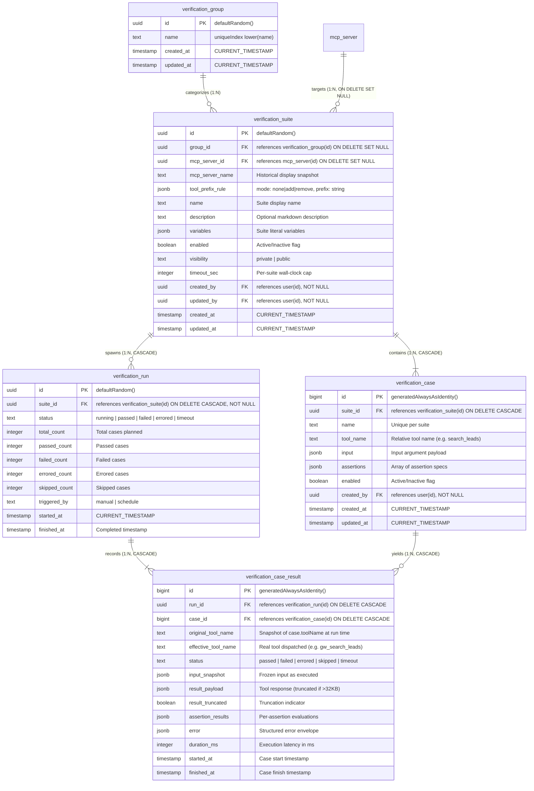

# Verification Subsystem

> **Status**
> - **MCP tool tests** — shipped end-to-end. Schema, runner, SSE
>   pipeline, group/suite/case CRUD, tool prefix engine, dual-snapshot
>   fidelity, single-case debugging run, suite run with live updates,
>   group batch execution with aggregate notifications, history-view via
>   the recent-runs banner, and the `(input snapshot, output, assertion verdicts, error envelope)`
>   inspector are all in place.
> - The verification subsystem is dedicated exclusively to **MCP tool contract verification**.
>
> **Position in the product**: a *deterministic* assert-on-output
> harness for MCP tools. Stochastic / quality-grade evaluation of agents lives in
> the separate **Eval** subsystem (`docs/evaluation.md`).

This document is the single source of truth for the Verification subsystem.
`AGENTS.md` carries the one-paragraph summary + the schema table
reference; everything operational is here.

---

## 1. Why a Verification Subsystem

Three needs the existing surfaces don't cover:

1. **MCP tool contract tests** — verify that our own MCP servers, and
   any REST APIs we wrap via MCPHub, behave as the LLM-facing schema
   promises. The MCP tool layer is the one the agent actually sees;
   testing at this layer catches MCPHub conversion errors that a raw
   REST test (Postman) cannot.
2. **Business-driven repeatable case organisation** — group suites into
   business catalogs (`Group -> Suite -> Case`), decouple test cases from
   raw physical server topologies, share them with team members, and execute
   one-click group regression runs.
3. **Environment drift resilience** — adapt to direct-connect vs. gateway tool
   naming differences via suite-level tool prefix transformation rules (`none/add/remove`),
   retaining 100% case portability.
4. **Failure forensics & audit fidelity** — freeze both `originalToolName` and
   `effectiveToolName` in execution snapshots so historical replays remain
   accurate even after subsequent case edits, surfacing *which layer* failed
   (MCPHub vs upstream vs assertion vs configuration).

What this is **not**:

- Not an agent quality evaluator. Agent outputs are stochastic and
  belong in the Eval subsystem (`docs/evaluation.md`).
- Not a replacement for unit / e2e tests. This is a runtime harness
  for live tools, not a CI gate.

---

## 2. Data Model

The subsystem consists of five core tables (`src/lib/db/schema.ts`):


```mermaid
erDiagram
    verification_group ||--o{ verification_suite : "categorizes (1:N)"
    mcp_server ||--o{ verification_suite : "targets (1:N, ON DELETE SET NULL)"
    verification_suite ||--|{ verification_case : "contains (1:N, CASCADE)"
    verification_suite ||--o{ verification_run : "spawns (1:N, CASCADE)"
    verification_run ||--|{ verification_case_result : "records (1:N, CASCADE)"
    verification_case ||--o{ verification_case_result : "yields (1:N, CASCADE)"

    verification_group {
        uuid id PK "defaultRandom()"
        text name "uniqueIndex lower(name)"
        timestamp created_at "CURRENT_TIMESTAMP"
        timestamp updated_at "CURRENT_TIMESTAMP"
    }

    verification_suite {
        uuid id PK "defaultRandom()"
        uuid group_id FK "references verification_group(id) ON DELETE SET NULL"
        uuid mcp_server_id FK "references mcp_server(id) ON DELETE SET NULL"
        text mcp_server_name "Historical display snapshot"
        jsonb tool_prefix_rule "mode: none|add|remove, prefix: string"
        text name "Suite display name"
        text description "Optional markdown description"
        jsonb variables "Suite literal variables"
        boolean enabled "Active/Inactive flag"
        text visibility "private | public"
        integer timeout_sec "Per-suite wall-clock cap"
        uuid created_by FK "references user(id), NOT NULL"
        uuid updated_by FK "references user(id), NOT NULL"
        timestamp created_at "CURRENT_TIMESTAMP"
        timestamp updated_at "CURRENT_TIMESTAMP"
    }

    verification_case {
        bigint id PK "generatedAlwaysAsIdentity()"
        uuid suite_id FK "references verification_suite(id) ON DELETE CASCADE"
        text name "Unique per suite"
        text tool_name "Relative tool name (e.g. search_leads)"
        jsonb input "Input argument payload"
        jsonb assertions "Array of assertion specs"
        boolean enabled "Active/Inactive flag"
        uuid created_by FK "references user(id), NOT NULL"
        timestamp created_at "CURRENT_TIMESTAMP"
        timestamp updated_at "CURRENT_TIMESTAMP"
    }

    verification_run {
        uuid id PK "defaultRandom()"
        uuid suite_id FK "references verification_suite(id) ON DELETE CASCADE, NOT NULL"
        text status "running | passed | failed | errored | timeout"
        integer total_count "Total cases planned"
        integer passed_count "Passed cases"
        integer failed_count "Failed cases"
        integer errored_count "Errored cases"
        integer skipped_count "Skipped cases"
        text triggered_by "manual | schedule"
        timestamp started_at "CURRENT_TIMESTAMP"
        timestamp finished_at "Completed timestamp"
    }

    verification_case_result {
        bigint id PK "generatedAlwaysAsIdentity()"
        uuid run_id FK "references verification_run(id) ON DELETE CASCADE"
        bigint case_id FK "references verification_case(id) ON DELETE CASCADE"
        text original_tool_name "Snapshot of case.toolName at run time"
        text effective_tool_name "Real tool dispatched (e.g. gw_search_leads)"
        text status "passed | failed | errored | skipped | timeout"
        jsonb input_snapshot "Frozen input as executed"
        jsonb result_payload "Tool response (truncated if >32KB)"
        boolean result_truncated "Truncation indicator"
        jsonb assertion_results "Per-assertion evaluations"
        jsonb error "Structured error envelope"
        integer duration_ms "Execution latency in ms"
        timestamp started_at "Case start timestamp"
        timestamp finished_at "Case finish timestamp"
    }
```

### 2.1 Table Specifications

| Table | Purpose | Key Constraints & Rules |
|---|---|---|
| `verification_group` | Shared catalog/grouping container. | `name` case-insensitive unique index (`lower(name)`). Shared team directory, auto-hidden when empty. |
| `verification_suite` | The primary Aggregate Root. Binds MCP server, prefix rules, variables, and history. | Unique index on `(name, created_by)`. `groupId` can be `NULL` (Ungrouped). `mcp_server_id` ON DELETE SET NULL. Category and workflow legacy fields eliminated. |
| `verification_case` | An individual test case definition. | `tool_name` stores the relative business tool name. Unique index on `(suite_id, name)`. |
| `verification_run` | Execution instance of a suite. | `suite_id` is NOT NULL (all runs belong to a suite). No server-level run rows. |
| `verification_case_result`| Immutable audit record of a case execution. | Contains both `original_tool_name` and `effective_tool_name` snapshots for 100% audit fidelity. |

### 2.2 MCP Server Lifecycle (Detached Suites & Self-Healing)

When an underlying MCP server is deleted:
1. Foreign key `ON DELETE SET NULL` clears `verification_suite.mcp_server_id`.
2. The denormalized string `mcp_server_name` preserves the historical server name.
3. In the left panel, the suite shows a warning badge and the Run button is disabled (`runDisabled`).
4. In `VerificationSuiteDialog`, an amber warning banner appears: *"Bound MCP Server Deleted. The original server no longer exists. You can re-bind this suite by selecting an available server below."*
5. The user selects any available MCP server and saves to immediately restore full functionality.

### 2.3 Why MCP Cases Do Not Write `entity_run`

`entity_run` represents "an agent / team / workflow was dispatched" (`AGENTS.md` §11). An MCP tool call is a direct function invocation against `mcp/provider-pool`. Threading verification cases through the orchestration kernel would inflate its contract, introduce zombie-sweep concerns to a synchronous code path, and provide no additional forensics value (`verification_case_result` is already self-contained).

---

## 3. Tool Prefix Conversion Engine

MCP gateways or multi-tenant proxies often prepend prefixes (e.g. `crm_`, `gateway_`) to tool names. To allow test cases to be written with pure relative tool names (`search_leads`) and run against both raw servers and gateways without duplication, suites configure a `toolPrefixRule`:

```ts
export type ToolPrefixMode = "none" | "add" | "remove";

export interface ToolPrefixRule {
  mode: ToolPrefixMode;
  prefix: string;
}
```

- **`resolveEffectiveToolName(toolName, rule)`** (`src/lib/verification/tool-name.ts`):
  - `mode: "none"`: returns `toolName` unchanged.
  - `mode: "add"`: prepends `prefix` unless already present (case-insensitive idempotency).
  - `mode: "remove"`: strips `prefix` if present (case-insensitive).
  - Trims whitespace and handles empty/null strings safely.
- **Diagnostics on Missing Tools**:
  If the server returns `-32601 Method not found`, the runner reports structured diagnostic details:
  ```json
  {
    "source": "upstream",
    "message": "MCP tool \"crm_search_leads\" not found on server \"crm-server\". (Original toolName: \"search_leads\", Mode: \"add\")"
  }
  ```
- **Dual Snapshot Fidelity**:
  `verification_case_result` stores both `original_tool_name` (as configured on the case) and `effective_tool_name` (as sent to MCP). In historical view, the UI displays `originalToolName → effectiveToolName` when transformed.

---

## 4. Error Source Convention

`verification_case_result.error` is JSON, never a free-form string:

```json
{
  "source": "mcphub" | "upstream" | "transport" | "assertion" | "timeout" | "config" | "internal",
  "message": "...",
  "details": { ... }
}
```

| `source` | When | `details` examples |
|---|---|---|
| `mcphub` | MCPHub returned an error (502, 504, or own envelope). | `{ httpStatus: 502, mcphubRouteId: "..." }` |
| `upstream` | Upstream returned a non-success or tool not found. | `{ httpStatus: 401, wwwAuthenticate: "Bearer ..." }` |
| `transport` | Network / connection / DNS failure. | `{ kind: "ECONNREFUSED", target: "mcphub:3000" }` |
| `assertion` | Tool returned successfully but assertions failed. | `{ assertionPath: "$.data.id", expected: "abc", actual: "xyz" }` |
| `timeout` | Per-case wall-clock or suite-level timeout reached. | `{ scope: "case" | "suite", elapsedMs: 30000 }` |
| `config` | Prohibited credential variable or missing configuration. | `{ variableKey: "SECRET_KEY" }` |
| `internal` | Unexpected throw inside runner. Always a bug. | `{ stack: "..." }` |

---

## 5. Assertion Types

`verification_case.assertions` is a JSON array evaluated against the `structuredContent` of the tool result:

| Type | Description | Example |
|---|---|---|
| `json_schema` | Validates against a JSON Schema (Draft 2020-12). | `{"type": "object", "required": ["id"]}` |
| `jsonpath` | Evaluates a JSONPath query against target operators. | `path: "items[0].id", operator: "==", expected: "abc"` |
| `js_expression` | Executes a pure JS expression in a restricted `node:vm`. | `result.totalCount > 42` |

- An empty assertions array acts as a smoke test (passes if no upstream tool error).
- Assertions can target raw MCP output by prefixing paths with `$` or using the `root` JS binding.

---

## 6. Execution Modes & Orchestration

### 6.1 Execution Modes

- **Single-case debug run** (`POST /api/verification-cases/[id]/run`):
  Synchronous in-memory execution (<50ms). Resolves variables and tool prefixes, returns `{ status, outcome, originalToolName, effectiveToolName }`. Does NOT write database run rows, preventing history pollution.
- **Suite run** (`POST /api/verification-runs` with `{ suiteId }`):
  Asynchronous serial execution. Creates a `verification_run` row and per-case `verification_case_result` rows. Publishes SSE events. Sends a single Notification Bell alert on completion.
- **Group run** (`POST /api/verification-runs` with `{ groupId }`):
  Concurrent multi-suite regression run across all visible enabled suites in the group.
  - **F6 Security Enforcement**: Queries enforce `viewer: VerificationViewer` and apply `visibilitySql`. Private suites of other users are never included.
  - **Aggregate Notification**: Individual suite runs set `suppressNotification: true`. On group completion, an aggregate Notification Bell message is posted (`runId: null`, clicking navigates to `/verification`).

### 6.2 Real-Time Updates (SSE)

Publishes `run_started`, `case_finished`, and `run_finished` events over `/api/runs/stream`. The client hook `useVerificationRunStream` drives real-time UI state updates.

---

## 7. Serial Execution & Cross-Case Reference Contract

Verification suites execute cases serially in deterministic alphabetical order. Downstream cases can reference outputs from earlier cases using `{{cases.<alias_or_name>.output.<path>}}`.

### 7.1 Numeric Prefix Convention & Aliasing
- **Prefix convention**: Case names should use a 3-digit step prefix (e.g. `010_login`, `020_create_order`, `030_cleanup`).
- **Dual registration**: When a case finishes, it is registered under:
  1. Full name: `suiteContext["010_login"] = caseData`
  2. Prefix alias: `suiteContext["010"] = caseData`
- **Usage**: Downstream cases can write `{{cases.010.output.orderId}}`.

### 7.2 Output Unwrapping Rules (`extractMcpStructuredData`)
1. **`structuredContent` priority**: Used directly if present.
2. **`content` JSON parsing**: Text items parsing as valid JSON objects/arrays are unwrapped.
3. **Fallback to full envelope**: Raw `CallToolResult` preserved if non-JSON or primitive.
4. **No `result` demangling**: Top-level `result` fields in business payloads are never stripped.

### 7.3 Suite Variables (Literal Variables)
Defined in `verification_suite.variables`:
- Case input: `{{variables.KEY}}`
- Assertions: `{{variables.KEY}}`
- JS expressions: `variables.KEY` and top-level `KEY`
- **Security constraint (`allowCredentials: false`)**: Credential references are strictly forbidden; any detected credential causes immediate fail-closed error.

---

## 8. UI Architecture & Conventions

### 8.1 Left Panel (`VerificationPanel.tsx`)
- **3-Level Navigation Tree**: `Group -> Suite -> Case`.
- **Group Folders**: Uniform Violet color styling (`text-violet-500/80 dark:text-violet-400/80 transition-colors`) with dynamic `<FolderOpen />` (expanded) and `<Folder />` (collapsed) states for all groups including `Ungrouped`.
- **Group Actions**: One-click Run Group button (`data-action="run-group"`) and Inline Rename (`data-action="rename-group"`).
- **Suite Item Badges**: Displays MCP server name badge (amber border when detached). Automatically suppresses badge if the suite name already contains `(${serverName})`.

### 8.2 Header Breadcrumbs (`VerificationSuiteEditor.tsx`)
- **Format**:
  - Suite root view: `[Highlighted Suite] (Server Group/Server Name)`
  - Selected Case view: `[Highlighted Suite] (Server Group/Server Name) / [Highlighted Case] (Tool Name)`
- **Visual hierarchy**:
  - `suite name` and `case name` are highlighted (`text-sm font-semibold text-foreground`).
  - `(server group/server name)`, `/`, and `(tool_name)` are rendered in muted secondary styling (`text-xs text-muted-foreground font-normal`).
  - Test IDs `verification-suite-heading` and `verification-case-heading` are scoped directly to the entity name elements.

### 8.3 Suite Dialog (`VerificationSuiteDialog.tsx`)
- **Natural field order**:
  1. `Group` (with `+ Create New Group...`)
  2. `Suite Name`
  3. `MCP Server` (with detached re-binding banner)
  4. `MCP Tool Prefix` (`none`, `add`, `remove`)
  5. `Description`
- Sized at `h-[720px] max-h-[92vh]` to prevent vertical scrollbars when expanding new group inputs.

### 8.4 Case Dialog (`NewCaseDialog.tsx`)
- **Field order**: `MCP Server` -> `MCP Tool` -> `Suite Name` -> `Case Name`.

### 8.5 MCP "Save As Case" Integration (`SaveAsCaseDialog.tsx`)
- Capturing a tool call from the MCP management/test page automatically routes to `Ungrouped` -> `Drafts (${serverName})`, computing the next prefix (e.g. `010_toolName`).

---

## 9. API Routes

All handlers use `withEditor` / `withSession` from `src/lib/http/route-handlers.ts`:

| Method & Path | Purpose |
|---|---|
| `GET    /api/verification-groups` | List all active verification groups with suite counts (empty groups hidden). |
| `PATCH  /api/verification-groups/[id]` | Rename a group (transactional reuse if name exists). |
| `GET    /api/verification-suites` | List visible suites with `serverGroup` and `serverName` metadata. |
| `POST   /api/verification-suites` | Create a suite (supports `groupId` or `groupName`, `toolPrefixRule`). |
| `GET    /api/verification-suites/[id]` | Suite metadata + cases summary. |
| `PATCH  /api/verification-suites/[id]` | Update suite (supports re-binding `mcpServerId`, moving groups, changing prefix). |
| `DELETE /api/verification-suites/[id]` | Cascade-delete suite, cases, runs, and results. |
| `GET    /api/verification-suites/[id]/cases` | List cases for suite (alphabetical). |
| `POST   /api/verification-cases` | Create a case (supports explicit `suiteId` or auto-creation into `Drafts (${serverName})`). |
| `PATCH  /api/verification-cases/[id]` | Update case details or move to another suite. |
| `DELETE /api/verification-cases/[id]` | Delete a single case. |
| `POST   /api/verification-cases/[id]/run` | Synchronous single-case debug run (does not persist). |
| `POST   /api/verification-runs` | Start async suite run (`{ suiteId }`) or group run (`{ groupId }`). |
| `GET    /api/verification-runs/[id]` | Full run snapshot (`run`, `results`) for live inspector and history view. |
| `GET    /api/verification-suites/[id]/runs` | Paginated recent runs for suite banner (`offset`, `limit`). |

> *Note: Legacy `/api/verification-servers/*` routes have been completely removed.*

---

## 10. Permissions & Security

| Action | Required Role & Guard |
|---|---|
| View suites, cases, runs, results | `editor`+ (`canEditResource` / visibility checks apply) |
| Create / edit suites, cases | `editor`+ (`canEditResource`) |
| Delete a suite | Suite author or admin (`canDeleteResource`) |
| Delete a case | Case author OR suite author OR admin |
| Single-case debug run | Suite edit permission + `enabled` + live MCP binding |
| Suite run | Suite edit permission + `enabled` + live MCP binding |
| Group run | Enforces `viewer: VerificationViewer` with `visibilitySql` — private suites of other users are sealed from execution |

Verification suites are always user-authored; `source='builtin'` does not apply.
